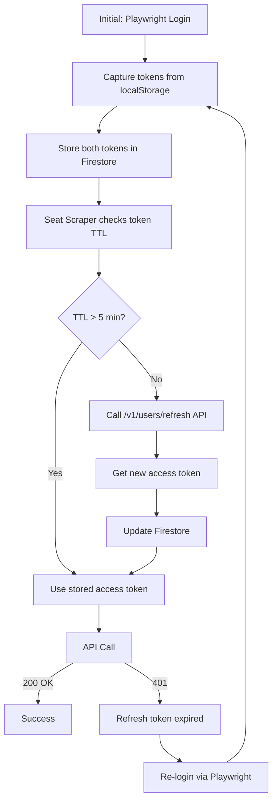
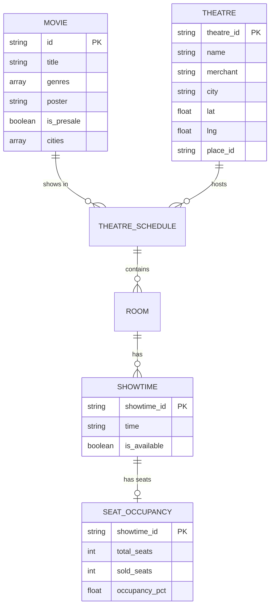

# CineRadar 🎬

[](https://github.com/okihita/CineRadar/actions/workflows/ci.yml)
[](https://github.com/okihita/CineRadar/actions/workflows/admin-ci.yml)
[](https://github.com/okihita/CineRadar/actions/workflows/smoke-tests.yml)
[](https://github.com/okihita/CineRadar/actions/workflows/daily-scrape.yml)

A Python scraper for TIX.id - Indonesia's cinema ticket booking platform. Scrapes movie listings, theatre schedules, and showtimes across all Indonesian cities.

## Features

- 🏙️ **83 Indonesian cities** - Scrape movie data from all TIX-supported cities
- 🎬 **Movie availability tracking** - See which movies are showing in which cities
- 🎭 **Theatre schedules** - Get showtimes with room types, prices, and time slots
- 🏷️ **Pre-sale detection** - Identifies advance ticket sales vs now playing
- 🤖 **Anti-bot detection** - Stealth mode with proper auth flow
- 📊 **Daily reports** - Track movie availability over time
- ⚡ **Fast & reliable** - Uses Playwright with response interception
- 🌐 **Next.js dashboard** - Beautiful frontend to browse movies and showtimes
- 🗺️ **Admin dashboard** - Theatre intelligence with Google Maps coverage

## Live Demos

| App | URL | Description |
|-----|-----|-------------|
| **Web** | Coming soon | Movie browser for end users |
| **Admin** | [cineradar-admin.vercel.app](https://cineradar-admin.vercel.app/) | Theatre intelligence dashboard |

## Project Structure

```
CineRadar/
├── backend/                 # Python backend
│   ├── scrapers/
│   │   ├── __main__.py      # CLI entry point
│   │   └── monthly_geocode.py  # Google Places geocoding
│   ├── services/
│   │   ├── tix_client.py    # TIX.id scraper
│   │   └── firebase_client.py  # Firestore CRUD
│   └── config.py            # Cities & API configuration
├── admin/                   # Next.js admin dashboard
│   └── src/
│       ├── app/page.tsx
│       └── components/
├── web/                     # Next.js frontend (movie browser)
├── firebase/                # Firebase configuration
│   ├── firestore.rules
│   └── firebase.json
├── data/                    # Scraped JSON files
├── .github/workflows/       # GitHub Actions
│   ├── daily-scrape.yml     # 6am WIB daily
│   └── monthly-geocode.yml  # 1st of month
├── populate_firestore.py    # Upload to Firebase
└── requirements.txt
```

## Quick Start

### Installation

```bash
# Clone and install
git clone https://github.com/okihita/CineRadar.git
cd CineRadar

# Install Python dependencies
pip install -r requirements.txt

# Install Playwright browsers
playwright install chromium
```

### Run Scraper

```bash
# Basic scrape (all 83 cities, no showtimes)
python -m scraper

# Include detailed showtimes (slower, ~45-75 min)
python -m scraper --schedules

# Scrape single city with showtimes
python -m scraper --city JAKARTA --schedules

# Show browser window (for debugging)
python -m scraper --visible

# Limit to first N cities (for testing)
python -m scraper --limit 5
```

### Command Line Options

| Option | Description |
|--------|-------------|
| `--schedules` | Fetch detailed theatre showtimes (~45-75 min for all cities) |
| `--city NAME` | Scrape specific city only (e.g., `JAKARTA`) |
| `--limit N` | Limit to first N cities (for testing) |
| `--visible` | Show browser window (default: headless) |
| `--output DIR` | Output directory (default: `data/`) |

### Run Frontend

```bash
cd web
npm install
npm run dev
# Open http://localhost:3000
```

### Run Admin Dashboard

```bash
cd admin
npm install
npm run dev
# Open http://localhost:3000
```

**Environment variables for admin:**
```bash
# admin/.env.local
NEXT_PUBLIC_FIREBASE_API_KEY=your_key
NEXT_PUBLIC_FIREBASE_PROJECT_ID=your_project
NEXT_PUBLIC_GOOGLE_MAPS_API_KEY=your_maps_key
```

## GitHub Actions (Automated Scraping)

The scraper runs automatically via GitHub Actions:

| Workflow | Schedule | Description |
|----------|----------|-------------|
| `daily-scrape.yml` | 6:00 AM WIB daily | Scrapes movies + showtimes → Firestore |
| `monthly-geocode.yml` | 1st of month 7:00 AM | Geocodes new theatres via Google Places |

### Required Secrets

Add these in GitHub → Settings → Secrets → Actions:

| Secret | Value |
|--------|-------|
| `GOOGLE_MAPS_API_KEY` | Your Google Maps API key |
| `FIREBASE_SERVICE_ACCOUNT` | Service account JSON from Firebase Console |

### Manual Trigger

Go to **Actions** → Select workflow → **Run workflow**

### View Logs

Click on any workflow run to see live logs as it executes.

## How It Works

## 📦 Data Format

```json
{
  "scraped_at": "2025-12-12 13:00:00",
  "date": "2025-12-12",
  "summary": {
    "total_cities": 83,
    "total_movies": 30,
    "presale_count": 7
  },
  "movies": [
    {
      "id": "1977633929036906496",
      "title": "AGAK LAEN: MENYALA PANTIKU!",
      "genres": ["Drama"],
      "poster": "https://asset.tix.id/movie_poster_v2/...",
      "age_category": "R",
      "country": "Indonesia",
      "merchants": ["XXI", "CGV", "Cinépolis"],
      "is_presale": false,
      "cities": ["JAKARTA", "SURABAYA", "BANDUNG", ...],
      "schedules": {
        "JAKARTA": [
          {
            "theatre_id": "1178839445860864000",
            "theatre_name": "AEON MALL JGC CGV",
            "merchant": "CGV",
            "address": "AEON Mall Lt. 3...",
            "rooms": [
              {
                "category": "REGULAR 2D",
                "price": "Rp46.000 - Rp51.000",
                "showtimes": ["12:00", "14:30", "17:00", "19:30"]
              }
            ]
          }
        ]
      }
    }
  ],
  "city_stats": {
    "JAKARTA": 28,
    "SURABAYA": 22,
    ...
  }
}
```

## Web Frontend

The Next.js dashboard provides a movie-browser interface:

### Layout

```
┌─────────────────┬─────────────────────────────────────────┐
│   Movie List    │                                         │
│   (Sidebar)     │         Selected Movie Details          │
│                 │                                         │
│  1. Movie A     │   [POSTER] Title                        │
│  2. Movie B ◄─  │   🏷️ PRE-SALE  [Drama] [R]             │
│  3. Movie C     │   83 cities • 200 theatres              │
│  ...            │                                         │
│                 │   ▼ JAKARTA (82 theatres)               │
│  [Search]       │     ├─ Cinema XXI                       │
│                 │     │  REGULAR 2D: 12:00 14:30 17:00    │
│  28 movies      │     └─ CGV                              │
│                 │     │  REGULAR 2D: 12:00 14:30 17:00    │
│  28 movies      │     └─ CGV                              │
└─────────────────┴─────────────────────────────────────────┘
```

### Features

- **Movie sidebar** with search, poster thumbnails, city counts
- **PRE-SALE badges** for advance ticket sales
- **Age ratings** with color coding (SU/R/D)
- **Collapsible city sections** with theatre details
- **Showtime buttons** with gradient styling

## Technical Details

### Schedule API Pagination

Theatre results are paginated (10 per page). The scraper handles this by:

1. **Capturing auth headers** from the initial page 1 request
2. **Checking `has_next`** field in the response
3. **Using `context.request`** with captured headers for pages 2, 3, etc.
4. **Stopping** when `has_next` is false

This ensures all theatres are captured (e.g., Jakarta has 80+ theatres across 9 pages).

### Pre-Sale Detection

Movies with advance ticket sales are identified by `presale_flag: 1` in the API response, stored as `is_presale: true` in the output.

### Performance

- **Without `--schedules`**: ~5-8 minutes for all 83 cities
- **With `--schedules`**: ~45-75 minutes (navigates to each movie page)
- - Use `--limit` or `--city` for faster testing

## Supported Cities (83)

<details>
<summary>Click to expand full list</summary>

AMBON, BALI, BALIKPAPAN, BANDUNG, BANJARBARU, BANJARMASIN, BATAM, BAUBAU, BEKASI, BENGKULU, BINJAI, BLITAR, BOGOR, BONDOWOSO, BONTANG, CIANJUR, CIKARANG, CILEGON, CIREBON, DEPOK, DUMAI, DURI, GARUT, GORONTALO, GRESIK, INDRAMAYU, JAKARTA, JAMBI, JAYAPURA, JEMBER, KARAWANG, KEDIRI, KENDARI, KETAPANG, KISARAN, KLATEN, KUALA KAPUAS, KUPANG, LAMPUNG, LUBUKLINGGAU, MADIUN, MAKASSAR, MALANG, MAMUJU, MANADO, MANOKWARI, MATARAM, MEDAN, MOJOKERTO, PADANG, PALANGKARAYA, PALEMBANG, PALU, PANGKAL PINANG, PEKALONGAN, PEKANBARU, PEMATANG SIANTAR, PONOROGO, PONTIANAK, PRABUMULIH, PROBOLINGGO, PURWAKARTA, PURWOKERTO, RANTAU PRAPAT, ROKAN HILIR, SAMARINDA, SAMPIT, SEMARANG, SERANG, SIDOARJO, SINGKAWANG, SOLO, SORONG, SUMEDANG, SURABAYA, TANGERANG, TANJUNG PINANG, TARAKAN, TASIKMALAYA, TEGAL, TERNATE, TIMIKA, YOGYAKARTA

</details>

## License

MIT License - Feel free to use and modify.

---

## Product Roadmap

> Based on product meeting notes (2025-12-23)

### Strategic Context

#### Competitor Analysis
- **Cinepoint** (Emtek) - Works directly with XXI, strong on daily ticket data
- Current gap: PHs still manually check data, no analytics layer

#### Target Users
- **Production Houses (PH)** - Need data for:
  - Screen allocation decisions
  - Regional marketing targeting
  - Digital campaign ROI analysis
  - Genre/timing strategy

### Phase 0: Strategic Decisions 🔴

> Must be defined before building features

- [ ] **Define main selling narrative** - What's CineRadar's unique value vs Cinepoint?
  - Option A: Direct competitor (daily ticket data)
  - Option B: Analytics/insights layer on top of existing data
  - Option C: Social media → ticket conversion specialist
- [ ] **Research Cinepoint 2025 offering** - Identify gaps to exploit
- [ ] **Validate with PH contacts** - What would they actually pay for?

### Phase 1: Regional Analytics MVP 🟡

> Core feature: Help PHs understand regional performance

- [ ] **Regional Genre Analytics Dashboard**
  - Performance breakdown by province
  - Historical trends (e.g., "horror performs 40% better in Jawa Barat")
  - Seasonal patterns by region

- [ ] **Theater Distribution Map**
  - Visualize # of screens per city/region
  - Highlight underserved vs oversaturated markets
  - Show capacity data (studio sizes)

- [ ] **Basic Reporting**
  - Export regional insights as PDF/spreadsheet
  - Weekly summary emails for subscribers

### Phase 2: Social Intelligence Layer 🟢

> Connect digital performance to ticket sales

- [ ] **Social Media Performance Tracker**
  - Track TikTok, Instagram, Twitter metrics for films
  - Views, engagement, sentiment over time
  - Compare pre-release buzz vs actual performance

- [ ] **Digital → Ticket Conversion Analysis**
  - Correlate social reach with box office
  - Identify anomalies (high views + low sales)
  - Build predictive model over time

- [ ] **Actor/Director Rankings**
  - Historical box office performance
  - Social media following/engagement
  - Genre affinity scores

### Phase 3: Trend Intelligence 🔵

> Predictive insights for film strategy

- [ ] **Trend Saturation Detector**
  - Track genre fatigue (e.g., religious films currently flopping)
  - Identify emerging themes
  - "Antitesis dari tren" analysis

- [ ] **Sentiment Analysis**
  - Socio-political sentiment affecting films
  - Controversy tracker for key talent
  - Real-time pulse of audience mood

- [ ] **Competitive Calendar**
  - What else is releasing?
  - Box office competition analysis
  - Optimal release window suggestions

### Phase 4: Screen Allocation Optimizer 🟣

> The holy grail for PHs

- [ ] **Screen Allocation Suggestions**
  - "Film genre X should target regions Y, Z"
  - Avoid mismatches (e.g., Christian films in Padang)
  - ROI-based regional prioritization

- [ ] **Ad Targeting Recommendations**
  - Don't waste ads on regions with few cinemas
  - Prioritize high-capacity markets
  - Budget allocation optimizer

- [ ] **OTT Impact Tracker**
  - Mark exclusive deals (OTT vs cinema)
  - Track OTT impact on cinema attendance
  - Timing recommendations (before OTT release)

### Data Sources to Integrate

- [ ] Current scraper data (CGV, XXI, etc.)
- [ ] Cinepoint historical data (if accessible)
- [ ] TikTok API / scraper
- [ ] Instagram API
- [ ] Twitter/X API
- [ ] Box office data (MTIX, etc.)
- [ ] OTT release schedules

### Key Metrics to Track

| Metric | Description |
|--------|-------------|
| Digital Reach | Total views/impressions across platforms |
| Conversion Rate | Reach → Ticket sales ratio |
| Regional Performance Index | Genre performance by province |
| Trend Saturation Score | How "tired" is a genre/theme |
| Screen Fill Rate | Occupancy vs capacity |

### Notes from Meeting

#### Pain Points Mentioned
- "PH MASIH NGECEKIN MANUAL" - Manual data checking
- No clear digital → ticket conversion funnel
- Regional allocation is guesswork
- OTT deals affecting 2025 occupancy rates
- Genre fatigue (perselingkuhan, religious themes)

#### Anomalies to Explain
- High views, low ticket sales (why?)
- Low views, high ticket sales (word of mouth?)
- Films affected by socio-political context (e.g., "Timur")

#### Competitive Intelligence
- Cinepoint is part of Emtek
- Works directly with XXI
- PHs get data from Pak Naril / MTIX

---

## Technical Specifications

3-scraper pipeline for TIX.id movie data collection.

| Scraper | Schedule | Login | Purpose |
|---------|----------|-------|---------|
| Token Refresh | Daily 5:50 AM WIB | Yes | Capture JWT for API auth |
| Movie + Theatre | Daily 6:00 AM WIB | No | Movies, showtimes, theatres |
| JIT Seats | Every 15 min | No* | Seat occupancy via API |

*Uses token from Token Refresh

### Overview

> [!IMPORTANT]
> **Every morning at 6:00 AM WIB**, the scraper automatically runs to get fresh movie showtimes for all cities in Indonesia.

#### Daily Pipeline (Automatic)

```
5:50 AM WIB  → Token Refresh (login, capture JWT)
6:00 AM WIB  → Movie + Theatre Scrape (9 parallel batches)
                ├── Scrape ~90 cities
                ├── Get all movies and showtimes
                ├── Merge results
                └── Upload to Firestore (snapshots/latest)
```

#### Data Flow

```
TIX.id Website → Scraper (GitHub Actions) → Firestore → 
  ├── Admin Dashboard (admin.cineradar-id.vercel.app)
  └── Public Website (cineradar-id.vercel.app)
```

#### No Manual Intervention Required
- Scraper runs automatically via GitHub Actions schedule
- Data is stored in Firestore (no static files in repo)
- Website fetches from Firestore REST API with 5-min cache

#### Time Display Convention

> [!IMPORTANT]
> **Database/Backend**: All timestamps stored as UTC/GMT  
> **Web/Admin Apps**: All times displayed as WIB (Jakarta time, UTC+7)

| Layer | Timezone | Example |
|-------|----------|---------|
| Firestore | UTC | `2025-12-18T00:15:08.000Z` |
| Backend/Scraper | UTC | `datetime.utcnow()` |
| Admin Dashboard | WIB | `Dec 18, 7:15 AM WIB` |
| Public Website | WIB | `Dec 18, 7:15 AM WIB` |

**Implementation:**
- Admin: Use `formatWIB()` from `@/lib/timeUtils.ts`
- Web: Use `formatWIB()` function with `timeZone: 'Asia/Jakarta'`

#### Admin Dashboard Navigation

| Page | URL | Purpose |
|------|-----|---------|
| Executive Dashboard | `/` | Overview & KPIs |
| Cinema Intelligence | `/cinemas` | Theatre locations & mapping |
| Movie Intelligence | `/movies` | Showtimes & schedules |
| **Scraper Monitor** | `/scraper` | Run history & data collection status |
| Advanced Analytics | `/analytics` | Predictions & scenarios |

> [!NOTE]
> The **Scraper Monitor** is a dedicated page for tracking data collection runs.
> It shows run history, success rates, and schedule information.

#### Frontend Applications

| App | Directory | Purpose | URL |
|-----|-----------|---------|-----|
| **Admin Dashboard** | `admin/` | Internal analytics & monitoring | `cineradar-admin.vercel.app` |
| **Consumer Web App** | `web/` | Public-facing movie discovery | `cineradar-id.vercel.app` |

**Admin Dashboard (`admin/`):**
- Full admin dashboard with Firebase, Recharts, shadcn/ui
- Theatre mapping, movie analytics, scraper monitoring
- CI/CD via `admin-ci.yml` and `smoke-tests.yml`

**Consumer Web App (`web/`):**
- Public-facing web app for end users
- Movie discovery with map-based theatre locations
- Uses Leaflet for interactive maps

#### Geographic Regions (6 Regions)

All 83 Indonesian cities are mapped to exactly 6 regions. **No "Others" category allowed.**

| Region | Example Cities | Count |
|--------|----------------|-------|
| **Jawa** | Jakarta, Bandung, Surabaya, Semarang, Yogyakarta | ~36 |
| **Sumatera** | Medan, Palembang, Pekanbaru, Batam, Padang | ~19 |
| **Kalimantan** | Balikpapan, Banjarmasin, Pontianak, Samarinda | ~12 |
| **Sulawesi** | Makassar, Manado, Palu, Kendari, Gorontalo | ~7 |
| **Bali & NT** | Bali, Mataram, Kupang | ~3 |
| **Papua & Maluku** | Jayapura, Sorong, Ambon, Ternate, Timika | ~6 |

Region mapping defined in: `admin/src/lib/regions.ts`

#### Network Diagnostics (Before Debugging Production)

> [!TIP]
> Before debugging production issues, check local network connectivity first:

```bash
# Quick connectivity check with timing
curl -s -o /dev/null -w "DNS: %{time_namelookup}s | Connect: %{time_connect}s | Total: %{time_total}s | HTTP: %{http_code}\n" https://cineradar-admin.vercel.app/api/dashboard

# Expected: HTTP 200, Total < 3s
# If DNS > 1s or Connect > 2s, network issue likely
```

#### Local Server Health Check (Before Local Testing)

> [!IMPORTANT]
> **AI Agents / Developers**: Before testing on localhost, verify the dev server is running:

```bash
# Check if admin dev server is running (port 3000)
curl -s -o /dev/null -w "%{http_code}" http://localhost:3000 || echo "NOT RUNNING"

# Check if web dev server is running (port 3001)
curl -s -o /dev/null -w "%{http_code}" http://localhost:3001 || echo "NOT RUNNING"

# Start admin dev server if needed
cd admin && npm run dev

# Start web dev server if needed  
cd web && npm run dev -- --port 3001
```

#### Package Lock File Sync

> [!CAUTION]
> **After modifying `package.json`**, always run `npm install` to update the lock file:

```bash
# After changing admin/package.json
cd admin && npm install

# After changing web/package.json  
cd web && npm install

# Commit both files together
git add package.json package-lock.json
```

CI will fail with `npm ci` if the lock file is out of sync.

#### Next.js Hydration Rules

> [!WARNING]
> **Prevent hydration mismatch errors** by following these rules:

1. **Never access `document` or `window` during render** - only in `useEffect` or event handlers
2. **Use `suppressHydrationWarning`** on `<html>` and `<body>` tags (already applied in `layout.tsx`)
3. **Defer theme initialization** to client-side `useEffect`:
```tsx
useEffect(() => {
  const saved = localStorage.getItem('darkMode');
  document.documentElement.classList.toggle('dark', saved === 'true');
}, []);
```
4. **Don't use `Date.now()` or `Math.random()`** in component render

#### Runtime API Availability

> [!CAUTION]
> **TypeScript passing ≠ Runtime working**. External APIs load asynchronously.

```tsx
// ❌ WRONG: google.maps.marker may not be loaded yet
const marker = new google.maps.marker.AdvancedMarkerElement({...});

// ✅ CORRECT: Use library hook to wait for API
const markerLib = useMapsLibrary('marker');
useEffect(() => {
  if (!markerLib) return; // Wait for API
  const marker = new markerLib.AdvancedMarkerElement({...});
}, [markerLib]);
```

Always use library hooks (`useMapsLibrary`) when working with Google Maps or similar async-loaded APIs.

#### Cinema Intelligence Map Configuration

| Setting | Value | Reason |
|---------|-------|--------|
| **Default zoom** | 5.5 | Shows all of Indonesia |
| **Clustering radius** | 80px | Groups nearby theatres |
| **Clustering max zoom** | 14 | At zoom 15+, show individual markers |
| **POI toggle** | ❌ Not implemented | Requires 4 custom map styles in Google Cloud Console (too much maintenance) |

#### Brand Colors (Chains)

| Chain | Color | Hex | Source |
|-------|-------|-----|--------|
| **XXI** | Tan/Gold | `#CFAB7A` | Official brand |
| **CGV** | CG Red | `#E03C31` | Official brand |
| **Cinépolis** | Midnight Blue | `#002069` | Official brand |

#### Region Colors (Non-conflicting with chains)

| Region | Color | Hex |
|--------|-------|-----|
| Jawa | Teal | `#0d9488` |
| Sumatera | Purple | `#7c3aed` |
| Kalimantan | Pink | `#db2777` |
| Sulawesi | Orange | `#ea580c` |
| Bali & NT | Cyan | `#0891b2` |
| Papua & Maluku | Lime | `#65a30d` |

#### UI Features

| Feature | Description |
|---------|-------------|
| **Cluster hover tooltip** | 300ms delay, shows chain breakdown with percentages |
| **Search highlighting** | Yellow highlight on matching text in table |
| **Region filter pan** | Clicking region badge pans map to region center |
| **InfoWindow** | Compact popup with chain badge, location, room types, action buttons |

#### Region Center Coordinates

| Region | Lat | Lng | Zoom |
|--------|-----|-----|------|
| Indonesia (All) | -2.5 | 118 | 5.5 |
| Jawa | -7.0 | 110.4 | 7 |
| Sumatera | -0.5 | 101.5 | 6 |
| Kalimantan | 0.5 | 116.5 | 6 |
| Sulawesi | -2.0 | 121.0 | 6.5 |
| Bali & NT | -8.5 | 118.0 | 7 |
| Papua & Maluku | -3.5 | 135.0 | 6 |

**Map library:** `@vis.gl/react-google-maps` + `@googlemaps/markerclusterer`

### Scraper 1: Token Refresh

#### Purpose
Login to TIX.id and capture JWT token for authenticated API calls.

#### Endpoints
| Type | URL |
|------|-----|
| Web App Base | `https://app.tix.id` |
| Login Page | `https://app.tix.id/login` |

#### Credentials (from `.env`)
```
TIX_PHONE_NUMBER=+62XXXXXXXXXX
TIX_PASSWORD=<your_password>
```

#### Login Flow

> [!CAUTION]
> TIX.id has **TWO Login buttons** on the login page:
> - **Header button** (top) - Navigates back to home, does NOT login!
> - **Form button** (below password) - Actually calls the login API
> 
> Use `.last` or element index 5 for Playwright, NOT `.first`!

1. Navigate to `https://app.tix.id/login`
2. Wait for page load (Flutter app, may take 5-15 seconds)
3. Find input fields (Flutter renders canvas, use `get_by_placeholder`)
4. Fill phone number (strip `+62` prefix, type via keyboard)
5. Fill password (type via keyboard)
6. Click **LAST** "Login" button (`.last`, NOT `.first`) or press Enter
7. Wait for redirect (success = `/home` or URL with `login-success`)
8. Extract tokens from localStorage:
   - `authentication_token` - Access token (valid ~30 min)
   - `authentication_refresh_token` - Refresh token (valid ~91 days)

#### Token Storage
- **Location**: Firestore collection `auth_tokens`, document `tix_jwt`
- **Fields**:
  - `token`: JWT string
  - `stored_at`: ISO timestamp
  - `expires_at`: ISO timestamp (TTL ~20 hours)
  - `phone`: Phone number used (masked)

#### Success Criteria
- [ ] JWT token captured from localStorage
- [ ] Token stored in Firestore
- [ ] Token can authenticate API calls

#### Error Handling
| Error | Action |
|-------|--------|
| Login page not loading | Retry 3 times with 5s delay |
| Input fields not found | Try placeholder text approach |
| Login failed (still on /login) | Log error, exit with code 1 |
| Token storage failed | Log error, exit with code 1 |

#### CLI Usage
```bash
# Refresh token (headless)
python -m backend.cli.refresh_token

# Refresh token (visible browser)
python -m backend.cli.refresh_token --visible

# Check token status
python -m backend.cli.refresh_token --check
```

#### GitHub Actions
- **Workflow**: `.github/workflows/token-refresh.yml`
- **Schedule**: `cron: '50 22 * * *'` (5:50 AM WIB)
- **Secrets Required**: `TIX_PHONE_NUMBER`, `TIX_PASSWORD`, `FIREBASE_SERVICE_ACCOUNT`

### Scraper 2: Movie + Theatre

#### Purpose
Scrape daily movie listings, showtimes, and theatre information.

#### Endpoints
| Type | URL |
|------|-----|
| Web App Base | `https://app.tix.id` |
| API Base | `https://api-b2b.tix.id` |
| Cities Page | `https://app.tix.id/cities` |
| Movie Schedule | `https://app.tix.id/movies/{slug}-{id}/{date}` |

#### Data Captured
- Movie: id, title, genres, poster, age_category, merchants
- Theatre: id, name, merchant, address, city
- Room: category (SATIN, GOLD CLASS, IMAX, etc.), price
- Showtime: time, `showtime_id`, status, is_available

#### Output
- **File**: `data/movies_{date}.json`
- **Firestore**: `theatres` collection (deduplicated, geocoded)

#### CLI Usage
```bash
python -m backend.cli.cli movies --city JAKARTA
python -m backend.cli.cli movies --batch 0 --total-batches 9
```

### Scraper 3: JIT Seats

#### Purpose
Scrape seat availability just before showtime starts.

#### Endpoints
| Type | URL |
|------|-----|
| Seat Layout API | `https://api-b2b.tix.id/v1/movies/{merchant}/layout` |

#### API Parameters
```
GET /v1/movies/{merchant}/layout
  ?show_time_id={id}
  &tz=Asia/Jakarta

Headers:
  Authorization: Bearer {JWT_TOKEN}
  Accept: application/json
```

#### Data Captured
- `seat_map[]`:
    - **XXI/CGV**: Nested `seat_rows[]` with `status`
    - **Cinépolis**: Flat list with `seat_status`
- **Status Codes** (verified Dec 23, 2025):
    - `1` = **Available** (can be purchased)
    - `5` = **Unavailable** (sold or blocked - cannot distinguish)
    - `6` = **Unavailable** (sold or blocked - cannot distinguish)
- `price_group[]`: seat grades and prices
- Calculated: total_seats, unavailable_seats, available_seats, occupancy_pct

> [!IMPORTANT]
> The API does not distinguish between "sold" and "under maintenance/blocked". Both appear as status 5 or 6. Occupancy estimates should be treated as upper bounds.

#### CLI Usage
```bash
# JIT mode (uses stored token)
python -m backend.cli.cli seats --mode jit --use-stored-token

# Manual mode (with login)
python -m backend.cli.cli seats --mode morning
```

### Environment Variables

| Variable | Description | Example |
|--------|-------------|---------|
| `TIX_PHONE_NUMBER` | TIX.id login phone | `+62XXXXXXXXXX` |
| `TIX_PASSWORD` | TIX.id login password | `<your_password>` |
| `FIREBASE_SERVICE_ACCOUNT` | Firebase credentials JSON | `{...}` |

### File Structure

```
backend/
├── services/
│   ├── base_scraper.py      # Shared browser/login
│   ├── tix_client.py        # Movie scraper
│   ├── seat_scraper.py      # Seat scraper
│   └── token_storage.py     # Firestore token storage
└── scrapers/
    ├── cli.py               # Unified CLI
    ├── refresh_token.py     # Token refresh script
    └── __main__.py          # Entry point
```

### Token Architecture (Single Source of Truth)

> [!NOTE]
> This is the authoritative documentation for TIX.id authentication. All other docs reference this section.

#### Token Types

| Token | localStorage Key | Actual TTL | Purpose |
|-------|-----------------|------------|---------|
| **Access** | `authentication_token` | **30 minutes** | Bearer token for API calls |
| **Refresh** | `authentication_refresh_token` | **~91 days** | Used for programmatic token refresh |

#### Token Lifecycle Flowchart



#### Programmatic Token Refresh (Discovered Dec 23, 2025)

> [!IMPORTANT]
> **No browser needed!** We can refresh tokens via API using the refresh token.

**Endpoint:**
```http
POST https://api-b2b.tix.id/v1/users/refresh
Authorization: Bearer <REFRESH_TOKEN>
Content-Type: application/json

(empty body)
```

**Response:**
```json
{
  "success": true,
  "data": {
    "token": "eyJhbGciOiJIUzI1NiIs..."  // New access token (30 min TTL)
  }
}
```

**Python Example:**
```python
import requests

response = requests.post(
    'https://api-b2b.tix.id/v1/users/refresh',
    headers={
        'Authorization': f'Bearer {refresh_token}',
        'Content-Type': 'application/json',
        'platform': 'web',
    }
)
new_access_token = response.json()['data']['token']
```

**Key Points:**
- Works **before** token expiration (proactive refresh)
- Works **after** token expiration (recovery)
- Refresh token lasts ~91 days
- Initial login still requires Playwright (to get refresh token)

#### Firestore Storage

Tokens are stored at `auth_tokens/tix_jwt`:

```json
{
    "token": "eyJhbGciOiJIUzI1NiIs...",
    "refresh_token": "eyJhbGciOiJIUzI1NiIs...",
    "phone": "6285***",
    "stored_at": "2025-12-23T06:26:40.591620"
}
```

> [!NOTE]
> `expires_at` was removed in favor of a fixed 30-minute TTL calculation from `stored_at`.

#### How to Refresh Tokens

**Method 1: API Refresh (Preferred)**
```bash
# Test the refresh API
python -m backend.cli.test_refresh_api
```

**Method 2: Playwright Login (Initial setup or refresh token expired)**
```bash
# Refresh token (headless)
python -m backend.cli.refresh_token

# Refresh with visible browser (debugging)
python -m backend.cli.refresh_token --visible

# Check token status
python -m backend.cli.refresh_token --check
```

**The `/v1/auth` endpoint does NOT help for seat scraping:**

```http
POST https://api-b2b.tix.id/v1/auth
Content-Type: application/json

{"client_id": "tixid_guest"}
```

This returns a **guest token** that cannot access seat layout APIs. Only login tokens work.

#### Known Bugs & Fixes

**Bug 1: Token Stored With Quotes (FIXED Dec 23, 2025)**

**Symptom:** All API calls return 401 even with fresh token.

**Cause:** `localStorage.getItem()` returns tokens wrapped in quotes: `"eyJ..."` instead of `eyJ...`

**Fix:** `refresh_token.py` now strips quotes before storing:
```python
if token.startswith('"') and token.endswith('"'):
    token = token[1:-1]
```

**Bug 2: Two Login Buttons**

**Symptom:** Playwright clicks wrong button, page goes to `about:blank`.

**Fix:** Use `.last` selector:
```python
login_button = page.get_by_role('button', name='Login').last
```

**Bug 3: Flutter Rendering in Headless Mode**

**Symptom:** Page appears blank, elements not found.

**Fix:** Use `xvfb-run` on Linux:
```bash
xvfb-run --auto-servernum python -m backend.cli.refresh_token
```

#### Troubleshooting Guide

| Error | Cause | Solution |
|-------|-------|----------|
| `401 INVALID_TOKEN` | Token has quotes | Re-run `refresh_token.py` (bug is fixed) |
| `401 EXPIRED_EVENT_DETAIL` | Showtime already started | Use fresh movie data |
| `401` after fresh login | Token not stripped | Check first/last char of token |
| Login hangs | Flutter rendering issue | Use `xvfb-run` |
| Refresh API returns 401 | Refresh token expired (~91 days) | Re-login via Playwright |

#### GitHub Actions Integration

Token refresh runs daily at 5:50 AM WIB via `.github/workflows/token-refresh.yml`:

```yaml
on:
  schedule:
    - cron: '50 22 * * *'  # 5:50 AM WIB (UTC+7)
  workflow_dispatch:
```

#### Future: JIT Scraping with Proactive Refresh

For just-in-time seat scraping:
1. Check token TTL before each API call
2. If TTL < 5 min, call `/v1/users/refresh` 
3. Store new access token, continue scraping
4. No browser needed for ~91 days (refresh token lifetime)

### Known Issues & Fixes

> [!NOTE]
> For token-related bugs (quote stripping, two login buttons, Flutter headless mode), see [Token Architecture - Known Bugs](#known-bugs--fixes) above.

#### Issue 1: Showtime ID Extraction

**Problem:** CLI was reading wrong field for showtime IDs.

**Data Structure:**
```json
{
  "rooms": [{
    "category": "2D",
    "showtimes": ["19:35", "20:00"],        // ❌ No IDs
    "all_showtimes": [                       // ✅ Has IDs
      {"time": "19:35", "showtime_id": "123", "is_available": true}
    ]
  }]
}
```

**Fix:** Changed CLI to read from `all_showtimes`:
```python
# WRONG
for st in room.get('showtimes', []):

# CORRECT
for st in room.get('all_showtimes', room.get('showtimes', [])):
```

#### Issue 2: Local Firestore Access

**Problem:** Local development uses different Google Cloud project (kadago109 vs cineradar).

**Symptom:** `403 Cloud Firestore API has not been used in project kadago109`

**Fix:** Set `FIREBASE_SERVICE_ACCOUNT` environment variable with CineRadar service account JSON.

### Data Structure Reference

#### Movie Data (`data/movies_{date}.json`)

```json
{
  "scraped_at": "2025-12-17 16:59:35",
  "date": "2025-12-17",
  "movies": [{
    "id": "1961889705591132160",
    "title": "AVATAR: FIRE AND ASH",
    "merchants": ["XXI", "CGV", "Cinépolis"],
    "schedules": {
      "MALANG": [{
        "theatre_id": "986744938815295488",
        "theatre_name": "ARAYA XXI",
        "merchant": "XXI",
        "rooms": [{
          "category": "2D",
          "price": "Rp35.000",
          "all_showtimes": [{
            "time": "19:35",
            "showtime_id": "2000039256042586112",
            "status": 1,
            "is_available": true
          }]
        }]
      }]
    }
  }]
}
```

#### Token Storage (Firestore `auth_tokens/tix_jwt`)

```json
{
  "token": "eyJhbGciOiJIUzI1NiIs...",
  "stored_at": "2025-12-17T09:06:29.115024",
  "expires_at": "2025-12-18T05:06:29.115029",
  "phone": "6285***"
}
```

### Data Contracts (Pydantic Schemas)

> [!IMPORTANT]
> All data passing through the pipeline is validated using Pydantic V2 schemas.
> This ensures data integrity and prevents corrupted data from reaching Firestore.

#### Schema Files

| Schema | File | Purpose |
|--------|------|---------|
| `MovieSchema` | `backend/schemas/movie.py` | Complete movie with schedules |
| `DailySnapshotSchema` | `backend/schemas/movie.py` | Full daily scrape output |
| `TheatreSchema` | `backend/schemas/theatre.py` | Theatre for Firestore storage |
| `TokenSchema` | `backend/schemas/token.py` | JWT with TTL validation |
| `ScraperRunSchema` | `backend/schemas/scraper_run.py` | Scraper run logging |

#### Validation Points

| Pipeline Step | Validation Applied |
|---------------|-------------------|
| Batch merge | `DailySnapshotSchema` validates merged output |
| Firestore upload | `TheatreSchema` validates each theatre |
| Token retrieval | Token expiry check before use |
| Pre-seat-scrape | Token TTL ≥ 25 minutes verified |

#### Integrity Assertions

After schema validation, these assertions are checked:

```python
assert len(movies) >= 10       # At least 10 movies expected
assert len(city_stats) >= 50   # At least 50 cities expected (normally ~83)
```

#### Failure Modes

| Failure | GitHub Action Behavior |
|---------|----------------------|
| Schema validation fails | Exit with code 1, no Firestore write |
| Token expired | Seat scrape skipped, error in logs |
| Integrity assertion fails | Exit with code 1, data not uploaded |
| Token TTL < 25 min | Seat scrape job fails fast |

#### CLI Validation Commands

```bash
# Validate today's movie data
python -m backend.cli.validate

# Validate specific file
python -m backend.cli.validate --file data/movies_2025-12-18.json

# Check token TTL (exit 1 if < 25 min remaining)
python -m backend.cli.refresh_token --check-min-ttl 25
```

### CI/CD Pipeline

#### Workflow Overview

| Workflow | Trigger | Purpose |
|----------|---------|---------|
| `ci.yml` | Push/PR to `backend/**` | Lint, test, type-check Python |
| `admin-ci.yml` | Push/PR to `admin/**` | Lint, type-check, build Next.js |
| `pr-checks.yml` | Pull requests | Unified quality gate |
| `smoke-tests.yml` | Push to `admin/**` + daily | Test production APIs |
| `security-scan.yml` | Push/PR + weekly | CodeQL security analysis |
| `failure-reporter.yml` | Workflow failures | Auto-create GitHub issues |
| `daily-scrape.yml` | Daily 6 AM WIB | Movie + seat scraping |
| `token-refresh.yml` | Daily 5:50 AM WIB | JWT token refresh |

#### Quality Gates (Required for Merge)

The `PR Checks` workflow serves as a single required status check for branch protection:

```
PR Checks
├── backend-quality
│   ├── ruff lint
│   ├── mypy type check
│   └── pytest (70% coverage minimum)
└── frontend-quality
    ├── TypeScript type check
    └── Next.js build
```

#### Automated Dependency Updates

Dependabot is configured for:
- **Python** (`requirements.txt`) - Weekly
- **npm** (`admin/`, `web/`) - Weekly  
- **GitHub Actions** - Weekly

#### Security Scanning

CodeQL runs on:
- Every push to `main`
- Every pull request
- Weekly scheduled scan

Languages: Python, JavaScript/TypeScript

#### Alerting

When critical workflows fail (`Daily Scrape`, `Token Refresh`, `Smoke Tests`):
1. GitHub issue is automatically created
2. Labeled with `workflow-failure` and `bug`
3. Contains link to failed run

#### Smoke Tests

Production API endpoints are tested:
- After every `admin/**` push (with 2-min Vercel deploy delay)
- Daily at 7 AM WIB
- Manually via `workflow_dispatch`

**11 endpoints tested:**
- `/api/dashboard` (validates `kpis.revenue`)
- `/api/movies` (validates `total` or `showtimes`)
- `/api/scraper` (validates `runs`)
- All other analytics endpoints (HTTP 200 check)

#### Local CI Commands

```bash
# Backend
ruff check backend/                    # Lint
mypy backend/domain/ --ignore-missing  # Type check
pytest tests/ -v --cov=backend         # Test with coverage

# Frontend (from admin/)
npm run lint                           # ESLint
npx tsc --noEmit                       # Type check
npm run build                          # Production build
```

### Database Schema

> Consolidated from `docs/DATABASE_SCHEMA.md`

#### Entity Relationship Diagram



#### Firestore Collections

| Collection | Document ID | Purpose |
|------------|-------------|---------|
| `theatres` | `{theatre_id}` | Master list of cinema locations |
| `snapshots` | `latest` or `{YYYY-MM-DD}` | Daily movie data (slim) |
| `schedules/{date}/movies` | `{movie_id}` | Full showtime data by date |
| `seat_snapshots` | `{showtime_id}_{type}_{time}` | Seat occupancy data |
| `scraper_runs` | `{timestamp}_{type}` | Scraper run logs |
| `auth_tokens` | `tix_jwt` | JWT token storage |

### Seat Scraper Reference

> Consolidated from `docs/SEAT_SCRAPER.md`

#### Merchant API Paths

| Merchant | API Path |
|----------|----------|
| XXI | `xxi` |
| CGV | `cgv` |
| Cinépolis | `cinepolis` |

#### API Parameters

```
GET https://api-b2b.tix.id/v1/movies/{merchant}/layout
    ?show_time_id={id}
    &tz=7
```

> ⚠️ Use `tz=7`, NOT `Asia/Jakarta`!

#### Response Formats

**Type A (XXI, CGV):** Nested structure with `seat_rows[]`
**Type B (Cinépolis):** Flat list with `seat_status` field

The scraper handles both formats automatically.
