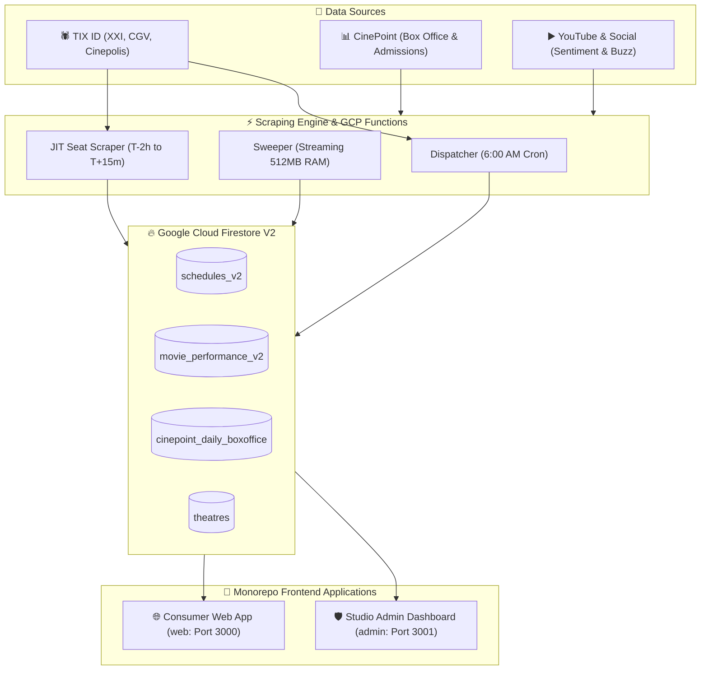

# CineRadar 🎬

> **The "Bloomberg Terminal" for the Indonesian Film Industry.**  
> Real-time seat occupancy, daily box office intelligence, and market analytics across 496+ theatres in 83 cities.

---


---

## ⚡ High-Level System Architecture


```mermaid
flowchart TB
    subgraph Sources ["📡 Data Sources"]
        TIX["🕷️ TIX ID (XXI, CGV, Cinepolis)"]
        CP["📊 CinePoint (Box Office & Admissions)"]
        YT["▶️ YouTube & Social (Sentiment & Buzz)"]
    end

    subgraph Backend ["⚡ Scraping Engine & GCP Functions"]
        Disp["Dispatcher (6:00 AM Cron)"]
        Sweep["Sweeper (Streaming 512MB RAM)"]
        JIT["JIT Seat Scraper (T-2h to T+15m)"]
    end

    subgraph Storage ["🔥 Google Cloud Firestore V2"]
        Schedules[("schedules_v2")]
        Perf[("movie_performance_v2")]
        BoxOffice[("cinepoint_daily_boxoffice")]
        Theatres[("theatres")]
    end

    subgraph Frontend ["🚀 Monorepo Frontend Applications"]
        Admin["🛡️ Studio Admin Dashboard (admin: Port 3001)"]
        Web["🌐 Consumer Web App (web: Port 3000)"]
    end

    TIX --> Disp & JIT
    CP --> Backend
    YT --> Backend
    Disp & Sweep & JIT --> Storage
    Storage --> Admin
    Storage --> Web
```

---

## 🚀 60-Second Developer Quickstart

Get the entire monorepo running locally in 3 steps:

### 1. Install Dependencies
```bash
pnpm run setup
# Automatically runs: pnpm install && uv sync
```

### 2. Configure Environment
```bash
cp .env.example .env
cp .env.example admin/.env.local
```

### 3. Launch Local Development
```bash
pnpm dev
```
* 🌐 **Consumer Web**: [http://localhost:3000](http://localhost:3000)
* 🛡️ **Studio Dashboard**: [http://localhost:3001](http://localhost:3001)

---

## 📁 Monorepo Structure

```text
CineRadar/
├── admin/          # 🛡️ Studio / Admin Dashboard (Next.js 16, Tailwind CSS v4, React 19, SWR)
│   └── scripts/    # 🛠️ CinePoint backfill and enrichment scripts (see admin/scripts/README.md)
├── web/            # 🌐 Consumer Web App (Next.js 16, React 19, Live showtimes)
├── backend/        # 🐍 Python 3.13 Scraping Engine (uv, httpx, Firestore 2.28)
│   ├── functions/  # ⚡ Gen 2 Cloud Functions (dispatcher, sweeper, scrape_seat_jit)
│   └── scripts/    # 🛠️ Scraping & aggregation CLI tools (see backend/scripts/README.md)
├── docs/           # 📚 Documentation Hub (system/, features/, intel/, archive/)
├── AGENTS.md       # 🤖 AI Agent rules, Git branching standards & conventional commits
└── package.json    # 📦 Root monorepo orchestrator (PNPM Workspace catalog)
```

---

## 📚 Documentation Hub

Explore the full technical manuals in [`docs/`](./docs/README.md):

* **⚙️ [System & Architecture](./docs/README.md#-1-system--operations-docssystem)**:
  * [`01 Architecture & Design`](./docs/system/01_architecture.md) — High-level architecture, Stability DNA & Firestore V2.
  * [`02 Setup & Deploy`](./docs/system/02_setup_and_deploy.md) — Environment setup & GCP replication.
  * [`03 Daily Pipeline`](./docs/system/03_daily_pipeline.md) — 6 AM to Midnight (T+0) scraping dataflow.
  * [`07 Git Workflow`](./docs/system/07_git_workflow.md) — Monorepo scoped branching & release standards.
* **🎬 [Features & Intelligence](./docs/README.md#-2-feature-specifications-docsfeatures)**:
  * [`02 Studio Layout`](./docs/features/02_studio_layout.md) — Studio dashboard layout & telemetry matrix.
  * [`03 Competitor Tracking`](./docs/features/03_competitor_tracking.md) — CinePoint box office & director rankings.
  * [`04 Social Pulse`](./docs/features/04_social_pulse.md) — Viral social & YouTube sentiment intelligence.
  * [`05 Movie Comparison`](./docs/features/05_movie_comparison.md) — Multi-film occupancy benchmark engine.
* **🕵️ [Scraping Intel & Payloads](./docs/README.md#-3-scraping-intelligence-docsintel)**: [TIX ID](./docs/intel/tixid/), [Twitter](./docs/intel/twitter/), [CinePoint](./docs/intel/cinepoint/).

---

## 🔗 Live Deployments

| Environment | Application | URL |
| :--- | :--- | :--- |
| **Production** | Admin Dashboard | [studio.cineradar.id](https://studio.cineradar.id) |
| **Production** | Public Web | [cineradar.id](https://cineradar.id) |
| **Staging** | *Preview Deployments* | *Triggered automatically on PRs to `dev`* |

---

> **Emergency Protocol**: Check [`docs/system/05_troubleshooting.md`](./docs/system/05_troubleshooting.md) for incident recovery procedures.
