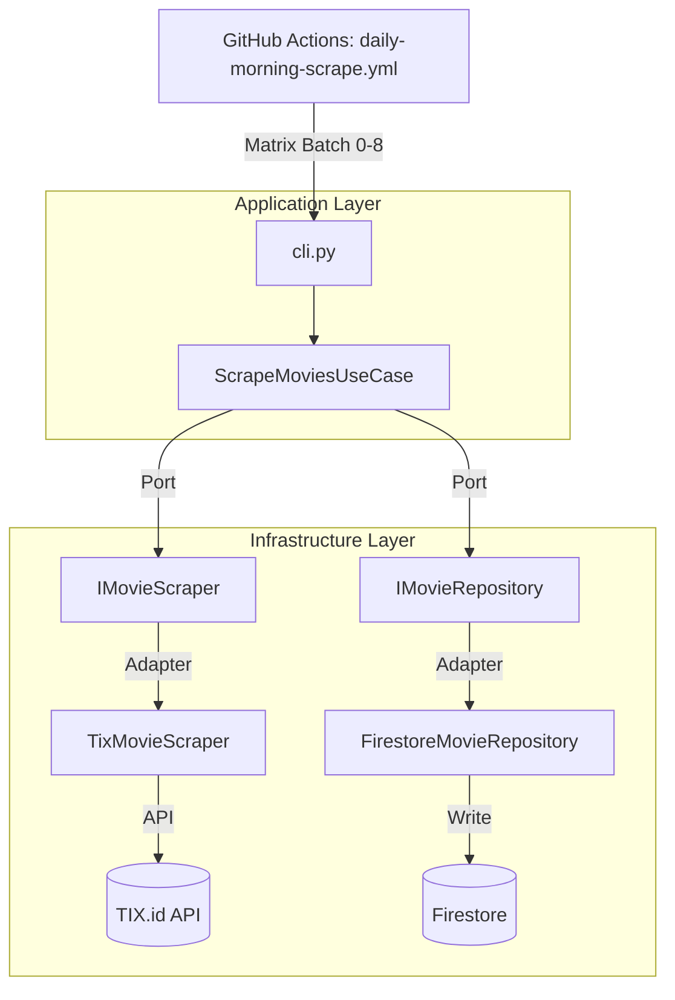
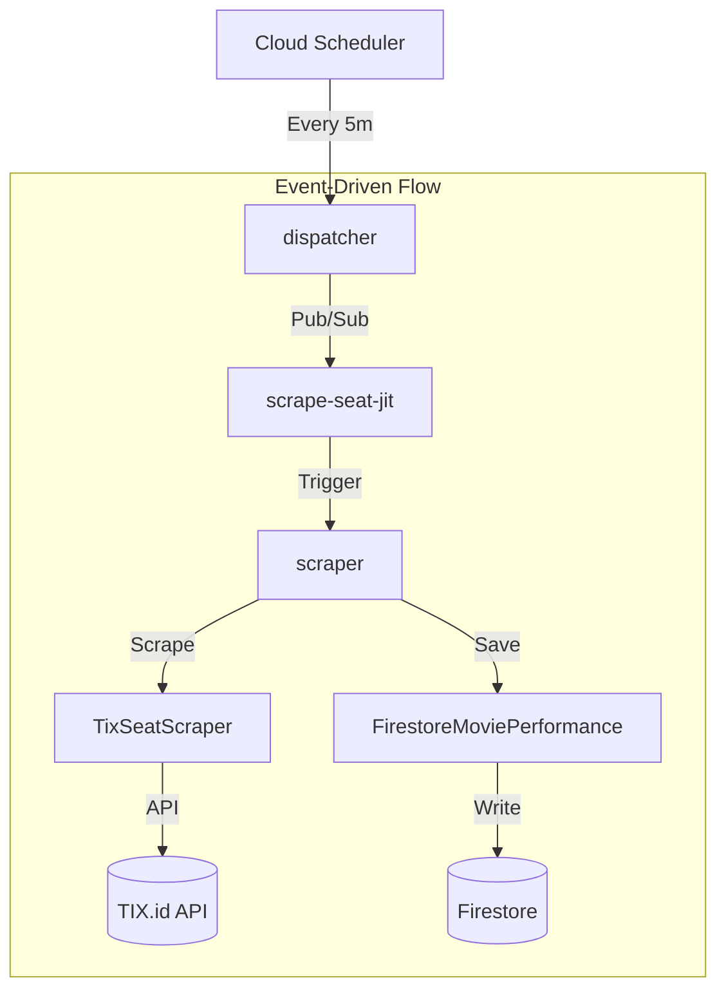
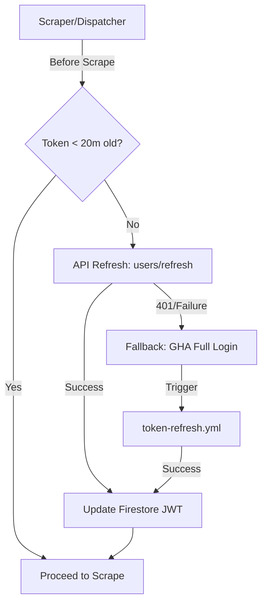
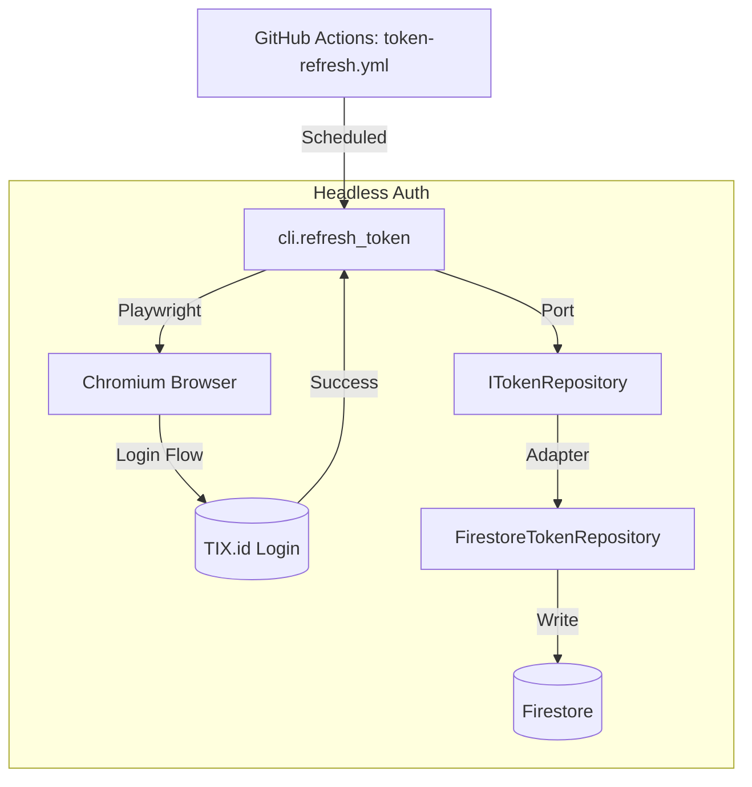

# CineRadar Backend 🐍

> **The Scraper & API Engine**
> Powered by Python 3.12, Playwright, and Firestore.

## ⚡ Quick Start

We use `uv` for lightning-fast package management.

### 1. Install Environment
```bash
uv sync
uv run playwright install chromium
```

### 2. Run Scraper (Test Mode)
Scrape a single city to verify the pipeline:
```bash
uv run python -m backend.cli --city BANDUNG
```

### 3. Check Auth Status
Verify your TIX.id token is valid:
```bash
uv run python -m backend.cli.refresh_token --check
```

---

## 🗺️ Visual Call Graphs

### 1. Daily Movie & Schedule Scrape (`daily-morning-scrape.yml`)
The "Big Scrape" that runs every morning to refresh the entire catalog.



**Narrative**: This workflow is our **Daily Catalog Sync**. Every morning at 6 AM, GitHub Actions launches a set of parallel workers. These workers use our CLI to trigger the "Scrape Movies" Use Case. This Use Case acts as an orchestrator: it doesn't know how to scrape or where to save, it simply asks its "Ports" (Interfaces) to do the work. This allows us to swap the scraper or the database implementation without touching the core business logic.

### 2. Real-time JIT Seat Scraping (Cloud Functions)
The "Heartbeat" that monitors seat availability for upcoming shows.



**Narrative**: This is our **High-Frequency Heartbeat** for real-time occupancy. Running 24/7 on Google Cloud, it uses a "Fan-out" architecture. Every 5 minutes, a Dispatcher identifies all movies starting soon and tosses thousands of individual tasks into a queue. A fleet of small, fast Scraper functions then wakes up to fetch seat maps and save compressed snapshots. This allows the system to scale to thousands of simultaneous screenings without getting blocked.

### 3. Hybrid Token Management (The "Anti-Expire" System)
Ensures we always have valid credentials without performing a heavy browser login every time.



**Narrative**: This is our **Multi-Tiered Auth Insurance**. 
- **Tier 1 (Every Scrape)**: The system checks if the current key is "fresh" (>20 mins life).
- **Tier 2 (Every 30 Mins)**: If the key is aging, the system performs a silent **API Refresh**. This is a fast, backend-to-backend call that takes milliseconds and doesn't involve a browser.
- **Tier 3 (Every 60 Days)**: If the silent refresh fails (the "master key" expired), it triggers the heavy **Credential Bot** (Diagram #4 below) to do a full browser login.

### 4. Auth Refresh Pipeline (`token-refresh.yml`)
The "Headless Bot" that performs a full browser login to refresh credentials.



**Narrative**: This is our **Emergency Master-Key Generator**. When the silent API refresh is no longer enough, this bot launches a hidden web browser (Playwright) to mimic a human user logging in. It types the phone number, handles the password, and extracts a brand new 91-day "Master Key" (Refresh Token). This happens automatically every 2 months or as an emergency fallback.

---

## 📂 Directory & File Glossary

We follow **Clean Architecture** principles. The dependency rule is strict: inner layers (Domain) deeply know nothing about outer layers (Infrastructure/CLI).

### 1. `backend/domain/` (The Core / Inner Circle)
**Pure business logic.** Contains the heart of the application.
- **Dependencies**: ZERO. No external libraries, no database code, no browser code.
- **Contents**:
    - `models/`:
      - `Movie`: The aggregate root. A movie entity containing metadata and schedules across all cities.
      - `Showtime`: A single screening slot (time, availability status).
      - `Room`: A cinema hall (e.g., "IMAX", "Regular") containing showtimes.
      - `Theatre`: A physical cinema location.
      - `TheatreSchedule`: A theatre's schedule *specifically for one movie*.
      - `SeatOccupancy`: The sold/available status of a specific showtime's seating plan.
      - `Token`: The JWT authentication token for TIX.id.
      - `ScrapeResult`: A summary object representing the outcome of a scraping job.
    - `errors.py`:
      - `CineRadarError`: Base exception for all domain errors.
      - `TokenExpiredError`: Raised when the TIX.id JWT is invalid or expired.
      - `LoginFailedError`: Raised when headless browser login fails.
      - `ScrapingError`: Generic error for when TIX.id data cannot be fetched/parsed.
      - `StorageError`: Raised when Firestore/File writing fails.
      - `DataNotFoundError`: Raised when expected data (like a movie) is missing.
      - `ValidationError`: Raised when data integrity checks fail (e.g., negative prices).
    - `time.py`: Timezone specifications.

### 2. `backend/application/` (The Application Layer)
**Orchestration logic.** These are the "Use Cases" of the system.
- **Dependencies**: Imports from `domain`.
- **Contents**:
    - `use_cases/`:
      - `ScrapeMoviesUseCase`: Orchestrates the daily movie availability scrape.
      - `ScrapSeatsUseCase`: Orchestrates real-time seat occupancy checks.
      - `RefreshTokenUseCase`: Handles TIX.id login and token rotation.
      - `ValidateDataUseCase`: Ensures scraped data meets quality standards before saving.
    - `ports/`:
      - `IMovieRepository`: Interface for saving/loading movie snapshots.
      - `ITheatreRepository`: Interface for managing theatre locations/metadata.
      - `ITokenRepository`: Interface for securely storing the JWT auth token.
      - `IScraperRunRepository`: Interface for logging scraper execution history.
      - `IMovieScraper`: Interface for fetching movie data from an external source.
      - `ISeatScraper`: Interface for fetching seat layouts.
      - `IGeocodingService`: Interface for converting addresses to coordinates.
      - `INotificationService`: Interface for sending alerts (Slack/Email).

### 3. `backend/infrastructure/` (The Adapters)
**implementations.** The dirty details of how things actually work.
- **Dependencies**: Imports from `application` (to implement ports) and `domain`.
- **Contents**:
    - `repositories/`:
      - `FirestoreMovieRepository`: Implementation of `IMovieRepository` using Cloud Firestore.
      - `FirestoreTheatreRepository`: Implementation of `ITheatreRepository` using Cloud Firestore.
      - `FirestoreTokenRepository`: Implementation of `ITokenRepository` for managing TIX.id tokens.
      - `FirestoreMoviePerformanceRepository`: specialised repository for storing compressed seat layouts.
      - `FileMovieRepository`: Local filesystem implementation for testing/debugging.
    - `scrapers/`:
      - `TixMovieScraper`: Clean implementation of `IMovieScraper` that wraps the legacy `CineRadarScraper`.
      - `TixSeatScraper`: Clean implementation of `ISeatScraper` that uses `SeatScraper`.
    - `core/`:
      - `CineRadarScraper`: **Legacy** Playwright script for scraping movie schedules (monolithic).
      - `SeatScraper`: **Legacy** logic for calling TIX.id B2B APIs to get seat layouts.
      - `Geocoder`: Service for resolving theatre addresses to coordinates using external APIs.
    - `city_data.py`: Static configuration of supported cities and their IDs.
    - `token_refresher.py`: Utility class for checking and refreshing tokens (hybrid logic).

### 4. `backend/cli/` & `backend/functions/` (The Entry Points)
**Controllers.** The outer layer that triggers the application.

- **`cli/` (GitHub Actions / Local)**:
  - **Purpose**: Long-running "Batch" jobs (e.g., daily scraping, geocoding).
  - **Execution**: Run by GitHub Actions `schedule` or manually on your laptop.
- **`functions/` (Google Cloud Platform)**:
  - **Purpose**: "Real-Time" or "Event-Driven" jobs (e.g., checking seats every 5 mins).
  - **Execution**: Triggered by Cloud Scheduler (Pub/Sub) or HTTP requests.

- **Dependencies**: Imports everything. This is where `UseCases` are instantiated with specific `Infrastructure` implementations.
- **Contents**:
    - `cli/`:
      - `cli.py`: Main entry point for `movies` and `seats` subcommands. Orchestrates local executions.
      - `refresh_token.py`: Headless browser automation to log in to TIX.id and refresh the JWT.
      - `movie_performance.py`: Aggregates seat snapshots into movie performance metrics.
      - `monthly_geocode.py`: Batched job to geocode new theatres using Google Maps/OSM.
      - `merge_batches.py`: Utility to combine partial JSON results from parallel scrapers.
      - `populate_firestore.py`: Utility to upload scraped JSON data to Firestore.
      - `validate.py`: Quality assurance script that runs sanity checks on scraped data.
    - `functions/`:
      - `dispatcher/`: Pub/Sub triggered function that fans out scraping jobs to workers.
      - `scraper/`: The worker function that scrapes a specific batch of movies/theatres.
      - `sweeper/`: Cleanup function that monitors job status and handles failures/retries.

      > ⚠️ **CRITICAL: Cloud Functions are self-contained.** 
      > Each function deploys with `--source=.` which only uploads files in that function's directory.
      > **DO NOT** extract shared code to common modules - this will break deployments.
      > Code duplication with `backend/infrastructure/` is **intentional**.
      > See [`functions/README.md`](functions/README.md#critical-self-contained-function-constraint) and 
      > [`docs/cloud-functions-architecture.md`](docs/cloud-functions-architecture.md) for details.

---

## 📊 Job Lifecycle Logging

The JIT scraper system includes comprehensive job lifecycle logging for debugging and performance analysis.

### Architecture

Each scraping job is tracked from creation to completion:

```
scraper_logs/{date}/dispatches/{HH-MM}/jobs/{showtime_id}
├── status: "pending" → "running" → "success" | "error"
├── lifecycle: {created_at, started_at, finished_at, ...}
├── checkpoints: {token, api, schema, occupancy, snapshot}
├── timing: {queue_time_ms, api_call_ms, processing_ms}
└── error: {checkpoint, code, message}  # if failed
```

### Checkpoints

| Checkpoint | Description |
|------------|-------------|
| JOB_CREATED | Job published by dispatcher |
| JOB_STARTED | Scraper picked up the job |
| TOKEN_ACQUIRED | Auth token obtained |
| API_CALLED | TIX API request started |
| API_COMPLETED | TIX API response received |
| SCHEMA_VALIDATED | Response schema validated |
| OCCUPANCY_CALCULATED | Seat occupancy computed |
| SNAPSHOT_SAVED | Data saved to Firestore |
| JOB_COMPLETED | Final status logged |

### Key Classes

- **[`JobLogger`](functions/scraper/main.py)**: Tracks job lifecycle checkpoints
- **[`log_job_creation()`](functions/dispatcher/main.py)**: Logs job creation in dispatcher

### Timing Metrics

The system automatically computes:
- **queue_time_ms**: Time from job creation to scraper pickup
- **token_acquire_ms**: Time to get valid auth token
- **api_call_ms**: TIX API response time
- **processing_ms**: Total scraper execution time

### Cost Estimate

~$2.71/month for full lifecycle logging (~8 writes × 6,265 jobs × 30 days)
