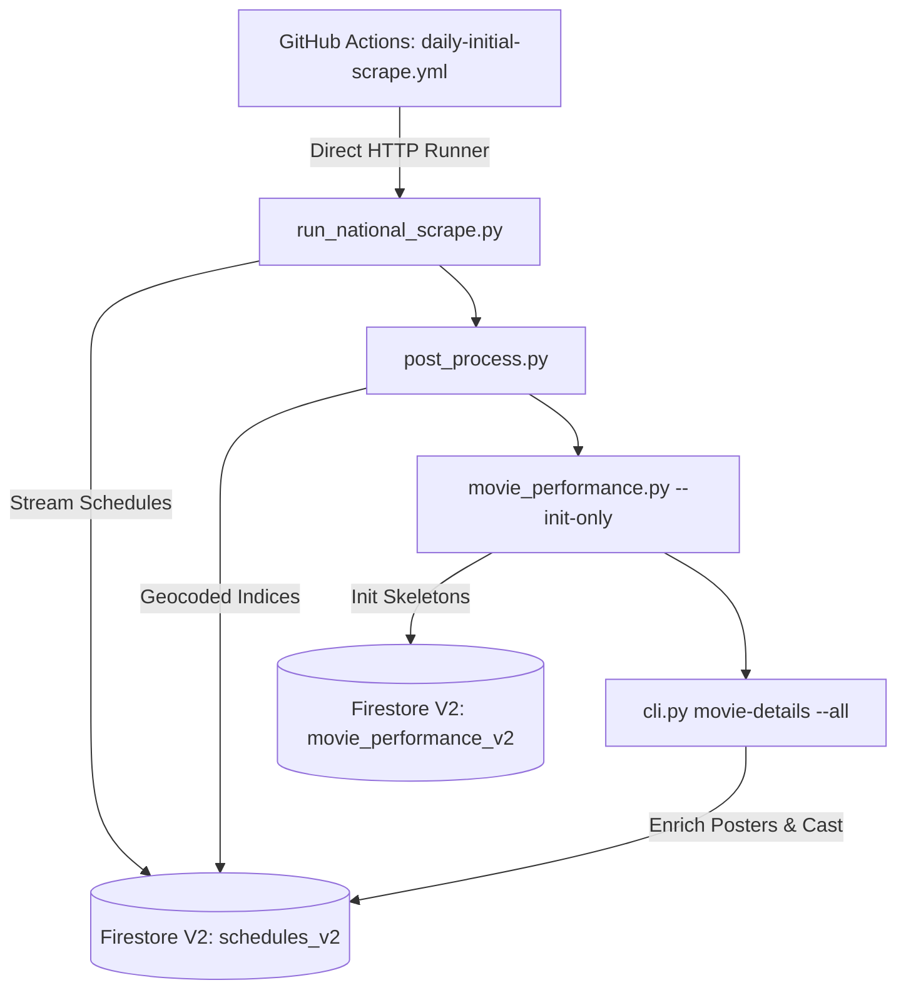
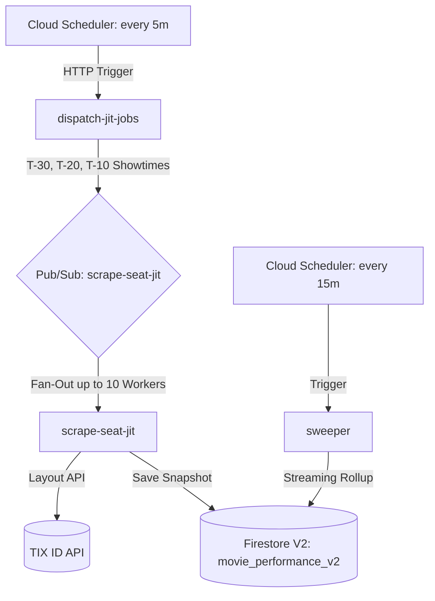
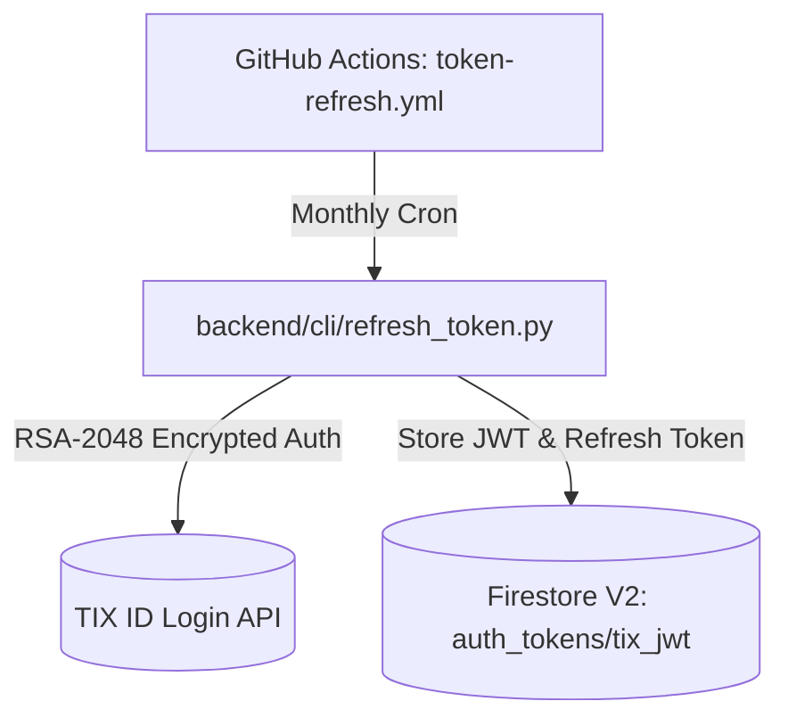

# CineRadar Backend 🐍

> **The Nationwide Scraping & Data Pipeline Engine**  
> Powered by Python 3.13 (`uv`), Google Cloud Functions (Gen 2), and Cloud Firestore V2.

---

## ⚡ Quick Start

Dependencies are locked via `uv`.

### 1. Synchronize Python Environment
```bash
uv sync
```

### 2. Verify Authentication Status
Check if the current TIX ID JWT in Firestore is active:
```bash
uv run python backend/cli/refresh_token.py --check
```

### 3. Run Nationwide Scraper Locally
```bash
# Run full nationwide schedule scrape
uv run python backend/scripts/run_national_scrape.py

# Post-process, index cities, and link theatre IDs
uv run python backend/scripts/post_process.py
```

---

## 🗺️ High-Level System Architecture

### 1. Daily Catalog & Schedule Pipeline (`daily-initial-scrape.yml`)
Runs every morning at **05:30 AM WIB** (`22:30 UTC`) and **09:00 AM WIB** (`02:00 UTC`):



---

### 2. Real-Time JIT Seat Scraping (GCP Cloud Functions)
Monitors real-time seat availability leading up to showtimes:



---

### 3. Monthly RSA Token Refresh (`token-refresh.yml`)
Automated RSA-2048 encryption flow executed on the 1st of every month to refresh the 91-day master key:



---

## 📂 Directory Layout

```
backend/
├── application/         # Core application use cases and abstract interfaces (Ports)
├── cli/                 # CLI entry points (refresh_token.py, movie_performance.py)
├── domain/              # Pure domain models (Movie, Showtime, Theatre, Room)
├── functions/           # Self-contained GCP Gen 2 Cloud Functions (dispatcher, scraper, sweeper)
├── infrastructure/      # Concrete adapters (Firestore repositories, TIX HTTP scrapers)
├── schemas/             # Pydantic V2 data contracts (Movie, Theatre, Token, MovieDetails)
└── scripts/             # Production pipeline runners (run_national_scrape.py, post_process.py)
```

> ⚠️ **CRITICAL: Cloud Functions Isolation**  
> Each directory in `backend/functions/` (`dispatcher/`, `scraper/`, `sweeper/`) deploys as an independent, self-contained Cloud Function. **Do not** import from `backend.*` inside `functions/`.
