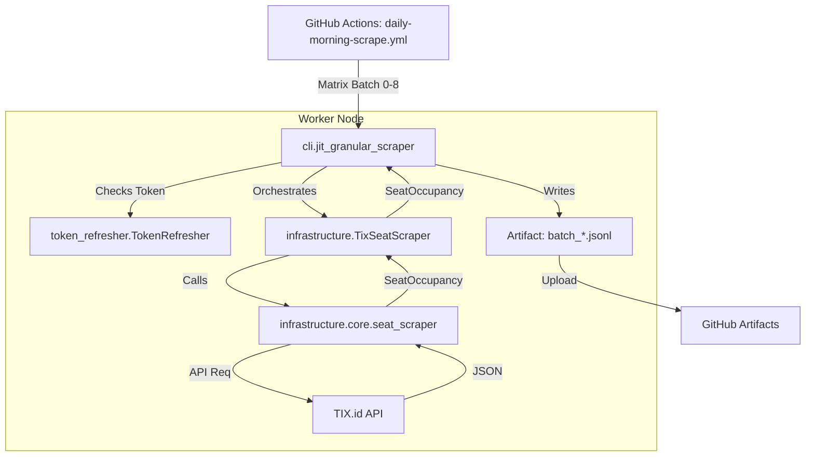
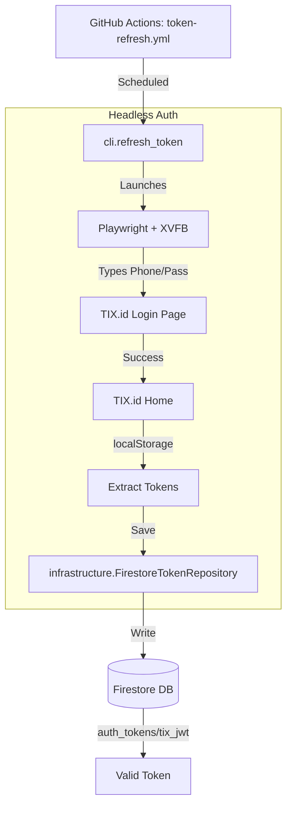

# CineRadar Backend 🐍

> **The Scraper & API Engine**
> Powered by Python 3.12, Playwright, and Firestore.

## ⚡ Quick Start

We use `uv` for lightning-fast package management.

### 1. Install Environment
```bash
uv sync
uv run playwright install chromium
```

### 2. Run Scraper (Test Mode)
Scrape a single city to verify the pipeline:
```bash
uv run python -m backend.cli --city BANDUNG
```

### 3. Check Auth Status
Verify your TIX.id token is valid:
```bash
uv run python -m backend.cli.refresh_token --check
```

---

## 🗺️ Visual Call Graphs

### 1. Daily Scrape Pipeline (`daily-morning-scrape.yml`)
This workflow runs parallel batches to scrape movies and seats.



### 2. Auth Refresh Pipeline (`token-refresh.yml`)
This workflow performs a full "Headless Browser" login to regenerate the long-lived refresh token.



---

## 📂 Directory & File Glossary

### 1. `backend/cli/` (Controllers)
The **Entry Points**. These files are the "main" scripts called by GitHub Actions. They handle arguments, logging, and coordinating the domain logic.

| File | Associated Workflow | Responsibility |
|------|---------------------|----------------|
| **`cli.py`** | `daily-morning-scrape.yml` | **Main CLI.** Entry point for `movies` and `seats` subcommands. |
| **`movie_performance.py`** | `daily-morning-scrape.yml` | **[NEW] Performance Aggregator.** Aggregates seat data into per-movie summaries. |
| **`refresh_token.py`** | `token-refresh.yml` | **The Login Bot.** Launches a headless browser to perform a real login flow and capture the JWT from localStorage. |
| **`daily_summary.py`** | `daily-summary.yml` | **The Reporter.** Aggregates Firestore data at midnight to calculate total audience stats. |
| **`monthly_geocode.py`** | `monthly-geocode.yml` | **The Mapper.** Queries Google Maps API to fix missing coordinates for new theatres. |
| `merge_batches.py` | `daily-morning-scrape.yml` | Merges the 9 parallel request artifacts into one single valid JSON file. |
| `populate_firestore.py` | `daily-morning-scrape.yml` | Reads the merged movie JSON and upserts it to Firestore (`snapshots` collection). |
| `upload_seats.py` | `daily-morning-scrape.yml` | Reads the merged seat JSON and upserts to Firestore (`seat_snapshots` collection). |
| `validate.py` | `daily-morning-scrape.yml` | Runs sanity checks on the scraped data (e.g. "Are there 0 movies?") before we upload. |

### 2. `backend/infrastructure/` (The "How")
The technical implementations. This is where the dirty work happens.

| Directory/File | Responsibility |
|----------------|----------------|
| **`scrapers/`** | **The Scraper Implementations.** |
| ↳ `seat_scraper.py` | `TixSeatScraper`: The clean wrapper that mimics the `ISeatScraper` interface. |
| ↳ `base.py` | `BaseScraper`: Shared logic for browser initialization and user-agent rotation. |
| **`core/`** | **Core Scraping Logic.** |
| ↳ `seat_scraper.py` | `SeatScraper`: The *actual* complex logic that calls the TIX.id API. |
| ↳ `tix_client.py` | `CineRadarScraper`: Main movie/schedule scraper. |
| **`repositories/`** | **Database Adapters.** |
| ↳ `firestore_repo.py` | Handles all reads/writes to Google Cloud Firestore. |
| ↳ `firestore_token.py` | Specialized logic for reading/writing the JWT auth token document. |
| ↳ `firestore_movie_performance.py` | **[NEW]** Persistence for `movie_performance` collection. |
| `token_refresher.py` | **Hybrid Auth Logic.** Checks if the token is alive. If dying (<5m TTL), it calls the TIX API to refresh it. |

### 3. `backend/domain/` (The "What")
Pure business logic and data structures. Zero external dependencies (no Firestore lib, no Playwright lib).

| File | Responsibility |
|------|----------------|
| `models/` | Contains dataclasses (e.g. `Movie`, `Showtime`, `SeatOccupancy`, `MoviePerformance`). |
| `models/movie_performance.py` | **[NEW]** `ShowtimeSnapshot` and `MoviePerformance` dataclasses. |
| `errors.py` | Custom exception classes (e.g. `TokenExpiredError`, `ScrapeError`) for clean error handling. |

### 4. `backend/application/` (The "Orchestrator")
This layer holds "Use Cases" and "Services" that connect Scrapers to Repositories.

| Directory/File | Responsibility |
|----------------|----------------|
| `use_cases/` | Scripts that orchestrate multi-step operations (e.g., scraping flow). |
| `services/` | **[NEW]** Business logic services. |
| ↳ `performance_aggregator.py` | `PerformanceAggregator`: Aggregates showtime snapshots into movie summaries. |
