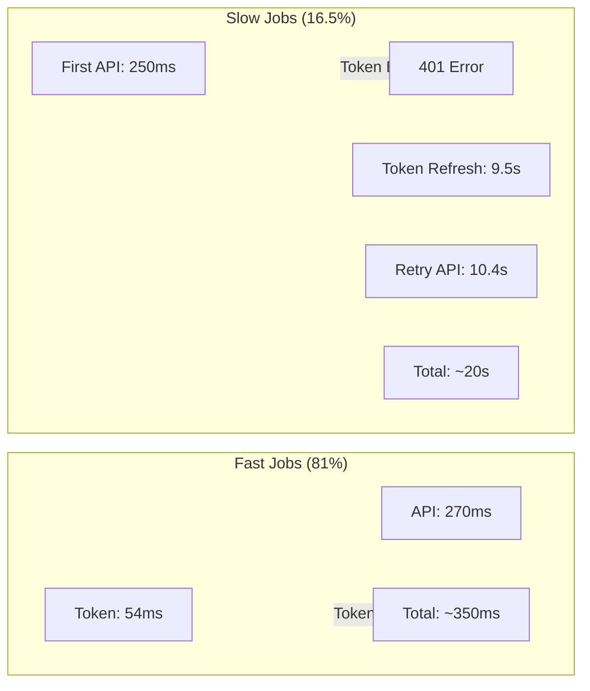
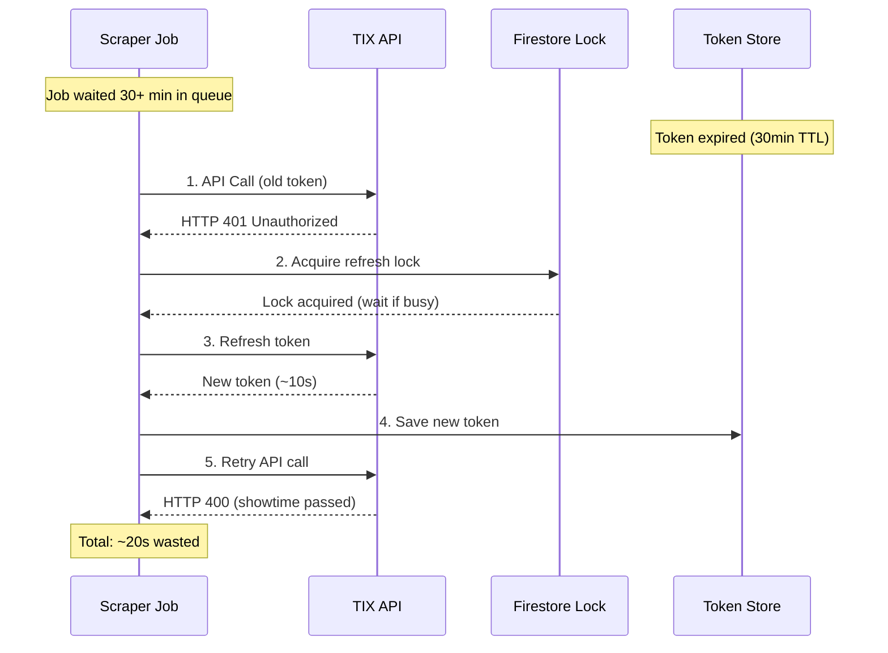
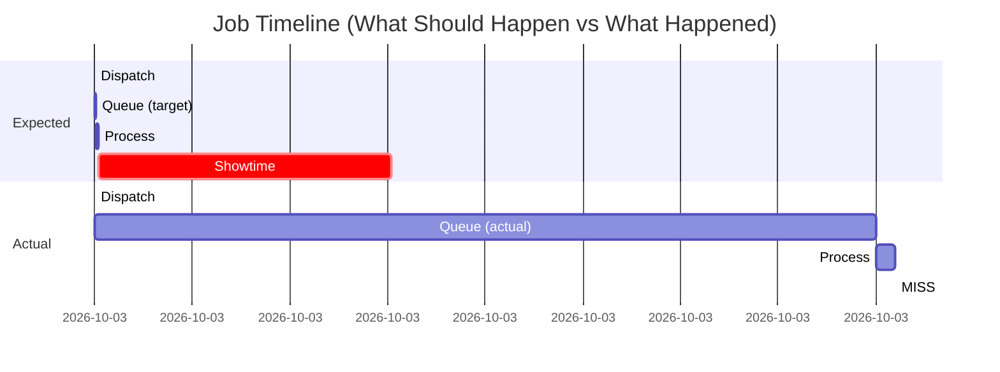
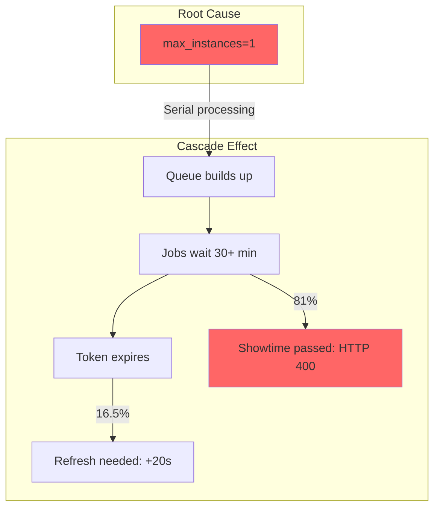
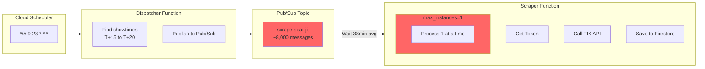
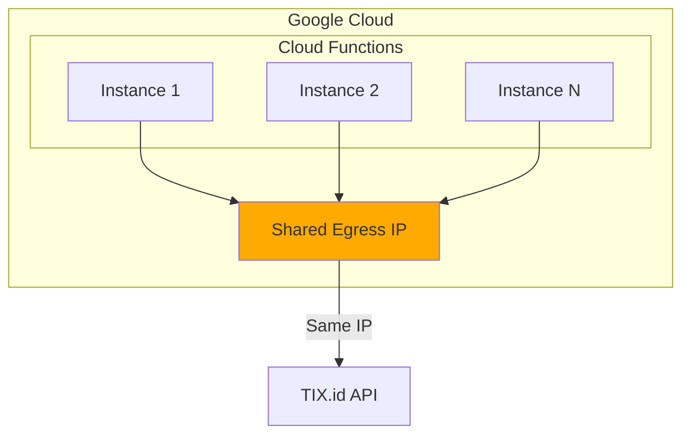
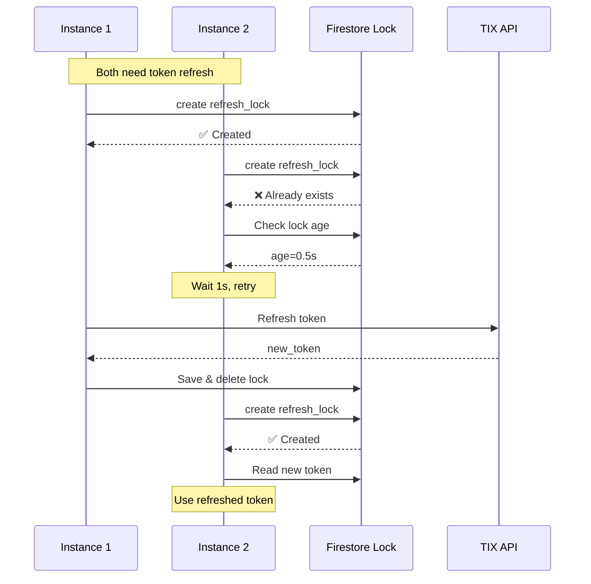
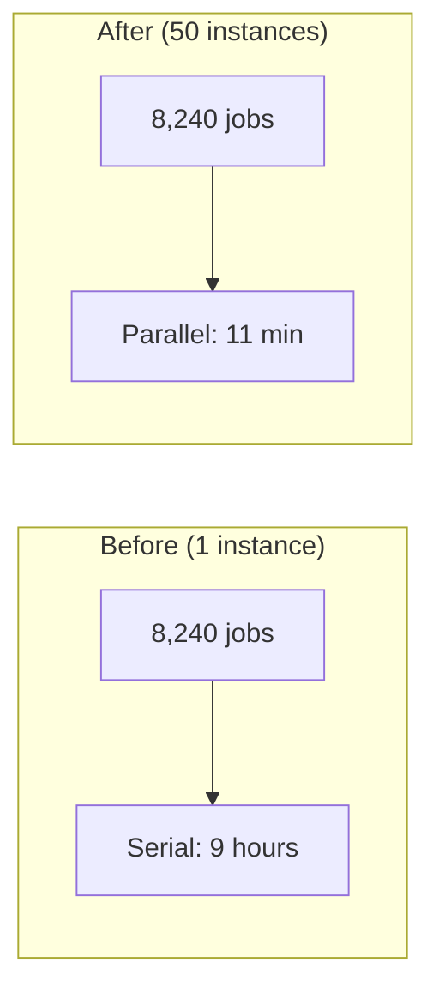
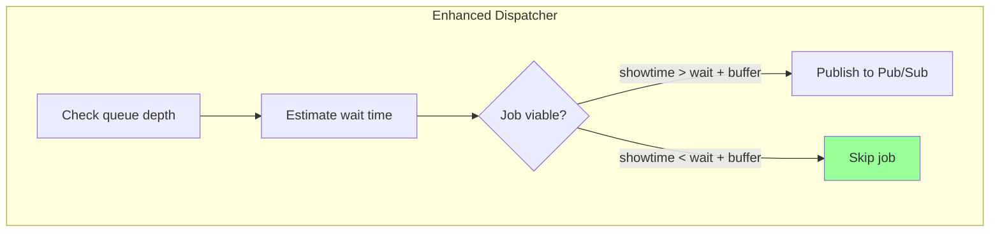

# CineRadar JIT Scraper Analysis: February 16, 2026

> **Executive Summary**: Analysis of 8,240 scraper jobs revealed a **7.4% success rate** caused by Pub/Sub queue backlog. Jobs waited an average of **38.7 minutes** in queue, by which time showtimes had passed. This document provides complete analysis, root causes, and scored recommendations.

---

## Table of Contents

1. [Key Metrics](#1-key-metrics)
2. [Job Duration Distribution](#2-job-duration-distribution)
3. [Queue Time Analysis](#3-queue-time-analysis)
4. [Error Analysis](#4-error-analysis)
5. [Root Cause Analysis](#5-root-cause-analysis)
6. [Architecture Deep Dive](#6-architecture-deep-dive)
7. [Solution Comparison](#7-solution-comparison)
8. [Recommendations](#8-recommendations)

---

## 1. Key Metrics

### Overall Statistics (All 8,240 Jobs Processed)

| Metric | Value |
|--------|-------|
| **Total Jobs** | 8,240 |
| **Success** | 608 (7.4%) |
| **Errors** | 7,632 (92.6%) |
| **Avg Queue Time** | 38.7 minutes |
| **Max Queue Time** | 4.1 hours |
| **Token Refreshes** | 1,595 |
| **Token Failures** | 0 |

### Success Rate by Time of Day

| Time (UTC) | Jobs | Success Rate | Avg Queue Time |
|------------|------|--------------|----------------|
| 09:00-11:00 | ~50 | 50-67% | <30s |
| 11:00-13:00 | ~800 | 10-20% | 1-10 min |
| 13:00-17:00 | ~5,000 | 0-5% | 30-45 min |
| 17:00-22:00 | ~2,400 | 5-20% | 20-40 min |

---

## 2. Job Duration Distribution

### Bimodal Distribution Discovered

```
Duration Distribution (8,240 jobs):

  <100ms      :     0 (  0.0%) 
  100-250ms   :    61 (  0.7%) 
  250-500ms   :  5990 ( 72.7%) ████████████████████████████████████
  500ms-1s    :   554 (  6.7%) ███
  1s-2s       :    58 (  0.7%) 
  2s-5s       :    11 (  0.1%) 
  5s-10s      :    26 (  0.3%) 
  10s-15s     :   179 (  2.2%) █
  15s-20s     :   810 (  9.8%) ████
  >20s        :   551 (  6.7%) ███
```

### Percentiles

| Percentile | Duration |
|------------|----------|
| P10 | 289ms |
| P25 | 313ms |
| P50 (Median) | 348ms |
| P75 | 582ms |
| P90 | 19.5s |
| P95 | 21.4s |
| P99 | 21.6s |
| Max | 25.9s |

### Two Distinct Populations



### Fast Jobs vs Slow Jobs Comparison

| Metric | Fast Jobs (81%) | Slow Jobs (16.5%) |
|--------|-----------------|-------------------|
| **Count** | 6,674 | 1,361 |
| **Processing Time** | ~350ms | ~20s |
| **Token Acquire** | 54ms avg | 9.5s avg |
| **API Call** | 270ms avg | 10.4s avg |
| **Token Refreshed** | 0.5% | **100%** |
| **Error Code** | HTTP 400 (expired) | HTTP 401 (token) |

### Why 16.5% of Jobs Are Slow



**Key Insight**: All 1,361 slow jobs experienced token refresh due to queue wait time exceeding token TTL (30 min).

---

## 3. Queue Time Analysis

### Queue Time Distribution

```
Queue Time Distribution (8,240 jobs):

  <1s         :    25 (  0.3%) 
  1s-10s      :   315 (  3.8%) 
  10s-1min    :   808 (  9.8%) 
  1min-5min   :  1041 ( 12.6%) 
  5min-15min  :  1058 ( 12.8%) 
  15min-30min :  1354 ( 16.4%) ████
  30min-1h    :  1555 ( 18.9%) █████
  1h-2h       :  1584 ( 19.2%) █████
  >2h         :   500 (  6.1%) ██
```

### Queue Time Percentiles

| Percentile | Queue Time |
|------------|------------|
| P50 | 24.2 minutes |
| P75 | 45 minutes |
| P90 | 90 minutes |
| P99 | 2.5 hours |
| Max | 4.1 hours |

### Impact on JIT Window



**44% of jobs waited more than 30 minutes** - by which time the showtime had passed.

---

## 4. Error Analysis

### Error Code Breakdown

| Error Code | Count | Percentage | Meaning |
|------------|-------|------------|---------|
| HTTP 400 | 6,178 | 81.0% | `EXPIRED_EVENT_DETAIL` - showtime passed |
| HTTP 401 | 1,452 | 19.0% | Token expired - triggers refresh |
| HTTP 500 | 2 | 0.03% | Server error |

### Error by Checkpoint

All errors occurred at `api_call` checkpoint - meaning token was acquired successfully.

### Sample Error Messages

**HTTP 400 (81% of errors)**:
```
EXPIRED_EVENT_DETAIL: Please check the latest schedule to get your movie ticket.
```

**HTTP 401 (19% of errors)**:
```
Token expired (401)
```

---

## 5. Root Cause Analysis

### Primary Issue: Pub/Sub Queue Backlog



### Bottleneck Math

| Variable | Value |
|----------|-------|
| Jobs per day | ~8,240 |
| Avg processing time | 3.9s |
| Max instances | 1 |
| **Theoretical min time** | **8,240 × 3.9s = 8.9 hours** |
| Actual time | ~12 hours |
| Scheduler window | 15 hours (09:00-24:00) |

**The system is fundamentally undersized**: 8.9 hours minimum processing time exceeds the 5-minute JIT window.

### Token Management Assessment

| Aspect | Status | Evidence |
|--------|--------|----------|
| Distributed lock | ✅ Works | 0 token failures |
| Stale lock takeover | ✅ Works | 30s timeout |
| Concurrent refresh | ✅ Handled | Lock wait implemented |
| Token saved to Firestore | ✅ Works | 1,595 refreshes saved |

**Token management is SOLID. The issue is queue time, not token logic.**

---

## 6. Architecture Deep Dive

### Current Architecture



### Max Instances vs Concurrency

```
max_instances = HOW MANY VMS
concurrency   = HOW MANY REQUESTS PER VM
```

| Config | VMs | Reqs/VM | Total Parallel |
|--------|-----|---------|----------------|
| Current | 1 | 1 | **1** |
| Option A | 50 | 1 | 50 |
| Option B | 5 | 10 | 50 |

### IP Address Considerations



**All instances share the same egress IP**. Scaling instances does NOT give more IPs.

### Token Refresh Lock Architecture



**Token lock is SAFE for concurrent scaling.**

---

## 7. Solution Comparison

### Approach A: Scale Out (Increase Max Instances)

**Change**: `--max-instances=1` → `--max-instances=10-50`



#### Scoring

| Criterion | Weight | Score | Weighted |
|-----------|--------|-------|----------|
| Implementation Speed | 2 | 9 | 18 |
| Code Changes | 2 | 10 | 20 |
| Risk Level | 3 | 6 | 18 |
| Cost Impact | 1 | 5 | 5 |
| Scalability | 2 | 7 | 14 |
| **Total** | **10** | | **7.5/10** |

#### Pros & Cons

| Pros | Cons |
|------|------|
| ✅ 1 line change | ⚠️ TIX rate limit risk (429) |
| ✅ Deploys in seconds | ⚠️ All instances share IP |
| ✅ Immediate effect | ⚠️ +$20-50/mo cost |
| ✅ Auto-scales | ⚠️ No priority handling |

---

### Approach B: Pre-filtering + Priority Queue

**Change**: Skip jobs that will expire before processing



#### Scoring

| Criterion | Weight | Score | Weighted |
|-----------|--------|-------|----------|
| Implementation Speed | 2 | 4 | 8 |
| Code Changes | 2 | 4 | 8 |
| Risk Level | 3 | 8 | 24 |
| Cost Impact | 1 | 8 | 8 |
| Scalability | 2 | 9 | 18 |
| **Total** | **10** | | **6.6/10** |

#### Pros & Cons

| Pros | Cons |
|------|------|
| ✅ No wasted API calls | ⚠️ ~100 lines of code |
| ✅ Better cost efficiency | ⚠️ Miss ~5% data |
| ✅ No rate limit risk | ⚠️ 2-3 hours to implement |
| ✅ Addresses root cause | ⚠️ More complex |

---

### Approach Comparison Matrix

| Aspect | Approach A (Scale) | Approach B (Filter) |
|--------|-------------------|---------------------|
| **Time to Deploy** | 5 minutes | 2-3 hours |
| **Lines Changed** | 1 | ~100 |
| **Immediate Impact** | High | Medium |
| **Long-term Stability** | Medium | High |
| **Cost Change** | +$20-50/mo | -$10-20/mo |
| **API Rate Limit Risk** | High | Low |
| **Data Completeness** | 100% | 95% |

---

## 8. Recommendations

### Recommended: Hybrid Approach

#### Phase 1: Immediate (Today)
```bash
# Conservative scale-up
gcloud functions deploy scrape-seat-jit \
    --max-instances=5 \
    --concurrency=1
```

**Expected Result**: 5× throughput = 8,240 jobs in ~1.8 hours

#### Phase 2: This Week
Add queue-aware dispatch filtering:

```python
def should_dispatch_job(showtime_dt: datetime, queue_depth: int) -> bool:
    """Skip jobs that will expire before processing."""
    now = datetime.now(JAKARTA_TZ)
    time_until_showtime = (showtime_dt - now).total_seconds()
    estimated_wait = queue_depth * 3.9  # avg processing time
    buffer_seconds = 300  # 5 min safety
    
    return time_until_showtime > (estimated_wait + buffer_seconds)
```

#### Phase 3: Next Week (if needed)
- Monitor for HTTP 429 rate limit errors
- If safe, increase to `max-instances=10`
- Add `concurrency=3` for I/O parallelism

### Monitoring Checklist

After deployment, add alerts for:

| Metric | Threshold | Action |
|--------|-----------|--------|
| Pub/Sub backlog | > 100 messages | Alert + auto-scale |
| Average queue time | > 5 minutes | Investigate |
| HTTP 429 count | > 0 | Reduce max-instances |
| HTTP 400 rate | > 20% | Check queue depth |
| HTTP 401 count | > 10 | Check token refresh |

### Cost Estimate

| Config | Jobs/Day | Cost/Month |
|--------|----------|------------|
| Current (1 instance) | 8,240 | ~$1.30 |
| Phase 1 (5 instances) | 8,240 | ~$3.50 |
| Phase 2 + filtering | ~7,800 | ~$2.00 |

---

## Appendix

### Data Files

| File | Description |
|------|-------------|
| `/tmp/full_analysis_2026-02-16.json` | Full JSON export (8,240 jobs) |
| `backend/cli/analyze_errors.py` | Analysis tool |

### How to Reproduce Analysis

```bash
# Run analysis
uv run python -m backend.cli.analyze_errors --date 2026-02-16 --jobs --json > analysis.json

# Key metrics
cat analysis.json | python3 -c "
import json, sys
d = json.load(sys.stdin)
print(f'Total jobs: {d[\"summary\"][\"total_jobs\"]}')
print(f'Success rate: {d[\"summary\"][\"by_status\"][\"success\"]/d[\"summary\"][\"total_jobs\"]*100:.1f}%')
print(f'Avg queue time: {d[\"timing\"][\"queue_time\"][\"avg_ms\"]/1000/60:.1f} min')
"
```

---

## Conclusion

The Feb 16, 2026 scraper run achieved only **7.4% success rate** due to Pub/Sub queue backlog. The root cause is `max_instances=1` creating a serial processing bottleneck.

**Key Findings**:
1. **44% of jobs waited >30 minutes** in queue
2. **16.5% of jobs needed token refresh** (adding 20s each)
3. **81% of errors were HTTP 400** (showtime passed)
4. **Token management is SOLID** - safe to scale

**Immediate Action**: Increase `max-instances=5` and monitor for rate limits.

**Long-term Solution**: Add queue-aware dispatch filtering to skip non-viable jobs.
