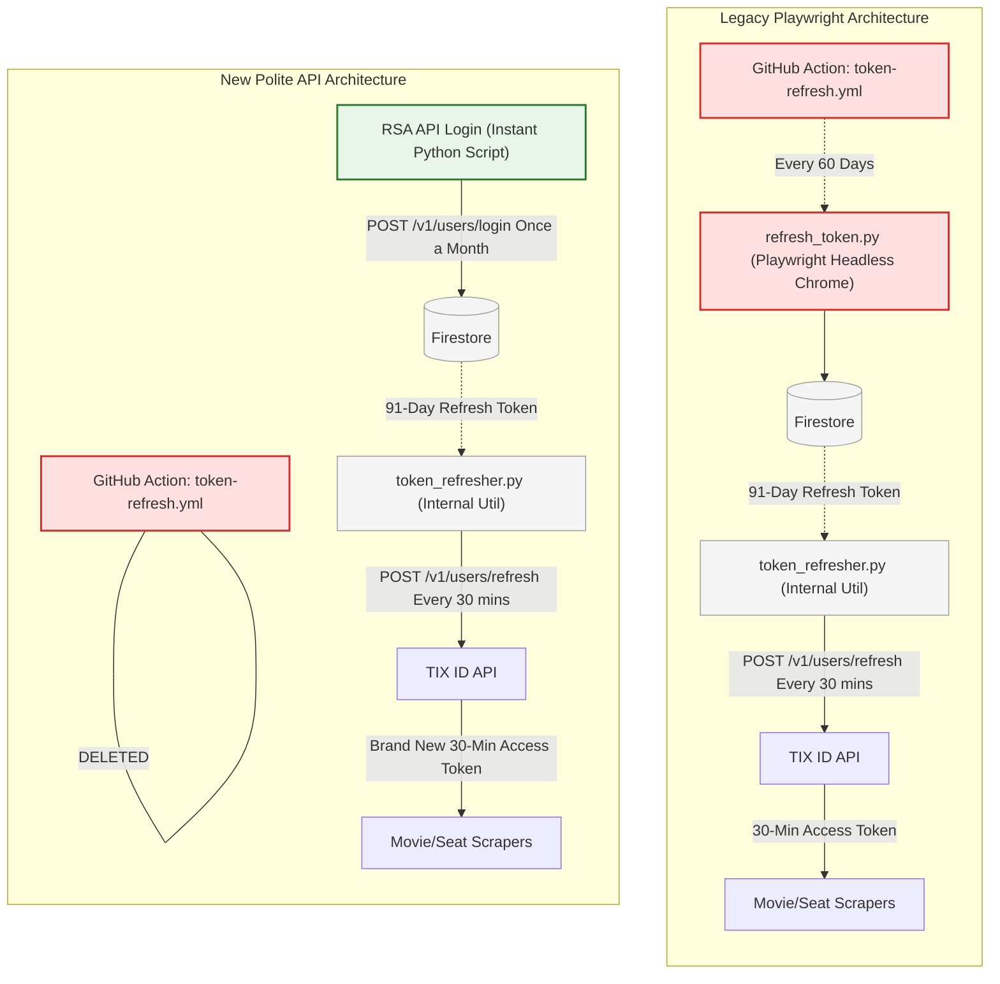

# TIX ID Scraper API Migration Plan

This document outlines the step-by-step, atomic deployment strategy for migrating the CineRadar TIX ID scraper from a Playwright headless browser implementation to a fast, direct HTTP API implementation.

**Philosophy:** Make minimal, isolated changes. Deploy, manually test, verify production data (e.g., Firestore checks), and monitor before proceeding to the next step.

---

## FAQ: Untangling the Confusing "Refresh" Terminology

Because this project evolved over time, several scripts share very similar names but perform entirely different jobs. Let's break down the terminology clearly:

### The Two Types of Tokens
To understand the architecture, you first need to understand that TIX ID uses two different tokens:
1. **The "Short-Term Access Token" (expires every 30 mins):** This is the token the scrapers actually use in the HTTP headers (`Authorization: Bearer ...`) to fetch movie data.
2. **The "Long-Term Refresh Token" (expires every 91 days):** This token is *only* used to ask TIX ID to generate a new Short-Term Access Token without having to type in a phone number and password again.

### The Three Confusingly Named Scripts
*(Here is what each script actually does)*

1. **`token-refresh.yml` (The 60-Day GitHub Action)** 
   - **What it does:** Once every two months, this GitHub Action wakes up and runs `refresh_token.py`.
2. **`refresh_token.py` (The Heavy Playwright Login Script)**
   - **What it does:** It launches a headless Chrome browser, types in your phone/password, clicks the login button, and steals a brand new **Long-Term Refresh Token** (91 days) from the browser's storage. It saves this long-term token into Firestore.
3. **`token_refresher.py` (The Fast 30-Minute Internal Utility)**
   - **What it does:** Right before a scraper runs daily, it checks if the **Short-Term Access Token** has expired. If it has, this utility reads the long-term token from Firestore and sends a fast API ping to TIX ID (`POST /v1/users/refresh`) to instantly spawn a fresh 30-minute Short-Term Access Token so the scraper can do its job.

### Why this Migration Plan radically simplifies everything:
Instead of completely throwing away the Long-Term Refresh Token, we are going to adopt a **"Polite & Secure Hybrid"** approach. Corporate backends (Web Application Firewalls) treat frequent, repetitive `/login` requests as suspicious credential stuffing. 

To mimic a natural user who logs in once and stays logged in, **we will keep the 30-Minute `/refresh` loop exactly as it is today during daily scraping.** 

The monumental difference is how we get that initial Long-Term Refresh Token! 
- **Before:** We needed a heavy, fragile Playwright GitHub Action running every 60 days just to steal a token out of `localStorage`.
- **After:** We simply use our new 0.5-second RSA Encrypted `/login` API call once a month to natively generate the Long-Term token, store it in Firestore, and then happily use `/refresh` endpoints all day long.

**Playwright is 100% dead.** The scary 15-second Playwright GitHub Action is replaced by a safe, instant Python script. 

### Token Architecture: Before vs After

---

## Phase 1: The Authentication Backbone

### Step 1: Replace `TokenRefresher.refresh_token()`
**Goal:** Prove that the RSA encrypted API login generates a valid JWT token that can be securely stored.
**Changes:**
1. Update `TokenRefresher.refresh_token()` in `backend/cli/refresh_token.py` to use `httpx` and the RSA encryption script instead of Playwright.
2. Add the `pycryptodomex` and `httpx` dependencies.

**Verification:**
- **Local:** Run `uv run python -m backend.cli.refresh_token --check` before and after the change. Ensure a new token is stored.
- **Deployment:** Deploy the branch. Manually trigger the `.github/workflows/token-refresh.yml` action.
- **Data Check:** Inspect Firestore to confirm the `tix_token` document was updated with a valid, fresh JWT and timestamp.

---

## Phase 2: Integrating the Base Scraper

### Step 2: Replace `BaseScraper._login()`
**Goal:** Update the core base class so that the main movie scraping workflows (run daily) utilize the new, fast API login to fetch their working session token. We will keep Playwright intact for the actual movie/schedule scraping part in this step.
**Changes:**
1. Modify `_login` in `backend/infrastructure/scrapers/base.py` to use the direct API payload.
2. Ensure the returned token is properly assigned to `self.auth_token` for the scraping methods to pick up.

**Verification:**
- **Local:** Run a limited local scrape (e.g., `uv run python -m backend.cli --schedules --city "JAKARTA"`). Watch the logs to confirm the "Logging in via direct API" message appears and scraping continues flawlessly.
- **Deployment:** Deploy the branch. Let the next `daily-morning-scrape.yml` or a manual dispatch run.
- **Data Check:** Verify that the daily scrape output still correctly pushes data to Firestore. The scraping should take exactly the same amount of time, except the initial 15-second login delay will be gone.

---

## Phase 3: Moving to Full API Scraping

### Step 3: Replace `/v1/movies` Fetching
**Goal:** Migrate the scraping of the main "NOW PLAYING" movies list from Playwright interception to a direct `httpx` API call.
**Changes:**
1. In `tix_client.py` (`CineRadarScraper.scrape`), remove the logic that uses Playwright to navigate to `app.tix.id/cities` and intercept the `/v1/movies` route.
2. Replace it with a direct `httpx.AsyncClient` GET request to `https://api-b2b.tix.id/v1/movies?city_id={id}&movie_type=NOW_PLAYING&timezone=7`, utilizing the token fetched in Phase 2.
3. *Note: Keep Playwright initialized in this step because `_fetch_movie_schedule` still relies on it.*

**Verification:**
- **Local:** Run the scraper locally. Verify it successfully hits the API and parses the first layer of movie data (title, genres, poster).
- **Deployment:** Deploy the branch. Let the daily scraper run.
- **Data Check:** Verify the exact same number of movies are being scraped across the cities as before.

### Step 4: Replace `/v1/schedules/movies` Fetching
**Goal:** Migrate the highly intensive schedule fetching logic away from Playwright routing.
**Changes:**
1. In `tix_client.py` (`_fetch_movie_schedule`), remove the Playwright `page.route` interception.
2. Replace it with direct rate-limited `httpx` GET requests to `v1/schedules/movies/{movie_id}`.
3. Apply `aiolimiter.AsyncLimiter(max_rate=2, time_period=1)` around the API call here to guarantee we do not surpass 2 hits per second.

**Verification:**
- **Local:** Run the scraper locally with the `--schedules` flag. Watch the output to ensure the rate limiter smoothly spaces out the API calls without throwing HTTP 429 Too Many Requests errors.
- **Deployment:** Deploy the branch. Trigger the daily scraper manually or let the cron job run.
- **Data Check:** Review Firestore to ensure theatre rooms, showtimes, and `is_available` flags are correctly populated for the movies. Wait and monitor over a 24-48 hour window to ensure stability.

---

## Phase 4: The Cleanup

### Step 5: Complete Playwright Eradication
**Goal:** Entirely delete Playwright from the codebase and build pipelines now that it is functionally dead code.
**Changes:**
1. Remove all `playwright.async_api` imports and initializations (`start()`, `browser.launch()`, `new_context()`, `new_page()`) from `tix_client.py`, `base.py`, and `refresh_token.py`.
2. Delete `uv run playwright install chromium` and `uv run playwright install-deps chromium` commands from ALL GitHub Actions workflow `.yml` files.
3. Run `uv remove playwright` to remove the package dependency permanently.

**Verification:**
- **Local:** `uv sync` to simulate the clean environment, then run the scraper tests. Ensure the script runs instantly.
- **Deployment:** Deploy the PR. Observe the GitHub Action build logs. The "Install dependencies" step, which used to take minutes downloading Chromium, should now finish in a few seconds. The entire Action execution time should drop drastically.
