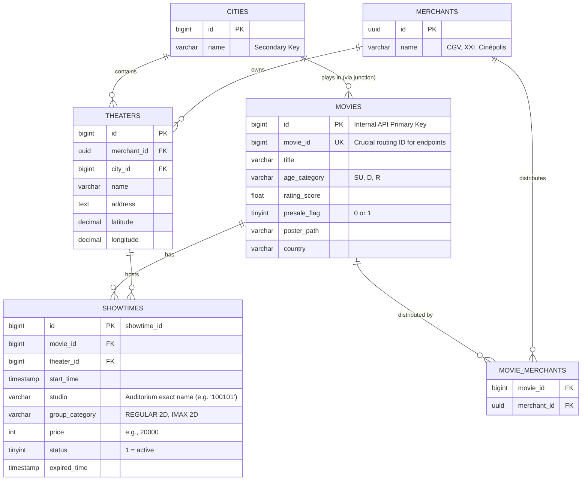

# TIX ID Inferred Relational Schema (ERD)

Because we treat the B2B API as a black box and can only read the aggregated JSON responses, we cannot know the exact table structures, indexes, or column names of their backend database. 

However, by analyzing the structure, ids, foreign keys, and 1:N / N:M relationships implied by the JSON payloads, we can accurately reverse-engineer **a projected Relational Schema**.

This document outlines the inferred SQL schema powering their `api-b2b.tix.id` application.

## 1. Projected Entity-Relationship Diagram (ERD)



## 2. Evidence from JSON Structures

### A. The 64-bit Identifiers
IDs provided in the JSON payload (like `"1996107175268794368"`) are strings simply to avoid JavaScript `Number` precision loss on the client side. They are definitively **64-bit Integers (`BIGINT`)** generated algorithmically on the backend (likely [Snowflake IDs](https://en.wikipedia.org/wiki/Snowflake_ID) based on insertion timestamp).

*Hint: Merchants are an exception here; they use `UUID` strings (`2224f7e3-da00-4fb9-9de3-2b888d83ac03`), implying Merchants were sourced from an older or external master table design.*

### B. Many-to-Many Relationships (N:M)
The `/v1/movies` endpoint returns movies with a nested array of `merchant` objects. Because one movie plays at many merchants (XXI, CGV), and one merchant plays many movies, they cannot store `merchant_id` directly in the `movies` table. This implies a junction table exists (`MOVIE_MERCHANTS`).

### C. Denormalization in the Showtimes Payload
The `/v1/schedules/movies/{id}` payload returns theater data heavily intertwined with showtime data. 
In the API response, it looks like:
```json
"theaters": [
  {
    "id": 1178839445806338048,
    "address": "Plaza Slipi Jaya",
    "price_groups": [ { "show_time": [...] } ]
  }
]
```
In a healthy relational database, `address` is stored strictly in the `THEATERS` table, and the `SHOWTIMES` table only holds keys like `theater_id`. 
We can infer that the API's SQL query runs heavily optimized `JOIN` operations across these tables, grouping by `theater` and `price_group_category` server-side, and denormalizing the result into a clean nested JSON object so the Flutter Mobile app can render the UI instantly without making secondary requests for the theater addresses.

### D. Time Storage
In JSON, dates are passed back as `1771977600000` (Milliseconds since Unix Epoch). While MongoDB occasionally saves these directly as long ints, PostgreSQL or MySQL implementations typically store these natively as `TIMESTAMP` or `DATETIME`, converting them to Epoch integers at the API middleware layer.
