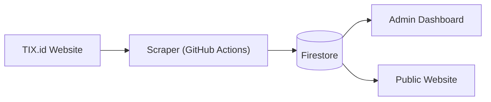
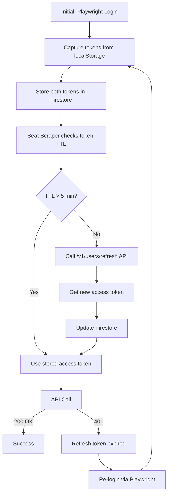
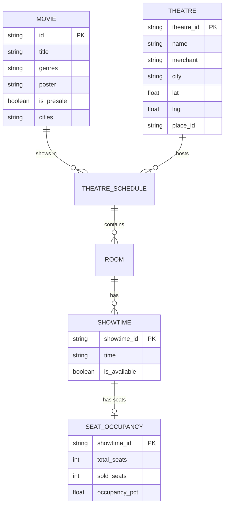
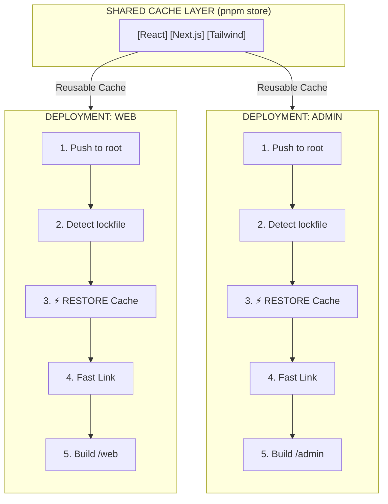

# Architecture & Data Flow

This document details the system design, data flow, token management, and infrastructure of CineRadar.

## System Overview

CineRadar is a 3-scraper pipeline for TIX.id movie data collection, feeding into a Firestore database that powers both an Admin Dashboard and a Public Consumer Web App.

---

## Core Philosophy: Stability First

To ensure long-term maintainability and prevent "bit-rot," CineRadar adheres to a strict **Stability DNA**:

### 1. LTS Preference
We prioritize **Long Term Support (LTS)** versions for all core runtimes and frameworks.
*   **Node.js**: Use Active LTS (even numbered releases) where possible.
*   **Python**: Use stable releases supported by major cloud providers.
*   **Next.js**: While we use the latest major version (e.g., 16), we treat it as our stable base and do not chase experimental flags.

### 2. SemVer Strategy (`^` Range)
We strictly follow Semantic Versioning:
*   **Major Updates**: Manual intervention required.
*   **Minor/Patch Updates**: Allowed via Caret (`^`) versioning to automatically consume security patches and non-breaking features.
*   **Lockfiles**: `pnpm-lock.yaml` and `uv.lock` are the sources of truth. We trust them to pin exact versions for reproducibility.

### 3. Boring Technology
We choose "boring" (proven) technology for critical infrastructure.
*   **Database**: Firestore (Serverless, Managed) over self-hosted SQL.
*   **Auth**: TIX.id's native tokens over complex custom auth flows.
*   **Hosting**: Vercel Managed Infrastructure over custom VPS/Docker Swarm.

---

### Data Flow



### Infrastructure Components

- **Backend**: Python 3.12+ using Playwright for scraping and interactions.
- **Database**: Google Cloud Firestore (NoSQL).
- **Admin**: Next.js 16 (React 19) dashboard.
- **Web**: Next.js 16 (React 19) consumer app.
- **CI/CD**: GitHub Actions for daily scraping, testing, and deployment.

---

## Token Architecture (Single Source of Truth)

> ℹ️ **Note**
> This is the authoritative documentation for TIX.id authentication. All other docs reference this section.

### Token Types

| Token | localStorage Key | Actual TTL | Purpose |
|-------|-----------------|------------|---------|
| **Access** | `authentication_token` | **30 minutes** | Bearer token for API calls |
| **Refresh** | `authentication_refresh_token` | **~91 days** | Used for programmatic token refresh |

### Token Lifecycle



### Programmatic Token Refresh

> 🚨 **Important**
> **No browser needed!** We can refresh tokens via API using the refresh token.

**Endpoint:**
```http
POST https://api-b2b.tix.id/v1/users/refresh
Authorization: Bearer <REFRESH_TOKEN>
```

**Key Points:**
- Works **before** token expiration (proactive refresh)
- Works **after** token expiration (recovery)
- Refresh token lasts ~91 days
- Initial login still requires Playwright (to get refresh token)

### Firestore Storage

Tokens are stored at `auth_tokens/tix_jwt`:

```json
{
    "token": "eyJhbGciOiJIUzI1NiIs...",
    "refresh_token": "eyJhbGciOiJIUzI1NiIs...",
    "phone": "6285***",
    "stored_at": "2025-12-23T06:26:40.591620"
}
```

---

## Database Schema

### Entity Relationship Diagram



### Firestore Collections

| Collection | Document ID | Purpose |
|------------|-------------|---------|
| `theatres` | `{theatre_id}` | Master list of cinema locations |
| `snapshots` | `latest` or `{YYYY-MM-DD}` | Daily movie data (slim) |
| `schedules/{date}/movies` | `{movie_id}` | Full showtime data by date |
| `seat_snapshots` | `{showtime_id}_{type}_{time}` | Seat occupancy data |
| `scraper_runs` | `{timestamp}_{type}` | Scraper run logs |
| `auth_tokens` | `tix_jwt` | JWT token storage |

---

## CI/CD Pipeline

### Workflow Overview

| Workflow | Trigger | Purpose |
|----------|---------|---------|
| `ci.yml` | Push/PR to `backend/**` | Lint, test, type-check Python |
| `smoke-tests.yml` | Push to `admin/**` + daily | Test production APIs |
| `security-scan.yml` | Push/PR + weekly | CodeQL security analysis |
| `failure-reporter.yml` | Workflow failures | Auto-create GitHub issues |
| `daily-scrape.yml` | Daily 6 AM WIB | Movie + seat scraping |
| `token-refresh.yml` | Daily 5:50 AM WIB | JWT token refresh |

### Quality Gates (Required for Merge)

The `PR Checks` workflow serves as a single required status check for branch protection. It enforces `ruff` linting, `mypy` type checking, `pytest` coverage (min 70%), and Frontend Type Check + Build.

---

## Deployment Strategy (Monorepo)

CineRadar uses a **Monorepo structure** (pnpm workspaces) for code organization, but deploys primarily via **Git Integration** on Vercel.

### Vercel Deployment Model

Although `web` and `admin` live in the same repository, they are deployed as separate Vercel projects (isolated environments) that benefit from a shared build cache.

| Project | Root Directory | Hosting | URL |
|---------|----------------|---------|-----|
| **cineradar-web** | `web` | Vercel | `cineradar-id.vercel.app` |
| **cineradar-admin** | `admin` | Vercel | `cineradar-admin.vercel.app` |

### Shared Cache Efficiency

Vercel automatically detects the root `pnpm-lock.yaml` and optimizes the build pipeline:



### Key Benefits
1.  **Faster Builds**: Dependencies are downloaded once per commit, not twice.
2.  **Versioning**: Guarantees `web` and `admin` use the exact same library versions defined in the root lockfile.
3.  **Isolation**: Users on `cineradar-web` never load admin code bundles.
