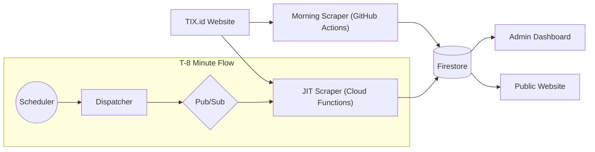
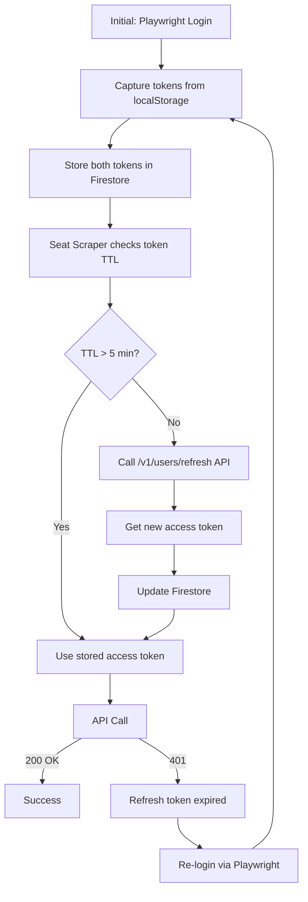
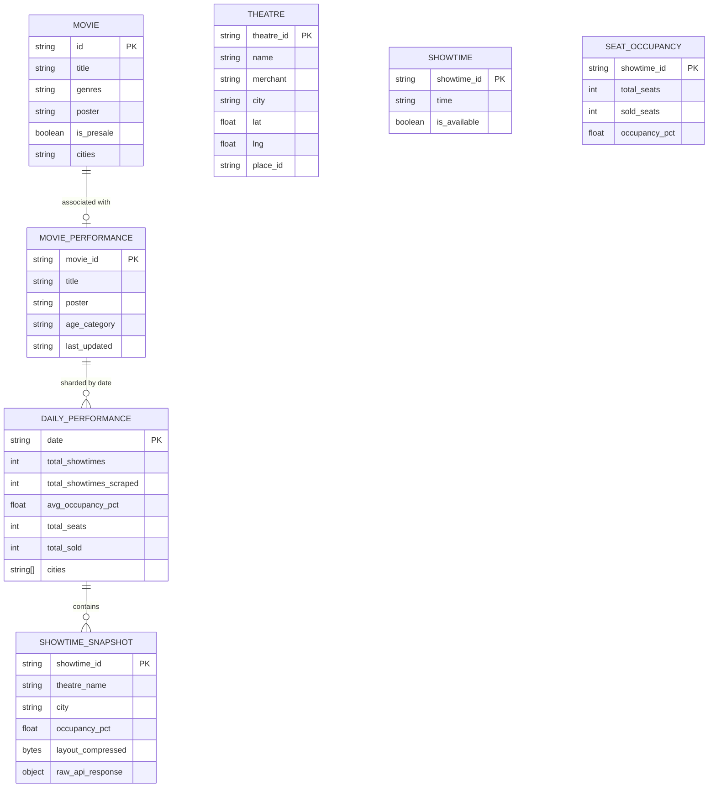
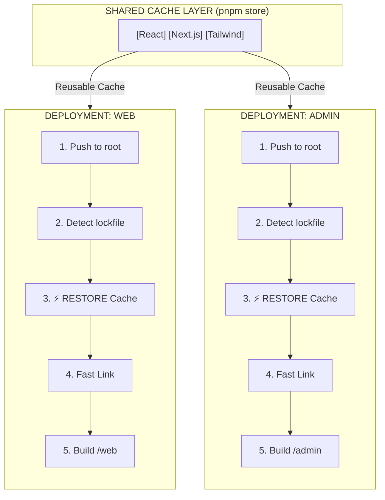

# Architecture & Data Flow

This document details the system design, data flow, token management, and infrastructure of CineRadar.

## System Overview

CineRadar is a **hybrid scraping pipeline** combining **Morning Batch** (GitHub Actions) and **Real-Time JIT** (Cloud Functions) for TIX.id movie data collection, feeding into a Firestore database.

---

## Software Architecture (Backend)

We follow a loose **Clean Architecture** pattern to separate concerns between the "Runner" (CLI), the "Business Logic" (Domain), and the "Tools" (Infrastructure).

| Layer | Directory | Responsibility |
|-------|-----------|----------------|
| **1. Controllers** | `cli/` | **Entry Points.** Every file here corresponds to a `run` or `workflow` command. Contains *no business logic*, only orchestration. |
| **2. Use Cases** | `application/` | **Orchestrator.** Connects Scrapers -> Repositories. Pure Python, no framework dependencies. |
| **3. Domain** | `domain/` | **Entities.** Pydantic models & Error definitions. pure business rules. |
| **4. Contracts** | `schemas/` | **DTOs.** Data Transfer Objects for validation (e.g., TIX.id JSON responses). |
| **5. Infrastructure** | `infrastructure/` | **The "Dirty" Work.** Playwright scripts, Token Logic, and Firestore Adapters. |

---

## Core Philosophy: Stability First

To ensure long-term maintainability and prevent "bit-rot," CineRadar adheres to a strict **Stability DNA**:

### 1. LTS Preference
We prioritize **Long Term Support (LTS)** versions for all core runtimes and frameworks.
*   **Node.js**: Use Active LTS (even numbered releases) where possible.
*   **Python**: Use stable releases supported by major cloud providers.
*   **Next.js**: While we use the latest major version (e.g., 16), we treat it as our stable base and do not chase experimental flags.

### 2. SemVer Strategy (`^` Range)
We strictly follow Semantic Versioning:
*   **Major Updates**: Manual intervention required.
*   **Minor/Patch Updates**: Allowed via Caret (`^`) versioning to automatically consume security patches and non-breaking features.
*   **Lockfiles**: `pnpm-lock.yaml` and `uv.lock` are the sources of truth. We trust them to pin exact versions for reproducibility.

### 3. Boring Technology
We choose "boring" (proven) technology for critical infrastructure.
*   **Database**: Firestore (Serverless, Managed) over self-hosted SQL.
*   **Auth**: TIX.id's native tokens over complex custom auth flows.
*   **Hosting**: Vercel Managed Infrastructure over custom VPS/Docker Swarm.

---

### Data Flow


```mermaid
flowchart LR
    TIX[TIX.id Website] --> S_MORNING["Morning Scraper (GitHub Actions)"]
    TIX --> S_JIT["JIT Scraper (Cloud Functions)"]
    
    S_MORNING --> FS[(Firestore)]
    S_JIT --> FS
    
    FS --> AD[Admin Dashboard]
    FS --> PW[Public Website]
    
    subgraph S_JIT_FLOW [T-8 Minute Flow]
        SCHED((Scheduler)) --> DISP[Dispatcher]
        DISP --> PUBSUB{Pub/Sub}
        PUBSUB --> S_JIT
    end
    
    click AD "https://cineradar-admin.vercel.app"
    click PW "https://cineradar-id.vercel.app"
```

### Infrastructure Components

- **Backend**: Python 3.12+ using Playwright for scraping and interactions.
- **Database**: Google Cloud Firestore (NoSQL).
- **Admin**: Next.js 16 (React 19) dashboard.
- **Web**: Next.js 16 (React 19) consumer app.
- **CI/CD**: GitHub Actions for daily scraping, testing, and deployment.

### Morning Scraper Environment (Batch)

The morning pipeline operates on **GitHub Actions**, utilizing parallel jobs to map the entire day's schedule.

#### Executors & Limits
*   **Runner**: `ubuntu-latest` (Standard GitHub Actions runner).
*   **Limits**: Subject to standard GitHub Actions concurrency and storage quotas.
*   **Strategy**: Matrix strategies are used to parallelize scraping batches, reducing total runtime.

#### Workflow Ecosystem

| Workflow | Schedule | Python Entry Point | Description |
|----------|----------|--------------------|-------------|
| **`daily-morning-scrape.yml`** | Daily 06:00 WIB | `.cli`, `.movie_performance` | **Main Pipeline**. Scrapes movies and aggregates performance data. |
| **`token-refresh.yml`** | Bi-monthly | `.refresh_token` | **Headless Login**. Runs full Playwright with `xvfb` to regenerate valid refresh tokens (~90 day TTL). |

#### Artifact Data Handover

Data is not persisted immediately. Instead, it flows through **GitHub Artifacts** to ensure atomic operations and easier debugging.

1.  **Intermediate Artifacts** (1-day retention):
    *   `batch-{N}`: Raw movie data from each parallel shard.

2.  **Final Artifacts** (7-day retention):
    *   `scrape-data-{RUN_ID}`: Merged, validated movie dataset.

### JIT Scraper Environment (Real-Time)

The **Just-In-Time (JIT) Scraper** captures seat occupancy data 8 minutes before a showtime starts (T-8) to get the final "sold" count.

#### Architecture
*   **Platform**: Google Cloud Functions (Gen 2).
*   **Trigger**: Event-driven architecture.

#### Component Flow
1.  **Cloud Scheduler**: Triggers the Dispatcher every 5 minutes.
2.  **Dispatcher**: Queries Firestore for showtimes starting between T+8 and T+15 minutes.
3.  **Pub/Sub**: Distributes individual scraping jobs (`scrape-seat-jit` topic).
4.  **Scraper Function**: Consumes message, fetches seat layout, and updates Firestore.

#### Persistence Layer
Final persistence is handled by dedicated Python CLI tools at the end of the workflows:
*   `populate_firestore`: Syncs merged movie/theatre data.
*   `movie_performance`: Aggregates seat data into per-movie performance summaries.
*   `refresh_token`: Updates auth tokens in `auth_tokens/tix_jwt`.

---

## Token Architecture (Single Source of Truth)

> ℹ️ **Note**
> This is the authoritative documentation for TIX.id authentication. All other docs reference this section.

### Token Types

| Token | localStorage Key | Actual TTL | Purpose |
|-------|-----------------|------------|---------|
| **Access** | `authentication_token` | **30 minutes** | Bearer token for API calls |
| **Refresh** | `authentication_refresh_token` | **~91 days** | Used for programmatic token refresh |

### Token Lifecycle


```mermaid
flowchart TD
    A[Initial: Playwright Login] --> B[Capture tokens from localStorage]
    B --> C[Store both tokens in Firestore]
    C --> D[Seat Scraper checks token TTL]
    D --> E{TTL > 5 min?}
    E -->|Yes| F[Use stored access token]
    E -->|No| G[Call /v1/users/refresh API]
    G --> H[Get new access token]
    H --> I[Update Firestore]
    I --> F
    F --> J[API Call]
    J -->|200 OK| K[Success]
    J -->|401| L[Refresh token expired]
    L --> M[Re-login via Playwright]
    M --> B
```

### Programmatic Token Refresh

> 🚨 **Important**
> **No browser needed!** We can refresh tokens via API using the refresh token.

**Endpoint:**
```http
POST https://api-b2b.tix.id/v1/users/refresh
Authorization: Bearer <REFRESH_TOKEN>
```

**Key Points:**
- Works **before** token expiration (proactive refresh)
- Works **after** token expiration (recovery)
- Refresh token lasts ~91 days
- Initial login still requires Playwright (to get refresh token)

### Firestore Storage

Tokens are stored at `auth_tokens/tix_jwt`:

```json
{
    "token": "eyJhbGciOiJIUzI1NiIs...",
    "refresh_token": "eyJhbGciOiJIUzI1NiIs...",
    "phone": "6285***",
    "stored_at": "2025-12-23T06:26:40.591620"
}
```

---

## Database Schema

### Entity Relationship Diagram


```mermaid
erDiagram
    MOVIE ||--o| MOVIE_PERFORMANCE : "associated with"
    MOVIE_PERFORMANCE ||--o{ DAILY_PERFORMANCE : "sharded by date"
    DAILY_PERFORMANCE ||--o{ SHOWTIME_SNAPSHOT : "contains"
    
    MOVIE {
        string id PK
        string title
        string genres
        string poster
        boolean is_presale
        string cities
    }
    
    THEATRE {
        string theatre_id PK
        string name
        string merchant
        string city
        float lat
        float lng
        string place_id
    }
    
    SHOWTIME {
        string showtime_id PK
        string time
        boolean is_available
    }
    
    SEAT_OCCUPANCY {
        string showtime_id PK
        int total_seats
        int sold_seats
        float occupancy_pct
    }
    
    MOVIE_PERFORMANCE {
        string movie_id PK
        string title
        string poster
        string age_category
        string last_updated
    }

    DAILY_PERFORMANCE {
        string date PK
        int total_showtimes
        int total_showtimes_scraped
        float avg_occupancy_pct
        int total_seats
        int total_sold
        string[] cities
    }
    
    SHOWTIME_SNAPSHOT {
        string showtime_id PK
        string theatre_name
        string city
        float occupancy_pct
        bytes layout_compressed
        object raw_api_response
    }
```

### Firestore Collections

| Collection | Document ID | Purpose |
|------------|-------------|---------|
| `theatres` | `{theatre_id}` | Master list of cinema locations |
| `snapshots` | `latest` or `{YYYY-MM-DD}` | Daily movie data (slim) |
| `schedules/{date}/movies` | `{movie_id}` | Full showtime data by date |
| `movies` | `{movie_id}` | **[NEW]** Detailed movie info (cast, synopsis, ratings) |
| `movies/{movie_id}/rating_history` | `{YYYY-MM-DD}` | **[NEW]** Daily rating score snapshots |
| `movie_performance` | `{movie_id}` | Movie metadata (title, poster, age_category) |
| `movie_performance/{movie_id}/days` | `{YYYY-MM-DD}` | Daily aggregated stats (Total Showtimes, Scraped, Sold) |
| `movie_performance/{movie_id}/days/{date}/showtimes` | `{showtime_id}` | Individual showtime snapshots with compressed seat layout (gzip) + full raw API response for debugging |
| `scraper_runs` | `{timestamp}_{type}` | Scraper run logs |
| `auth_tokens` | `tix_jwt` | JWT token storage |

---

## CI/CD Pipeline

### Workflow Overview

| Workflow | Trigger | Purpose |
|----------|---------|---------|
| `ci.yml` | Push/PR to `backend/**` | Lint, test, type-check Python |
| `api-smoke-tests.yml` | Push to `admin/**` + daily | Test production APIs |
| `security-scan.yml` | Push/PR + weekly | CodeQL security analysis |
| `failure-reporter.yml` | Workflow failures | Auto-create GitHub issues |
| `daily-morning-scrape.yml` | Daily 6 AM WIB | Movie + seat scraping |
| `token-refresh.yml` | Daily 5:50 AM WIB | JWT token refresh |

### Quality Gates (Required for Merge)

The `PR Checks` workflow serves as a single required status check for branch protection. It enforces `ruff` linting, `mypy` type checking, `pytest` coverage (min 70%), and Frontend Type Check + Build.

---

## Deployment Strategy (Monorepo)

CineRadar uses a **Monorepo structure** (pnpm workspaces) for code organization, but deploys primarily via **Git Integration** on Vercel.

### Vercel Deployment Model

Although `web` and `admin` live in the same repository, they are deployed as separate Vercel projects (isolated environments) that benefit from a shared build cache.

| Project | Root Directory | Hosting | URL |
|---------|----------------|---------|-----|
| **cineradar-web** | `web` | Vercel | `cineradar-id.vercel.app` |
| **cineradar-admin** | `admin` | Vercel | `cineradar-admin.vercel.app` |

### Shared Cache Efficiency

Vercel automatically detects the root `pnpm-lock.yaml` and optimizes the build pipeline:


```mermaid
flowchart TD
    subgraph CACHE ["SHARED CACHE LAYER (pnpm store)"]
        Deps["[React] [Next.js] [Tailwind]"]
    end

    %% Link Cache to both, but structure them vertically to save width
    Deps -- "Reusable Cache" --> WEB_DEPLOY
    Deps -- "Reusable Cache" --> ADMIN_DEPLOY

    subgraph WEB_DEPLOY ["DEPLOYMENT: WEB"]
        direction TB
        W1[1. Push to root]
        W2[2. Detect lockfile]
        W3["3. ⚡️ RESTORE Cache"]
        W4["4. Fast Link"]
        W5["5. Build /web"]
        
        W1 --> W2 --> W3 --> W4 --> W5
    end


    subgraph ADMIN_DEPLOY ["DEPLOYMENT: ADMIN"]
        direction TB
        A1[1. Push to root]
        A2[2. Detect lockfile]
        A3["3. ⚡️ RESTORE Cache"]
        A4["4. Fast Link"]
        A5["5. Build /admin"]
        
        A1 --> A2 --> A3 --> A4 --> A5
    end
```

### Key Benefits
1.  **Faster Builds**: Dependencies are downloaded once per commit, not twice.
2.  **Versioning**: Guarantees `web` and `admin` use the exact same library versions defined in the root lockfile.
3.  **Isolation**: Users on `cineradar-web` never load admin code bundles.
