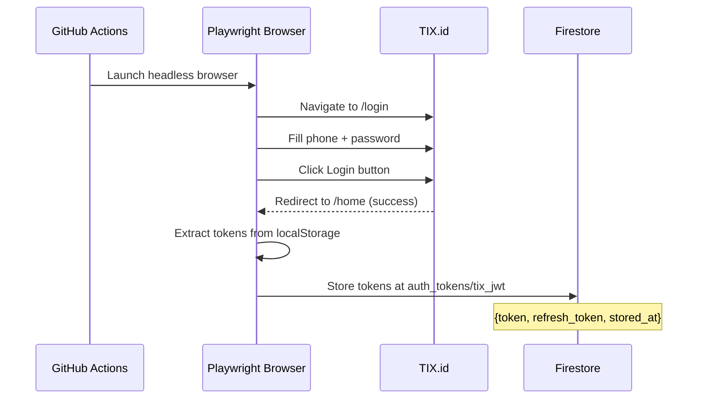
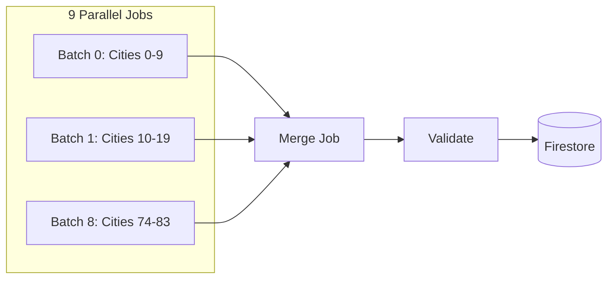
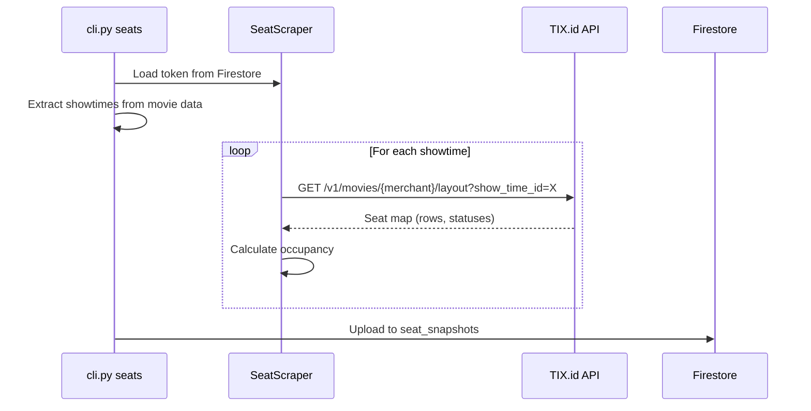

# Daily pipeline documentation

> Complete guide to how data flows through the system from morning to midnight.

## ⏳ Execution Timeline

```mermaid
gantt
    title Standard Daily Cycle (T+0 = Midnight WIB)
    dateFormat HH:mm
    axisFormat %H:%M
    
    section Auth
    Token Refresh      :crit, t1, 05:50, 5m
    Token Check        :active, t2, 06:35, 2m

    section Movie Data
    Movie Scrape       :active, m1, 06:00, 30m
    Merge and Upload   :active, m2, after m1, 10m

    section Seat Data
    Seat Scrape        :active, s1, after t2, 45m
    Merge and Loading  :active, s2, after s1, 10m
    
    section Reporting
    Daily Summary      :done, r1, 23:55, 10m
```



All times are **WIB (UTC+7)**. GitHub Action schedules use UTC.

---

## Phase 1: Token Refresh (5:50 AM WIB)

### Purpose
Capture a fresh JWT token from TIX.id for authenticated API calls.

### Workflow File
[`.github/workflows/token-refresh.yml`](../.github/workflows/token-refresh.yml)

### How It Works



### 🧑‍💻 Code References

| Component | Source File | Purpose |
|-----------|-------------|---------|
| **Entry Point** | [`backend/cli/refresh_token.py`](../backend/cli/refresh_token.py) | Main CLI command for Playwright flow |
| **Logic** | [`backend/infrastructure/token_refresher.py`](../backend/infrastructure/token_refresher.py) | API-based refresh logic |
| **Storage** | [`backend/infrastructure/repositories/firestore_token.py`](../backend/infrastructure/repositories/firestore_token.py) | Firestore read/write operations |

### 🚨 Failure Runbook

**Trigger:** Workflow fails with `TimeoutError` or `Login Failed`.

1.  **Check Screenshots**: Download the `debug-screenshots` artifact from the failed GitHub Action run.
2.  **Manual Refresh**:
    ```bash
    # Run locally with visible browser to debug
    uv run python -m backend.cli.refresh_token --visible
    ```
3.  **Force Push**: If local refresh works, the new token is already in Firestore. You can re-run dependent jobs manually.

---

## Phase 2: Movie Scraping (6:00 AM WIB)

### Purpose
Scrape all movies, showtimes, and theatre information for the day.

### Workflow File
[`.github/workflows/daily-scrape.yml`](../.github/workflows/daily-scrape.yml) (jobs: `scrape`, `merge`)

### How It Works



### 🧑‍💻 Code References

| Component | Source File | Purpose |
|-----------|-------------|---------|
| **Scraper** | [`backend/infrastructure/core/tix_client.py`](../backend/infrastructure/core/tix_client.py) | Deep scraper logic |
| **Merger** | [`backend/cli/merge_batches.py`](../backend/cli/merge_batches.py) | JSON combination logic |
| **Validator** | [`backend/cli/validate.py`](../backend/cli/validate.py) | Schema integrity checks |
| **Uploader** | [`backend/cli/populate_firestore.py`](../backend/cli/populate_firestore.py) | Batch write to Firestore |

### 🚨 Failure Runbook

**Trigger:** `Merge` job fails due to `ValidationError`.

1.  **Identify Bad Batch**: Check logs to see which batch produced invalid JSON.
2.  **Partial Upload**:
    ```bash
    # Upload whatever valid data we have
    uv run python -m backend.cli.populate_firestore --force
    ```
3.  **Retry Specific City**:
    ```bash
    uv run python -m backend.cli --city BANDUNG --schedules
    ```

---

## Phase 3: Seat Scraping (~6:40 AM WIB)

### Purpose
Scrape seat availability for ALL showtimes collected in Phase 2.

### Workflow File
[`.github/workflows/daily-scrape.yml`](../.github/workflows/daily-scrape.yml) (jobs: `token-refresh-pre-seat`, `seat-morning-scrape`, `seat-merge-upload`)

### How It Works



### 🧑‍💻 Code References

| Component | Source File | Purpose |
|-----------|-------------|---------|
| **Entry Point** | [`backend/cli/cli.py`](../backend/cli/cli.py) | `seats` subcommand handler |
| **Worker** | [`backend/infrastructure/core/seat_scraper.py`](../backend/infrastructure/core/seat_scraper.py) | Async API fetcher |
| **Uploader** | [`backend/cli/upload_seats.py`](../backend/cli/upload_seats.py) | Firestore partitioning |
| **Validator** | [`backend/schemas/scraper_run.py`](../backend/schemas/scraper_run.py) | Run metadata schema |

### 🚨 Failure Runbook

**Trigger:** `401 Unauthorized` errors in logs.

1.  **Check Token**:
    ```bash
    uv run python -m backend.cli.refresh_token --check
    ```
2.  **Emergency Rescrape** (if > 1 hour passed, data might be stale):
    ```bash
    # Run a high-concurrency rescrape
    uv run python -m backend.cli.cli seats --mode morning --concurrency 20
    ```

---

## Phase 4: Daily Summary (12:00 AM WIB / Midnight)

### Purpose
Aggregate all seat data from the previous day and generate a summary report.

### Workflow File
[`.github/workflows/daily-summary.yml`](../.github/workflows/daily-summary.yml)

### 🧑‍💻 Code References

| Component | Source File | Purpose |
|-----------|-------------|---------|
| **Aggregator** | [`backend/cli/daily_summary.py`](../backend/cli/daily_summary.py) | Math & Formatting logic |

### Output

The summary appears in the GitHub Actions job summary:

```
🎬 CineRadar Daily Summary - 2026-01-15

📊 AUDIENCE STATISTICS
━━━━━━━━━━━━━━━━━━━━━━
🎟️ Total Audience: 42,350 seats sold
🪑 Total Capacity: 125,000 seats
📈 Occupancy Rate: 33.9%

📋 COVERAGE
━━━━━━━━━━━━━━━━━━━━━━
🎬 Movies: 28
🏢 Theatres: 487
🏙️ Cities: 83
⏰ Showtimes: 12,450
```

### Firestore Output

Saved to `daily_summaries/{date}`:

```json
{
  "date": "2026-01-15",
  "total_audience": 42350,
  "total_seats": 125000,
  "occupancy_pct": 33.9,
  "movie_count": 28,
  "theatre_count": 487,
  "city_count": 83,
  "showtime_count": 12450,
  "generated_at": "2026-01-16T00:00:15"
}
```

---

## Phase 5: Monthly Maintenance (1st of Month)

### Purpose
Geocode new theatre locations using Google Maps API to ensure map visualization covers all 480+ cinemas.

### Workflow File
[`.github/workflows/monthly-geocode.yml`](../.github/workflows/monthly-geocode.yml) (Schedule: 07:00 AM WIB on the 1st)

### How It Works
1.  **Fetcher**: Loads all theatres from Firestore `theatres` collection.
2.  **Filter**: Identifies theatres with missing `lat`/`lng` or `place_id`.
3.  **Geocode**: Calls Google Places API for missing data.
4.  **Update**: Writes back to Firestore.

### 🧑‍💻 Code References
| Component | Source File | Purpose |
|-----------|-------------|---------|
| **Entry Point** | [`backend/cli/monthly_geocode.py`](../backend/cli/monthly_geocode.py) | Main logic for geocoding |

---

## Firestore Collections Summary

| Collection | Document ID | Updated By | Frequency |
|------------|-------------|------------|-----------|
| `auth_tokens` | `tix_jwt` | token-refresh.yml | Daily 5:50 AM |
| `theatres` | `{theatre_id}` | populate_firestore.py | Daily 6:30 AM |
| `snapshots` | `latest`, `{date}` | populate_firestore.py | Daily 6:30 AM |
| `schedules/{date}/movies` | `{movie_id}` | upload_schedules.py | Daily 6:30 AM |
| `seat_snapshots` | `{showtime_id}_{type}_{time}` | upload_seats.py | Daily 7:30 AM |
| `daily_summaries` | `{date}` | daily_summary.py | Daily 12:00 AM |
| `scraper_runs` | `{timestamp}_{type}` | Various | Each run |

---

## Manual Commands

### Run Movie Scrape Locally
```bash
uv run python -m backend.cli movies --city JAKARTA --schedules
```

### Run Seat Scrape Locally
```bash
# First ensure token is valid
uv run python -m backend.cli.refresh_token --check

# Then scrape seats
uv run python -m backend.cli.cli seats --mode morning --use-stored-token --limit 10
```

### Generate Daily Summary Locally
```bash
uv run python -m backend.cli.daily_summary
```

### Check Token Status
```bash
uv run python -m backend.cli.refresh_token --check
```

---

## Troubleshooting

| Issue | Cause | Solution |
|-------|-------|----------|
| Seat API returns 401 | Token expired | Re-run token refresh workflow |
| No seat data uploaded | Key mismatch (fixed) | Verify using latest code |
| Summary shows 0 | No seat data for date | Check seat_snapshots collection |
| Movies missing schedules | Partial scrape failure | Check batch job logs |
