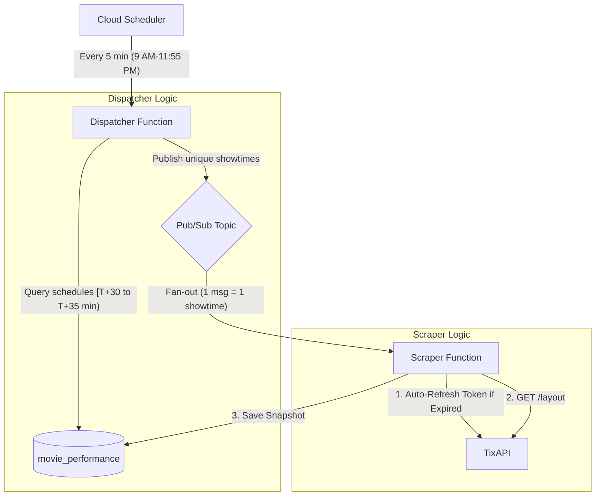

# Daily Pipeline Documentation

> Complete guide to how data flows through the system daily.

## Overview

The pipeline runs in three main phases:

1. **Morning Initialization** (1:15 AM - 4:30 AM WIB): Scrapes all movies, showtimes, and baseline layout data.
2. **JIT Seat Scraping** (9:00 AM - 11:55 PM WIB): Scrapes seats precisely 30 minutes before each showtime.
3. **Data Sweeping** (10:00 AM - 11:30 PM WIB): Aggregates JIT snapshots into daily performance data every 30 minutes.

> [!NOTE]
> Seat data is scraped **just-in-time** (JIT) — each showtime is captured exactly 30 minutes before it starts, giving near-final occupancy.

---

## ⏳ Execution Timeline


```mermaid
gantt
    title Daily Pipeline (WIB = UTC+7)
    dateFormat HH:mm
    axisFormat %H:%M
    
    section Initial Data
    Movie Scrape         :active, 01:15, 20m
    Details Backfill     :active, 04:00, 15m
    Initial Layouts      :active, 04:15, 60m

    section JIT Seats (Every 5 mins)
    09:00 Dispatch       :active, 09:00, 2m
    09:05 Dispatch       :active, 09:05, 2m
    ...                  :done, 12:00, 1m
    23:55 Dispatch       :active, 23:55, 2m

    section Sweeper (Every 30 mins)
    10:00 Sweeper        :active, 10:00, 5m
    10:30 Sweeper        :active, 10:30, 5m
    ...                  :done, 12:00, 1m
    23:30 Sweeper        :active, 23:30, 5m
```

All times are **WIB (UTC+7)**. GitHub Action schedules use UTC.

---

## Phase 1: Authentication & Token Refresh (Dynamic & Monthly)

### Purpose
Capture a fresh JWT token from TIX.id for authenticated API calls.

### Workflow Files & Logic
- [`.github/workflows/token-refresh.yml`](../.github/workflows/token-refresh.yml) - Monthly Full RSA Login
- Scraper Cloud Functions - Dynamic fast token refresh via API

### How It Works

1. **Monthly RSA Login (1st of month @ 2:50 AM WIB)**: Performs the heavy RSA-encrypted guest login to capture a fresh 91-day long-term token. Stores in Firestore.
2. **Dynamic JIT Refresh**: The Cloud Function Scraper dynamically and autonomously checks if the token is < 5 min from expiry and uses the fast `/refresh` API endpoint to get a new 30-min token during daily scraping.

### 🧑‍💻 Code References
| Component | Source File | Purpose |
|-----------|-------------|---------|
| **CLI Login** | [`backend/cli/refresh_token.py`](../backend/cli/refresh_token.py) | Full RSA API login flow |
| **JIT Refresh** | [`backend/infrastructure/token_refresher.py`](../backend/infrastructure/token_refresher.py) | Fast API refresh logic used by scrapers |

---

## Phase 2: Morning Movie Scraping (1:15 AM WIB)

### Purpose
Scrape all movies, showtimes, and theatre information for the day. Creates the initial baseline performance docs.

### Workflow File
[`.github/workflows/daily-initial-scrape.yml`](../.github/workflows/daily-initial-scrape.yml) (Runs at `18:15 UTC` / `01:15 AM WIB`)

### How It Works
The V2 API-based scraper runs sequentially across cities to fetch all `NOW_PLAYING` data and schedules. It ends by initializing the empty `movie_performance` documents.

### 🧑‍💻 Code References
| Component | Source File | Purpose |
|-----------|-------------|---------|
| **Script** | [`backend/scripts/run_national_scrape.py`](../backend/scripts/run_national_scrape.py) | Runner |

---

## Phase 3: Metadata Backfill (4:00 AM WIB)

### Purpose
Ensures any newly discovered movies from Phase 2 have full metadata (posters, genres, age ratings) from the `/v1/movies/{id}` endpoint.

### Workflow File
[`.github/workflows/scrape_movie_details.yml`](../.github/workflows/scrape_movie_details.yml) (Runs at `21:00 UTC` / `04:00 AM WIB`)

---

## Phase 4: Initial Layouts / Seat Scraping (4:15 AM WIB)

### Purpose
Scrape a baseline seat map for every single showtime available that day. Used to identify seats blocked out by the cinema before any tickets are organically sold.

### Workflow File
[`.github/workflows/daily-initial-layouts.yml`](../.github/workflows/daily-initial-layouts.yml) (Runs at `21:15 UTC` / `04:15 AM WIB`)

---

## Phase 5: JIT Seat Scraping (Live 9:00 AM - 11:55 PM WIB)

### Purpose
Scrape seat availability exactly **30 minutes before** a showtime begins to capture final occupancy. 

### Architecture
Runs on **Google Cloud Functions**.


```mermaid
graph TD
    Scheduler[Cloud Scheduler] -- "Every 5 min (9 AM-11:55 PM)" --> Dispatcher[Dispatcher Function]
    
    subgraph "Dispatcher Logic"
        Dispatcher -- "Query schedules [T+30 to T+35 min)" --> Firestore[(Firestore)]
        Dispatcher -- "Publish unique showtimes" --> PubSub{Pub/Sub Topic}
    end
    
    PubSub -- "Fan-out (1 msg = 1 showtime)" --> Scraper[Scraper Function]
    
    subgraph "Scraper Logic"
        Scraper -- "1. Auto-Refresh Token if Expired" --> TixAPI
        Scraper -- "2. GET /layout" --> TixAPI
        Scraper -- "3. Save Snapshot" --> Firestore[(movie_performance)]
    end
```

### Components (`backend/functions/`)
1. **Dispatcher (`dispatch-jit-jobs`)**:
   - **Trigger**: Cloud Scheduler (`*/5 9-23 * * *` WIB).
   - **Task**: Queries Firestore for showtimes starting exactly in the window `[T+30, T+35)` minutes from now.
2. **Scraper (`scrape-seat-jit`)**:
   - **Trigger**: Pub/Sub Message.
   - **Task**: Handles its own token refresh lock, fetches layout, and saves to Firestore.
   - **Scale**: Up to 5 concurrent instances.

---

## Phase 6: Sweeper / Aggregation (10:00 AM - 11:30 PM WIB)

### Purpose
Periodically aggregates the individual JIT snapshots from Phase 5 into daily movie performance totals.

### Component (`backend/functions/sweeper/`)
- **Trigger**: Cloud Scheduler (`0,30 10-23 * * *` WIB - Every 30 mins).
- **Task**: Reads newly created `ShowtimeSnapshot` docs and recalculates `DailyPerformance` rollups.

### Domain Models

| Model | Firestore Path | Key Fields |
|-------|----------------|------------|
| `MovieMetadata` | `movie_performance/{movie_id}` | `title`, `poster`, `age_category` |
| `DailyPerformance` | `.../days/{YYYY-MM-DD}` | `total_showtimes`, `avg_occupancy_pct`, `total_seats` |
| `ShowtimeSnapshot` | `.../showtimes/{id}` | `occupancy_pct`, `sold_seats`, `raw_api_response` |

---

## Admin Dashboard: Scraper Monitor

The Admin Dashboard `/scraper` page consumes `scraper_logs` via Next.js API routes:
- `GET /api/scraper` (30 days of logs)
- `GET /api/scraper/today` (Current status)
- `GET /api/scraper/jit` (JIT granularity monitor)

---

## Manual Commands

### Check Token Status
```bash
uv run python -m backend.cli.refresh_token --check
```

### Run Seat Scrape Locally
```bash
uv run python -m backend.cli.cli seats --mode morning --use-stored-token --limit 10
```

### Aggregate Movie Performance (Force full recalculation)
```bash
uv run python -m backend.cli.movie_performance --recalculate
```