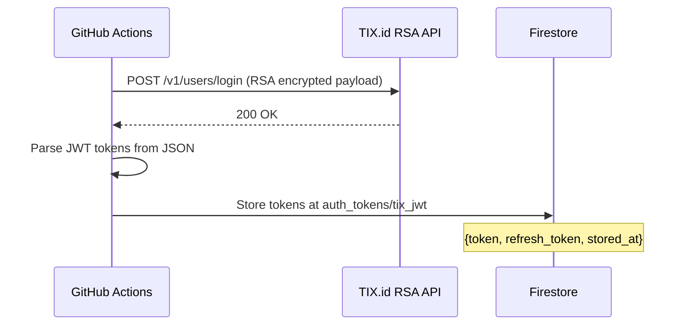
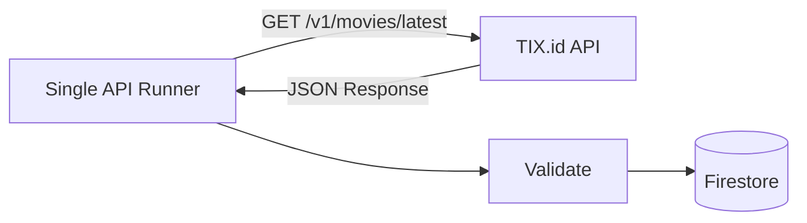
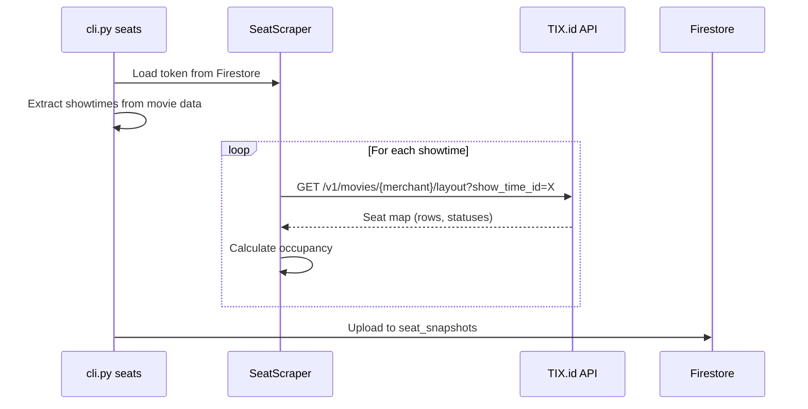
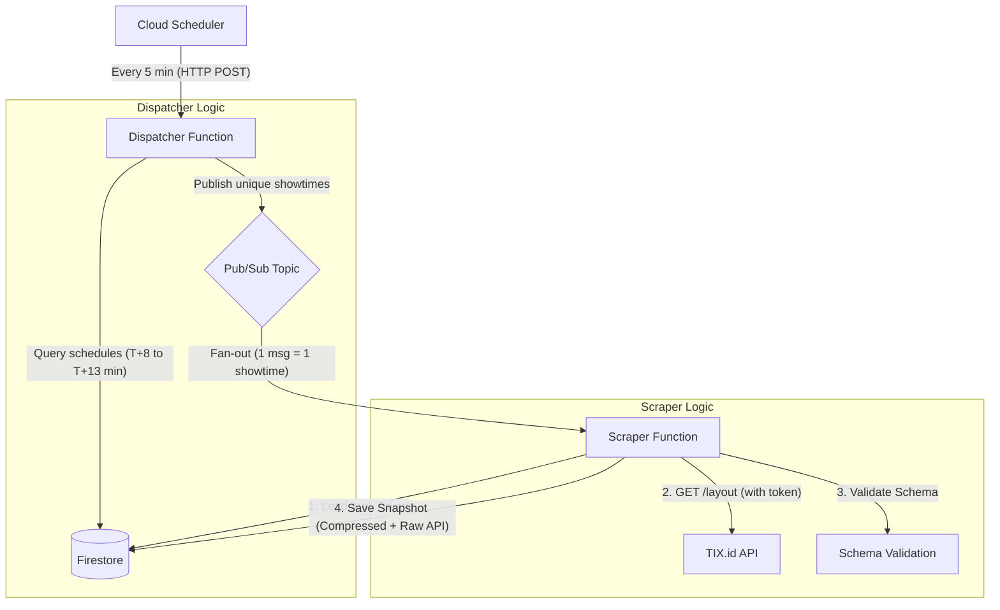

# Daily Pipeline Documentation

> Complete guide to how data flows through the system daily.

## Overview

The pipeline runs in two phases:

1. **Morning Movie Scrape** (3:00-3:40 AM): Scrapes all movies and showtimes
2. **JIT Seat Scraping** (10 AM-11 PM): Scrapes seats hourly, 8 min before showtime

> [!NOTE]
> Seat data is scraped **just-in-time** (JIT) — each showtime is captured ~8 minutes before it starts, giving near-final occupancy.

---

## ⏳ Execution Timeline


```mermaid
gantt
    title Daily Pipeline (WIB = UTC+7)
    dateFormat HH:mm
    axisFormat %H:%M
    
    section Auth
    Token Refresh (AM)   :crit, 02:50, 5m
    Token Refresh (Noon) :crit, 12:00, 5m

    section Movie Data
    Movie Scrape         :active, 03:00, 30m
    Merge and Upload     :active, 03:30, 10m

    section JIT Seats (Hourly)
    09:52 JIT Scrape     :active, 09:52, 18m
    10:52 JIT Scrape     :active, 10:52, 18m
    ...                  :done, 12:00, 1m
    22:52 JIT Scrape     :active, 22:52, 18m
```

All times are **WIB (UTC+7)**. GitHub Action schedules use UTC.

---

## Phase 1: Token Refresh (2:50 AM WIB)

### Purpose
Capture a fresh JWT token from TIX.id for authenticated API calls.

### Workflow File
[`.github/workflows/token-refresh.yml`](../.github/workflows/token-refresh.yml)

### How It Works


```mermaid
sequenceDiagram
    participant GH as GitHub Actions
    participant API as TIX.id RSA API
    participant FS as Firestore

    GH->>API: POST /v1/users/login (RSA encrypted payload)
    API-->>GH: 200 OK
    GH->>GH: Parse JWT tokens from JSON
    GH->>FS: Store tokens at auth_tokens/tix_jwt
    Note over FS: {token, refresh_token, stored_at}
```

### 🧑‍💻 Code References

| Component | Source File | Purpose |
|-----------|-------------|---------|
| **Entry Point** | [`backend/cli/refresh_token.py`](../backend/cli/refresh_token.py) | Main CLI command for API login flow |
| **Logic** | [`backend/infrastructure/token_refresher.py`](../backend/infrastructure/token_refresher.py) | API-based refresh logic |
| **Storage** | [`backend/infrastructure/repositories/firestore_token.py`](../backend/infrastructure/repositories/firestore_token.py) | Firestore read/write operations |

### 🚨 Failure Runbook

**Trigger:** Workflow fails with `TimeoutError` or `Login Failed`.

1.  **Check Logs**: Review the step output from the failed GitHub Action run. Usually, a failure here indicates the public RSA key or the salt rotated on TIX's end.
2.  **Manual Refresh**:
    ```bash
    # Run locally to trace the API response
    uv run python -m backend.cli.refresh_token
    ```
3.  **Force Push**: If local refresh works, the new token is already in Firestore. You can re-run dependent jobs manually.

---

## Phase 2: Movie Scraping (3:00 AM WIB)

### Purpose
Scrape all movies, showtimes, and theatre information for the day.

### Workflow File
[`.github/workflows/daily-initial-scrape.yml`](../.github/workflows/daily-initial-scrape.yml) (jobs: `scrape`, `merge`)

### How It Works

The V2 API-based scraper is exceptionally fast and no longer requires parallel batching.


```mermaid
flowchart LR
    S[Single API Runner] -->|GET /v1/movies/latest| TIX[TIX.id API]
    TIX -->|JSON Response| S
    S --> V[Validate]
    V --> FS[(Firestore)]
```

### 🧑‍💻 Code References

| Component | Source File | Purpose |
|-----------|-------------|---------|
| **Scraper** | [`backend/infrastructure/core/tix_client.py`](../backend/infrastructure/core/tix_client.py) | Deep scraper logic |

### 🚨 Failure Runbook

**Trigger:** Job fails due to network timeout.

1.  **Retry Specific City**:
    ```bash
    uv run python -m backend.cli --city BANDUNG --schedules
    ```

---

## Phase 3: Seat Scraping (~3:40 AM WIB)

### Purpose
Scrape seat availability for ALL showtimes collected in Phase 2.

### Workflow File
[`.github/workflows/daily-initial-layouts.yml`](../.github/workflows/daily-initial-layouts.yml) and [`.github/workflows/initial-layout-scrape.yml`](../.github/workflows/initial-layout-scrape.yml)

### How It Works


```mermaid
sequenceDiagram
    participant CLI as cli.py seats
    participant SS as SeatScraper
    participant API as TIX.id API
    participant FS as Firestore

    CLI->>SS: Load token from Firestore
    CLI->>CLI: Extract showtimes from movie data
    loop For each showtime
        SS->>API: GET /v1/movies/{merchant}/layout?show_time_id=X
        API-->>SS: Seat map (rows, statuses)
        SS->>SS: Calculate occupancy
    end
    CLI->>FS: Upload to seat_snapshots
```

### 🧑‍💻 Code References

| Component | Source File | Purpose |
|-----------|-------------|---------|
| **Entry Point** | [`backend/cli/cli.py`](../backend/cli/cli.py) | `seats` subcommand handler |
| **Worker** | [`backend/infrastructure/core/seat_scraper.py`](../backend/infrastructure/core/seat_scraper.py) | Async API fetcher |
| **Validator** | [`backend/schemas/scraper_run.py`](../backend/schemas/scraper_run.py) | Run metadata schema |

### 🚨 Failure Runbook

**Trigger:** `401 Unauthorized` errors in logs.

1.  **Check Token**:
    ```bash
    uv run python -m backend.cli.refresh_token --check
    ```
2.  **Emergency Rescrape** (if > 1 hour passed, data might be stale):
    ```bash
    # Run a high-concurrency rescrape
    uv run python -m backend.cli.cli seats --mode morning --concurrency 20
    ```

## Phase 4: Movie Performance Aggregation (~5:00 AM WIB)

### Purpose
Aggregate seat occupancy data into per-movie performance summaries for the Admin Dashboard.

### Workflow File
[`.github/workflows/daily-initial-scrape.yml`](../.github/workflows/daily-initial-scrape.yml) (job: `movie-performance`)

### Complete Data Flow

```
┌─────────────────────────────────────────────────────────────────────────────────┐
│                              PERFORMANCE DATA FLOW                              │
├─────────────────────────────────────────────────────────────────────────────────┤
│                                                                                 │
│  ┌─────────────┐     ┌──────────────────────┐     ┌─────────────────────────┐  │
│  │  TIX.id API │ ──▶ │  SeatScraper         │ ──▶ │  PerformanceAggregator  │  │
│  │  (seats)    │     │  seat_scraper.py     │     │  performance_aggregator │  │
│  └─────────────┘     └──────────────────────┘     └───────────┬─────────────┘  │
│                                                               │                 │
│                                                               ▼                 │
│                      ┌──────────────────────────────────────────────────────┐  │
│                      │  FirestoreMoviePerformanceRepository                 │  │
│                      │  firestore_movie_performance.py                      │  │
│                      └───────────┬──────────────────────────────────────────┘  │
│                                  │                                              │
│                                  ▼                                              │
│  ┌──────────────────────────────────────────────────────────────────────────┐  │
│  │                         FIRESTORE SCHEMA                                 │  │
│  │  movie_performance/{movie_id}              ← MovieMetadata (root doc)    │  │
│  │  movie_performance/{movie_id}/days/{date}  ← DailyPerformance            │  │
│  │  .../days/{date}/showtimes/{showtime_id}   ← ShowtimeSnapshot            │  │
│  └───────────┬──────────────────────────────────────────────────────────────┘  │
│              │                                                                  │
│              ▼                                                                  │
│  ┌──────────────────────────────────────────────────────────────────────────┐  │
│  │                         NEXT.JS API ROUTES                               │  │
│  │  GET /api/performance                    → list all movies               │  │
│  │  GET /api/performance/[movieId]/history  → list daily stats              │  │
│  │  GET /api/performance/[movieId]/days/[date] → get showtimes              │  │
│  └───────────┬──────────────────────────────────────────────────────────────┘  │
│              │                                                                  │
│              ▼                                                                  │
│  ┌──────────────────────────────────────────────────────────────────────────┐  │
│  │  PerformanceTab.tsx (admin/src/features/movies/components)               │  │
│  │  - Movie dropdown → GET /api/performance                                 │  │
│  │  - Date badges → GET /api/performance/{id}/history                       │  │
│  │  - KPIs + table → GET /api/performance/{id}/days/{date}                  │  │
│  └──────────────────────────────────────────────────────────────────────────┘  │
│                                                                                 │
└─────────────────────────────────────────────────────────────────────────────────┘
```

### 🧑‍💻 Code References

| Layer | File | Purpose |
|-------|------|---------|
| **Scraper** | [`backend/infrastructure/core/seat_scraper.py`](../backend/infrastructure/core/seat_scraper.py) | Fetches seat layouts from TIX.id B2B API |
| **Service** | [`backend/application/services/performance_aggregator.py`](../backend/application/services/performance_aggregator.py) | Aggregates snapshots → daily stats |
| **Repository** | [`backend/infrastructure/repositories/firestore_movie_performance.py`](../backend/infrastructure/repositories/firestore_movie_performance.py) | Firestore CRUD |
| **Models** | [`backend/domain/models/movie_performance.py`](../backend/domain/models/movie_performance.py) | `ShowtimeSnapshot`, `DailyPerformance`, `MovieMetadata` |
| **CLI** | [`backend/cli/movie_performance.py`](../backend/cli/movie_performance.py) | Manual trigger for scraping |
| **API** | `admin/src/app/api/performance/**/route.ts` | 3 endpoints for frontend |
| **UI** | [`admin/src/features/movies/components/PerformanceTab.tsx`](../admin/src/features/movies/components/PerformanceTab.tsx) | React component |

### Domain Models

| Model | Firestore Path | Key Fields |
|-------|----------------|------------|
| `MovieMetadata` | `movie_performance/{movie_id}` | `title`, `poster`, `age_category`, `last_updated` |
| `DailyPerformance` | `.../days/{YYYY-MM-DD}` | `total_showtimes`, `avg_occupancy_pct`, `total_seats`, `total_sold`, `cities` |
| `ShowtimeSnapshot` | `.../showtimes/{id}` | `theatre_name`, `city`, `showtime`, `occupancy_pct`, `sold_seats`, `layout_json`, `raw_api_response` |

### UI Flow (PerformanceTab.tsx)

1. **On mount** → `GET /api/performance` → populate movie dropdown
2. **On movie select** → `GET /api/performance/{id}/history` → show date badges
3. **On date select** → `GET /api/performance/{id}/days/{date}` → show KPIs + showtimes table

### Sample Output

Stored in `movie_performance/{movie_id}`:

```json
{
  "movie_id": "1961889705591132160",
  "title": "SIKSA NERAKA",
  "poster": "https://...",
  "last_updated": "2026-01-19T08:15:00Z"
}
```

Stored in `movie_performance/{movie_id}/days/{date}`:

```json
{
  "date": "2026-01-19",
  "cities": ["BANDUNG", "JAKARTA", "SURABAYA"],
  "total_showtimes": 45,
  "avg_occupancy_pct": 67.2,
  "total_seats": 5400,
  "total_sold": 3628,
  "last_updated": "2026-01-19T08:15:00Z"
}
```

---

## Admin Dashboard: Scraper Monitor

The Admin Dashboard `/scraper` page consumes `scraper_logs` via Next.js API routes:

| API Route | Source | Purpose |
|-----------|--------|---------|
| `GET /api/scraper` | `scraper_logs` (30 days) | History table |
| `GET /api/scraper/today` | `scraper_logs/{today}` | Today's status cards |
| `GET /api/scraper/stats` | DB collection counts | Database explorer |

### Frontend Components

| Component | File | Data Source |
|-----------|------|-------------|
| `TodayScrapeCards` | [`admin/src/features/scraper/components/TodayScrapeCards.tsx`](../admin/src/features/scraper/components/TodayScrapeCards.tsx) | `/api/scraper/today` |
| `ScrapeHistoryTable` | [`admin/src/features/scraper/components/ScrapeHistoryTable.tsx`](../admin/src/features/scraper/components/ScrapeHistoryTable.tsx) | `/api/scraper` |
| `JITGranularMonitor` | [`admin/src/components/scraper/JITGranularMonitor.tsx`](../admin/src/components/scraper/JITGranularMonitor.tsx) | `/api/scraper/jit` |

---

## Phase 5: Monthly Geocoding (1st of Month)

### Purpose
Geocode new theatre locations using Google Maps API to ensure map visualization covers all 480+ cinemas.

### Workflow File
[`.github/workflows/monthly-geocode.yml`](../.github/workflows/monthly-geocode.yml) (Schedule: 07:00 AM WIB on the 1st)

### How It Works
1.  **Fetcher**: Loads all theatres from Firestore `theatres` collection.
2.  **Filter**: Identifies theatres with missing `lat`/`lng` or `place_id`.
3.  **Geocode**: Calls Google Places API for missing data.
4.  **Update**: Writes back to Firestore.

### 🧑‍💻 Code References
| Component | Source File | Purpose |
|-----------|-------------|---------|
| **Entry Point** | [`backend/cli/monthly_geocode.py`](../backend/cli/monthly_geocode.py) | Main logic for geocoding |

---

## Firestore Collections Summary

| Collection | Document ID | Updated By | Frequency |
|------------|-------------|------------|-----------|
| `auth_tokens` | `tix_jwt` | token-refresh.yml | Daily 2:50 AM |
| `theatres` | `{theatre_id}` | populate_firestore.py | Daily 3:30 AM |
| `snapshots` | `latest`, `{date}` | populate_firestore.py | Daily 3:30 AM |
| `schedules/{date}/movies` | `{movie_id}` | upload_schedules.py | Daily 3:30 AM |
| `movies` | `{movie_id}` | movie-details CLI | Daily ~3:35 AM |
| `movies/{id}/rating_history` | `{YYYY-MM-DD}` | movie-details CLI | Daily |
| `movie_performance` | `{movie_id}` | movie_performance.py | Daily 5:00 AM |
| `movie_performance/{id}/showtimes` | `{showtime_id}` | movie_performance.py | Daily 5:00 AM |
| `scraper_logs` | `{YYYY-MM-DD}` | Various | Consolidated daily log |

---

## Manual Commands

### Run Movie Scrape Locally
```bash
uv run python -m backend.cli movies --city JAKARTA --schedules
```

### Run Seat Scrape Locally
```bash
# First ensure token is valid
uv run python -m backend.cli.refresh_token --check

# Then scrape seats
uv run python -m backend.cli.cli seats --mode morning --use-stored-token --limit 10
```

### Scrape Movie Details
```bash
# Scrape details for all movies in latest snapshot
uv run python -m backend.cli movie-details --all

# Scrape specific movie
uv run python -m backend.cli movie-details --movie-id 1961889705591132160

# Backfill from movie_performance collection
uv run python -m backend.cli movie-details --from-performance
```

### Check Token Status
```bash
uv run python -m backend.cli.refresh_token --check
```

### Aggregate Movie Performance
```bash
# Recalculate all movie performance summaries
uv run python -m backend.cli.movie_performance --recalculate

# Process a specific movie
uv run python -m backend.cli.movie_performance --movie-id 1961889705591132160

# Process all movies (limit 10)
uv run python -m backend.cli.movie_performance --all --limit 10
```

---

## Troubleshooting

| Issue | Cause | Solution |
|-------|-------|----------|
| Seat API returns 401 | Token expired | Re-run token refresh workflow |
| No seat data uploaded | Key mismatch (fixed) | Verify using latest code |
| Summary shows 0 | No seat data for date | Check seat_snapshots collection |
| Movies missing schedules | Partial scrape failure | Check scrape job logs |
| Performance tab empty | No aggregated data | Run `movie_performance --recalculate` |

---

## Phase 5: JIT Seat Scraping (Live)

### Purpose
Scrape seat availability for each showtime exactly **8-13 minutes before** it starts (Just-In-Time) to capture near-final occupancy.

### Architecture
This phase runs on **Google Cloud Functions** (Serverless) to handle the high concurrency and frequent scheduling required for T-8 precision.


```mermaid
graph TD
    Scheduler[Cloud Scheduler] -- "Every 5 min (HTTP POST)" --> Dispatcher[Dispatcher Function]
    
    subgraph "Dispatcher Logic"
        Dispatcher -- "Query schedules (T+8 to T+13 min)" --> Firestore[(Firestore)]
        Dispatcher -- "Publish unique showtimes" --> PubSub{Pub/Sub Topic}
    end
    
    PubSub -- "Fan-out (1 msg = 1 showtime)" --> Scraper[Scraper Function]
    
    subgraph "Scraper Logic"
        Scraper -- "1. Load Auth Token" --> Firestore
        Scraper -- "2. GET /layout (with token)" --> TixAPI[TIX.id API]
        Scraper -- "3. Validate Schema" --> Validate["Schema Validation"]
        Scraper -- "4. Save Snapshot (Compressed + Raw API)" --> Firestore
    end
```

### Components (`backend/functions/`)

1.  **Dispatcher (`dispatch-jit-jobs`)**:
    *   **Trigger**: Cloud Scheduler (Every 5 mins, 6 AM - 11 PM).
    *   **Task**: Queries Firestore for showtimes starting in the next 8-13 minutes.
    *   **Output**: Publishes `showtime_id` messages to Pub/Sub.

 2.  **Scraper (`scrape-seat-jit`)**:
    *   **Trigger**: Pub/Sub Message (`scrape-seat-jit`).
    *   **Task**: Fetches seat layout from TIX.id, validates schema, compresses layout (gzip), and saves to Firestore with **full raw API response** for debugging/audit.
    *   **Scale**: Auto-scales up to 5 concurrent instances to respect rate limits.

### Self-Healing Token Reuse
The Cloud Function is autonomous. It reuses the stored `tix_jwt` from Firestore. If the token is near expiration (< 5 min TTL), the Scraper function proactively calls the TIX.id refresh endpoint and updates Firestore, ensuring zero downtime.

### Limits
*   **Precision**: T-8 minutes.
*   **Safety**: Rate-limited to 5 concurrent scrapers (~1-2 req/sec).

### Raw API Response Storage
Each JIT scrape stores the **full TIX.id API response** in the `raw_api_response` field for debugging and audit purposes.

**What's Stored:**
- Complete API response including seat map, pricing, rules, and metadata
- Seat status codes (1 = available, 5/6 = sold/blocked)
- Seat layout structure (rows, sections, seat codes)

**Storage Location:**
```
movie_performance/{movie_id}/days/{date}/showtimes/{showtime_id}
  ├─ raw_api_response (object)  ← Full TIX.id API response
  ├─ layout_compressed (bytes)  ← Gzip-computed seat grid
  ├─ total_seats (int)
  ├─ sold_seats (int)
  └─ occupancy_pct (float)
```

**Access Methods:**
1. **CLI Tool** (Recommended for debugging):
   ```bash
   python backend/cli/inspect_showtime.py \
     --showtime-id <ID> \
     --movie-id <MOVIE_ID> \
     --date YYYY-MM-DD \
     --verbose
   ```

2. **Admin API:**
   ```
   GET /api/showtimes/[showtimeId]/raw?movieId=X&date=Y
   ```

3. **Firestore Console:** Navigate directly to document path

**Use Cases:**
- Debug seat calculation discrepancies (why occupancy shows 0%?)
- Detect API schema changes (new seat types, status codes)
- Audit historical seat availability
- Verify seat status code interpretation
- Analyze pricing/rule changes over time

