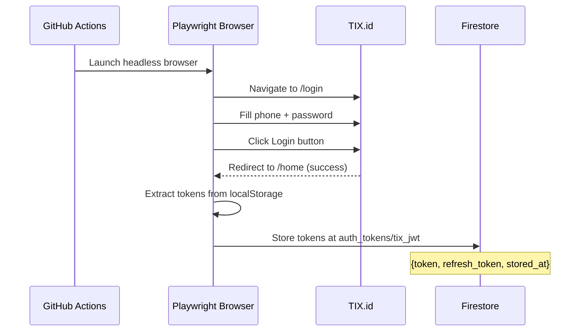
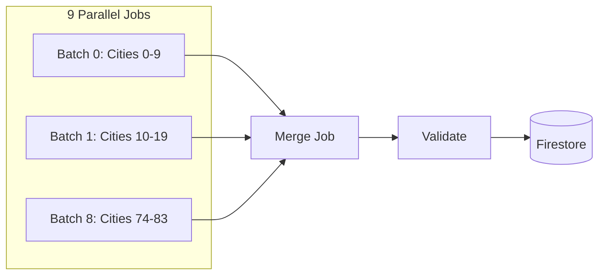
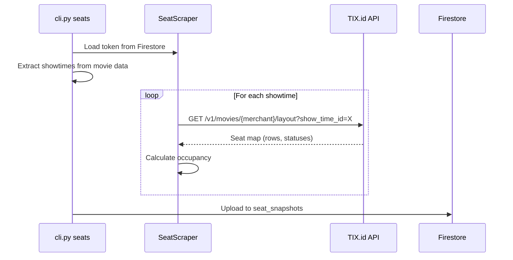

# CineRadar Daily Pipeline Documentation

> Complete guide to how data flows through the system from morning to midnight.

## Timeline Overview

```
┌─────────────────────────────────────────────────────────────────────────┐
│                        DAILY PIPELINE SCHEDULE                          │
├─────────────┬───────────────────────────────────────────────────────────┤
│  5:50 AM    │  Token Refresh (ensure fresh JWT before scraping)         │
│  6:00 AM    │  Movie + Theatre Scrape (9 parallel jobs)                 │
│  ~6:30 AM   │  Merge & Upload Movies → Firestore                        │
│  ~6:35 AM   │  Token Refresh (pre-seat scrape)                          │
│  ~6:40 AM   │  Seat Scrape (9 parallel jobs)                            │
│  ~7:30 AM   │  Merge & Upload Seats → Firestore                         │
│  12:00 AM   │  Daily Summary (aggregate yesterday's data)               │
└─────────────┴───────────────────────────────────────────────────────────┘
```

All times are **WIB (UTC+7)**. Cron expressions use UTC.

---

## Phase 1: Token Refresh (5:50 AM WIB)

### Purpose
Capture a fresh JWT token from TIX.id for authenticated API calls.

### Workflow File
[`.github/workflows/token-refresh.yml`](file:///Users/okihita/ArcaneSanctum/CineRadar/.github/workflows/token-refresh.yml)

### How It Works



### Key Files

| File | Purpose |
|------|---------|
| [`backend/cli/refresh_token.py`](file:///Users/okihita/ArcaneSanctum/CineRadar/backend/cli/refresh_token.py) | Main token refresh script |
| [`backend/infrastructure/token_refresher.py`](file:///Users/okihita/ArcaneSanctum/CineRadar/backend/infrastructure/token_refresher.py) | Programmatic token refresh via API |
| [`backend/infrastructure/repositories/firestore_token.py`](file:///Users/okihita/ArcaneSanctum/CineRadar/backend/infrastructure/repositories/firestore_token.py) | Token storage/retrieval |

### Token Lifecycle

| Token Type | Stored At | TTL | Usage |
|------------|-----------|-----|-------|
| Access Token | `auth_tokens/tix_jwt.token` | 30 minutes | Bearer auth for API calls |
| Refresh Token | `auth_tokens/tix_jwt.refresh_token` | ~91 days | Programmatic refresh via `/v1/users/refresh` |

---

## Phase 2: Movie Scraping (6:00 AM WIB)

### Purpose
Scrape all movies, showtimes, and theatre information for the day.

### Workflow File
[`.github/workflows/daily-scrape.yml`](file:///Users/okihita/ArcaneSanctum/CineRadar/.github/workflows/daily-scrape.yml) (jobs: `scrape`, `merge`)

### How It Works



### Key Files

| File | Purpose |
|------|---------|
| [`backend/cli/cli.py`](file:///Users/okihita/ArcaneSanctum/CineRadar/backend/cli/cli.py) | Main CLI entry point (`movies` subcommand) |
| [`backend/infrastructure/core/tix_client.py`](file:///Users/okihita/ArcaneSanctum/CineRadar/backend/infrastructure/core/tix_client.py) | TIX.id page scraper using Playwright |
| [`backend/cli/merge_batches.py`](file:///Users/okihita/ArcaneSanctum/CineRadar/backend/cli/merge_batches.py) | Combines batch JSON files |
| [`backend/cli/validate.py`](file:///Users/okihita/ArcaneSanctum/CineRadar/backend/cli/validate.py) | Validates merged data against Pydantic schemas |
| [`backend/cli/populate_firestore.py`](file:///Users/okihita/ArcaneSanctum/CineRadar/backend/cli/populate_firestore.py) | Uploads snapshot to Firestore |
| [`backend/cli/upload_schedules.py`](file:///Users/okihita/ArcaneSanctum/CineRadar/backend/cli/upload_schedules.py) | Uploads per-movie schedules |

### Data Flow

```
TIX.id Website
     │
     ▼ (Playwright intercepts API responses)
data/batch_0_{date}.json ... data/batch_8_{date}.json
     │
     ▼ (merge_batches.py)
data/movies_{date}.json
     │
     ▼ (populate_firestore.py)
Firestore: snapshots/latest, snapshots/{date}
     │
     ▼ (upload_schedules.py)
Firestore: schedules/{date}/movies/{movie_id}
```

---

## Phase 3: Seat Scraping (~6:40 AM WIB)

### Purpose
Scrape seat availability for ALL showtimes collected in Phase 2.

### Workflow File
[`.github/workflows/daily-scrape.yml`](file:///Users/okihita/ArcaneSanctum/CineRadar/.github/workflows/daily-scrape.yml) (jobs: `token-refresh-pre-seat`, `seat-morning-scrape`, `seat-merge-upload`)

### How It Works



### Key Files

| File | Purpose |
|------|---------|
| [`backend/cli/cli.py`](file:///Users/okihita/ArcaneSanctum/CineRadar/backend/cli/cli.py) | CLI entry point (`seats` subcommand) |
| [`backend/infrastructure/core/seat_scraper.py`](file:///Users/okihita/ArcaneSanctum/CineRadar/backend/infrastructure/core/seat_scraper.py) | API-based seat layout fetcher |
| [`backend/cli/upload_seats.py`](file:///Users/okihita/ArcaneSanctum/CineRadar/backend/cli/upload_seats.py) | Uploads seat data to Firestore |

### Seat Layout API

```http
GET https://api-b2b.tix.id/v1/movies/{merchant}/layout
    ?show_time_id={showtime_id}
    &tz=7
Authorization: Bearer {JWT_TOKEN}
```

**Response:** Seat map with status codes:
- `1` = Available
- `5` or `6` = Unavailable (sold or blocked)

### Output Data Structure

Each seat snapshot document in Firestore:

```json
{
  "showtime_id": "2000039256042586112",
  "movie_id": "1961889705591132160",
  "movie_title": "AVATAR: FIRE AND ASH",
  "theatre_id": "986744938815295488",
  "theatre_name": "ARAYA XXI",
  "city": "MALANG",
  "merchant": "XXI",
  "room_category": "2D",
  "showtime": "19:35",
  "date": "2026-01-15",
  "scraped_at": "2026-01-15T06:45:00",
  "total_seats": 200,
  "sold_seats": 45,
  "available_seats": 155,
  "occupancy_pct": 22.5,
  "layout": [["A", [1,1,0,0,1,1]], ["B", [1,0,0,0,0,1]]]
}
```

---

## Phase 4: Daily Summary (12:00 AM WIB / Midnight)

### Purpose
Aggregate all seat data from the previous day and generate a summary report.

### Workflow File
[`.github/workflows/daily-summary.yml`](file:///Users/okihita/ArcaneSanctum/CineRadar/.github/workflows/daily-summary.yml)

### How It Works

```mermaid
flowchart TD
    A[Read all seat_snapshots] --> B{Filter by date}
    B --> C[Sum total_seats]
    B --> D[Sum sold_seats]
    B --> E[Count unique movies/theatres/cities]
    C --> F[Calculate occupancy %]
    D --> F
    F --> G[Print to GitHub Actions summary]
    F --> H[Save to daily_summaries/{date}]
```

### Key Files

| File | Purpose |
|------|---------|
| [`backend/cli/daily_summary.py`](file:///Users/okihita/ArcaneSanctum/CineRadar/backend/cli/daily_summary.py) | Aggregation and reporting script |

### Output

The summary appears in the GitHub Actions job summary:

```
🎬 CineRadar Daily Summary - 2026-01-15

📊 AUDIENCE STATISTICS
━━━━━━━━━━━━━━━━━━━━━━
🎟️ Total Audience: 42,350 seats sold
🪑 Total Capacity: 125,000 seats
📈 Occupancy Rate: 33.9%

📋 COVERAGE
━━━━━━━━━━━━━━━━━━━━━━
🎬 Movies: 28
🏢 Theatres: 487
🏙️ Cities: 83
⏰ Showtimes: 12,450
```

### Firestore Output

Saved to `daily_summaries/{date}`:

```json
{
  "date": "2026-01-15",
  "total_audience": 42350,
  "total_seats": 125000,
  "occupancy_pct": 33.9,
  "movie_count": 28,
  "theatre_count": 487,
  "city_count": 83,
  "showtime_count": 12450,
  "generated_at": "2026-01-16T00:00:15"
}
```

---

## Firestore Collections Summary

| Collection | Document ID | Updated By | Frequency |
|------------|-------------|------------|-----------|
| `auth_tokens` | `tix_jwt` | token-refresh.yml | Daily 5:50 AM |
| `theatres` | `{theatre_id}` | populate_firestore.py | Daily 6:30 AM |
| `snapshots` | `latest`, `{date}` | populate_firestore.py | Daily 6:30 AM |
| `schedules/{date}/movies` | `{movie_id}` | upload_schedules.py | Daily 6:30 AM |
| `seat_snapshots` | `{showtime_id}_{type}_{time}` | upload_seats.py | Daily 7:30 AM |
| `daily_summaries` | `{date}` | daily_summary.py | Daily 12:00 AM |
| `scraper_runs` | `{timestamp}_{type}` | Various | Each run |

---

## Manual Commands

### Run Movie Scrape Locally
```bash
python -m backend.cli movies --city JAKARTA --schedules
```

### Run Seat Scrape Locally
```bash
# First ensure token is valid
python -m backend.cli.refresh_token --check

# Then scrape seats
python -m backend.cli.cli seats --mode morning --use-stored-token --limit 10
```

### Generate Daily Summary Locally
```bash
python -m backend.cli.daily_summary
```

### Check Token Status
```bash
python -m backend.cli.refresh_token --check
```

---

## Troubleshooting

| Issue | Cause | Solution |
|-------|-------|----------|
| Seat API returns 401 | Token expired | Re-run token refresh workflow |
| No seat data uploaded | Key mismatch (fixed) | Verify using latest code |
| Summary shows 0 | No seat data for date | Check seat_snapshots collection |
| Movies missing schedules | Partial scrape failure | Check batch job logs |
