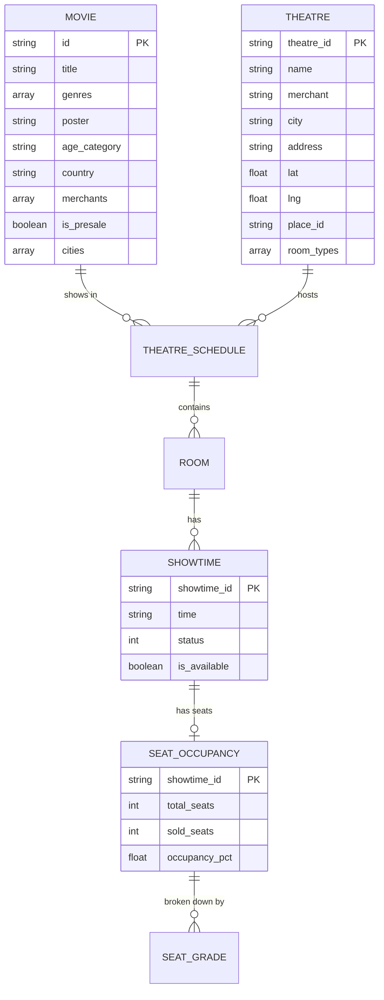

# CineRadar Database Schema

## Entity Relationship Diagram

---

## Domain Models

### 1. Movie
| Field | Type | Description |
|-------|------|-------------|
| `id` | string | TIX.id unique identifier |
| `title` | string | Movie title |
| `genres` | string[] | List of genres (Action, Drama, etc.) |
| `poster` | string | Poster image URL |
| `age_category` | string | Rating (SU, R, D, etc.) |
| `country` | string | Country of origin |
| `merchants` | string[] | Cinema chains showing it |
| `is_presale` | boolean | Advance ticket sales |
| `cities` | string[] | Cities where showing |
| `schedules` | Map | City → TheatreSchedule[] |

---

### 2. Theatre
| Field | Type | Description |
|-------|------|-------------|
| `theatre_id` | string | TIX.id unique ID |
| `name` | string | Display name (e.g., "ARAYA XXI") |
| `merchant` | string | Cinema chain (XXI, CGV, Cinépolis) |
| `city` | string | City (uppercase) |
| `address` | string | Physical address |
| `lat` | float | Latitude |
| `lng` | float | Longitude |
| `place_id` | string | Google Places ID |
| `room_types` | string[] | Room types (2D, IMAX, etc.) |
| `last_seen` | string | Last scrape timestamp |
| `created_at` | string | First seen |
| `updated_at` | string | Last update |

---

### 3. TheatreSchedule (embedded in Movie)
| Field | Type | Description |
|-------|------|-------------|
| `theatre_id` | string | Theatre ID |
| `theatre_name` | string | Theatre name |
| `merchant` | string | Cinema chain |
| `address` | string | Address |
| `rooms` | Room[] | List of rooms/screens |

---

### 4. Room (embedded in TheatreSchedule)
| Field | Type | Description |
|-------|------|-------------|
| `category` | string | Room type (2D, IMAX, PREMIERE) |
| `price` | string | Ticket price (e.g., "Rp35.000") |
| `showtimes` | string[] | Time strings (["12:45", "16:20"]) |
| `all_showtimes` | Showtime[] | Full showtime objects |

---

### 5. Showtime (embedded in Room)
| Field | Type | Description |
|-------|------|-------------|
| `time` | string | Time in HH:MM format |
| `showtime_id` | string | TIX.id showtime ID |
| `status` | int | 0=sold out, 1=available, 2=almost sold |
| `is_available` | boolean | Can purchase tickets |

---

### 6. SeatOccupancy
| Field | Type | Description |
|-------|------|-------------|
| `showtime_id` | string | Showtime ID (FK) |
| `movie_id` | string | Movie ID |
| `movie_title` | string | Movie title |
| `theatre_id` | string | Theatre ID |
| `theatre_name` | string | Theatre name |
| `city` | string | City |
| `merchant` | string | Cinema chain |
| `room_category` | string | Room type |
| `showtime` | string | Time (HH:MM) |
| `date` | string | Date |
| `scraped_at` | string | Scrape timestamp |
| `total_seats` | int | Total capacity |
| `sold_seats` | int | Tickets sold |
| `available_seats` | int | Seats available |
| `occupancy_pct` | float | Occupancy percentage |
| `seat_grades` | Map | Grade → SeatGradeStats |

---

### 7. SeatGradeStats (embedded in SeatOccupancy)
| Field | Type | Description |
|-------|------|-------------|
| `total` | int | Total seats in grade |
| `available` | int | Available seats |
| `sold` | int | Sold seats |

---

### 8. Token
| Field | Type | Description |
|-------|------|-------------|
| `token` | string | JWT token string |
| `phone` | string | Phone number (masked) |
| `stored_at` | string | Storage timestamp |
| `expires_at` | string | Expiry timestamp |

---

## Firestore Collections

### `theatres`
- **Document ID:** `{theatre_id}`
- **Purpose:** Master list of all cinema locations
- **Updated by:** `sync_theatres_from_scrape()`

### `snapshots`
- **Document ID:** `latest` (single document)
- **Purpose:** Daily movie data for web app
- **Updated by:** `save_daily_snapshot()`
- **Note:** Only contains `theatre_counts`, not full schedules

### `seat_snapshots`
- **Document ID:** `{showtime_id}_{type}_{time}`
- **Purpose:** Seat occupancy data
- **Updated by:** `upload_seats_to_firestore()`

### `scraper_runs`
- **Document ID:** Auto-generated
- **Purpose:** Scraper run logs
- **Updated by:** `log_scraper_run()`

### `tokens`
- **Document ID:** `tix_token`
- **Purpose:** JWT token storage
- **Updated by:** Token refresh workflow
