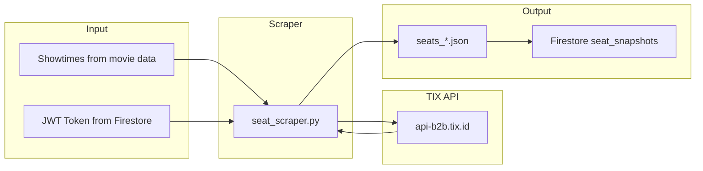

# CineRadar Seat Scraper Documentation

> **IMPORTANT**: This document is critical for understanding the TIX.id seat occupancy scraping system.

## Overview

The seat scraper fetches real-time seat availability data from TIX.id cinemas to calculate occupancy percentages for each showtime.

## Architecture



## API Details

### Endpoint

```
GET https://api-b2b.tix.id/v1/movies/{merchant}/layout
```

> ⚠️ **CRITICAL**: Use `api-b2b.tix.id`, NOT `api.tix.id`! The consumer API returns 404.

### Merchant Paths

| Merchant | API Path |
|----------|----------|
| XXI | `xxi` |
| CGV | `cgv` |
| Cinépolis | `cinepolis` |

### Parameters

| Parameter | Value | Description |
|-----------|-------|-------------|
| `show_time_id` | `string` | Showtime ID from movie schedule |
| `tz` | `7` | Timezone offset (NOT `Asia/Jakarta`!) |

### Headers

```
Authorization: Bearer {jwt_token}
Accept: application/json
User-Agent: Mozilla/5.0...
```

### Response Format

### Response Format

There are two variations of the API response structure depending on the merchant:

#### Type A: Nested Structure (XXI, CGV)
```json
{
    "success": true,
    "data": {
        "seat_map": [
            {
                "seat_code": "A",
                "seat_rows": [
                    {"seat_row": "A1", "status": 5},
                    {"seat_row": "A2", "status": 1}
                ]
            }
        ]
    }
}
```

#### Type B: Flat List Structure (Cinépolis)
```json
{
    "success": true,
    "data": {
        "seat_map": [
            {
                "row_name": "A",
                "seat_no": "1",
                "seat_status": 1
            },
            {
                "row_name": "A",
                "seat_no": "2",
                "seat_status": 1
            }
        ]
    }
}
```

> **Note**: The scraper automatically handles both formats. For flat lists, `seat_status` is used.

```json
{
    "success": true,
    "data": {
        "user_seat_purchased": 0,
        "price": 30000,
        "seat_map": [...] 
    }
}
```

### Seat Status Codes

| Status | Meaning | Count In Occupancy? |
|--------|---------|---------------------|
| `1` | **Sold** ❌ | Yes (numerator) |
| `5` | **Available** ✅ | Yes (denominator) |
| `6` | **Blocked/Reserved** 🚫 | No |

**Occupancy Formula**: `sold / (sold + available) * 100`

---

## Token Management

### Token Storage

Tokens are stored in Firestore at `auth_tokens/tix_jwt`:

```json
{
    "token": "eyJhbG...",
    "phone": "6285***",
    "stored_at": "2025-12-23T02:21:30.743621",
    "expires_at": "2025-12-23T22:21:30.743649"
}
```

### Token Lifetime

- **TTL**: ~20 hours
- **Refresh**: Daily via `token-refresh.yml` workflow before scraping
- **Validation**: Check `expires_at` before using

### ⚠️ Token Bug (Fixed)

The token from localStorage may include extra quotes (`"eyJ..."`). The scraper now strips these:

```python
self.auth_token = token.strip('"')
```

---

## Running the Scraper

### Local Testing

```bash
# Set up environment
export $(cat .env | xargs)

# Run for 1 showtime (quick test)
python -m backend.cli.cli seats --limit 1 --use-stored-token --city AMBON

# Run for specific city
python -m backend.cli.cli seats --city JAKARTA --use-stored-token

# Run in morning mode (all cities)
python -m backend.cli.cli seats --mode morning --use-stored-token
```

### Required Environment Variables

| Variable | Description |
|----------|-------------|
| `FIREBASE_SERVICE_ACCOUNT` | JSON service account for Firestore |
| `TIX_PHONE_NUMBER` | Phone number for token refresh (with 62 prefix) |
| `TIX_PASSWORD` | Password for token refresh |

---

## Troubleshooting

### "Auth token expired"

**Cause**: Token invalid or expired

**Solution**:
```bash
# Check token status
python -m backend.cli.refresh_token --check

# Refresh token (opens browser)
python -m backend.cli.refresh_token --visible
```

### 404 Not Found

**Cause**: Using wrong API domain

**Solution**: Ensure using `api-b2b.tix.id`, not `api.tix.id`

### 401 Invalid Token

**Cause**: Token has extra quotes or is malformed

**Solution**: Check token doesn't start with `"`. The scraper should strip quotes automatically.

### Empty Results

**Cause**: No showtimes with valid `showtime_id` in movie data

**Solution**: Check that movie data includes `all_showtimes` array with `showtime_id` fields

---

## Files

| File | Purpose |
|------|---------|
| `backend/infrastructure/_legacy/seat_scraper.py` | Main scraper logic |
| `backend/infrastructure/_legacy/token_storage.py` | Token storage/retrieval |
| `backend/cli/refresh_token.py` | Token refresh via browser |
| `backend/cli/upload_seats.py` | Upload seat data to Firestore |

---

## GitHub Workflows

### Daily Scrape (`daily-scrape.yml`)

Runs seat scraper after movie scrape at 6 AM WIB:
1. Token refresh
2. Movie scrape (9 batches)
3. Seat scrape (uses stored token)
4. Upload to Firestore

### Token Refresh (`token-refresh.yml`)

Runs before daily scrape to ensure fresh token:
1. Opens Playwright browser
2. Logs into TIX.id
3. Captures JWT from localStorage
4. Stores in Firestore

---

## Change History

| Date | Change |
|------|--------|
| 2025-12-23 | Fixed API endpoint: `api.tix.id` → `api-b2b.tix.id` |
| 2025-12-23 | Fixed tz parameter: `Asia/Jakarta` → `7` |
| 2025-12-23 | Fixed token quote stripping |
| 2025-12-23 | Updated parser for status codes 1/5/6 |
