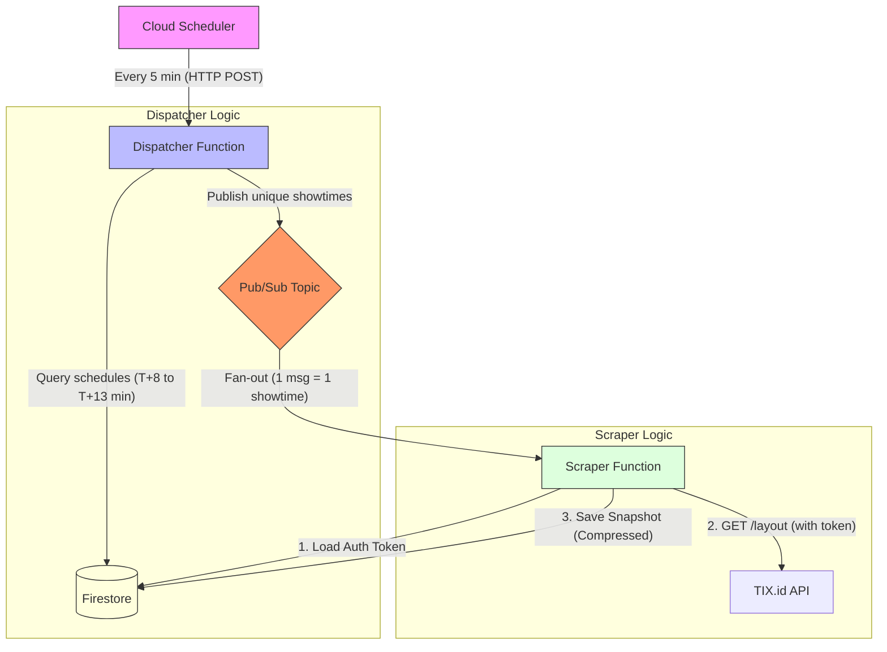

# Deep Scan: `backend/functions/`

## 1. Directory Structure

This directory contains the **JIT (Just-In-Time) Seat Scraper**, built on Google Cloud Functions. It uses an event-driven architecture to scrape seat data 8-13 minutes before showtime.

```text
backend/functions/
├── README.md               # Architecture docs & deployment guide
├── deploy.sh               # Deployment script (Dispatcher, Scraper, Scheduler, Pub/Sub)
├── dispatcher/             # [Function 1] Findings showtimes to scrape
│   ├── main.py             # Logic: Queries Firestore -> Publishes to Pub/Sub
│   └── requirements.txt    # Deps: google-cloud-firestore, google-cloud-pubsub
└── scraper/                # [Function 2] Scrapes individual showtimes
    ├── main.py             # Logic: Pub/Sub Msg -> TIX.id API -> Firestore
    └── requirements.txt    # Deps: requests, google-cloud-firestore
```

---

## 2. Architecture Overview

High-level flow from scheduling to data storage.



---

## 3. Component Deep Dive

### A. Dispatcher (`dispatch-jit-jobs`)

*   **Location**: `backend/functions/dispatcher/main.py`
*   **Trigger**: HTTP (called by Cloud Scheduler every 5 minutes).
*   **Purpose**: Identify which showtimes are about to start and need scraping.

**Key Logic:**
1.  **Calculate Window**: specific window `NOW + 8 min` to `NOW + 13 min`.
2.  **Query Firestore**: Reads `schedules/{date}/movies` to find all movies/showtimes for today.
3.  **Filter**: Iterates through nested structure (Cities → Theatres → Rooms → Showtimes) to find matches in the window.
4.  **Publish**: Sends a JSON message to Pub/Sub topic `scrape-seat-jit` for each matching showtime.

**Why?** This decouples finding work (fast, single instance) from doing work (slow, parallelizable).

### B. Scraper (`scrape-seat-jit`)

*   **Location**: `backend/functions/scraper/main.py`
*   **Trigger**: Pub/Sub Message (Topic: `scrape-seat-jit`).
*   **Concurrency**: Max 5 instances (controlled in `deploy.sh` to prevent rate-limiting).

**Key Logic:**
1.  **Load Token**: Fetches JWT from `auth_tokens/tix_jwt` in Firestore.
2.  **API Call**: Direct request to TIX.id B2B API (bypasses UI/browser).
    *   Endpoint: `https://api-b2b.tix.id/v1/movies/{merchant_slug}/layout`
3.  **Calculate Occupancy**:
    *   **Logic**: Parses seat map, handling both **nested** (XXI/CGV) and **flat** (Cinépolis/some CGV) structures. Reconstructs the visual grid for flat responses to ensure UI compatibility.
    *   Counts `status=1` (Available) vs `status=5,6` (Sold/Blocked).
4.  **Save Snapshot**: Writes result to `movie_performance/{movie_id}/days/{date}/showtimes/{showtime_id}`.
    *   **Optimization**: Compresses the full seat layout grid using GZIP before saving to save storage costs.

---

## 4. Token Management

### Token Refresh Mechanism (Self-Healing)

The Cloud Function is **autonomous** and self-healing. It proactively checks if the token is expired or expiring soon (< 5 minutes TTL).

1.  **Inline Refresh (Primary)**:
    -   Scraper checks `stored_at` timestamp.
    -   If token age > 25 mins, it calls `POST https://api-b2b.tix.id/v1/users/refresh`.
    -   Updates `auth_tokens/tix_jwt` in Firestore.
    -   Uses new token for the current scrape.

2.  **Backup Refreshers**:
    -   `token_refresher.py` (Script): Cron job or manually run.
    -   `token-refresh.yml` (GitHub Actions): Full login fallback for 91-day storage refresh.

---

## 5. Showtime & API Details

### Finding Showtimes
The dispatcher doesn't guess IDs. It relies on the pre-scraped schedule data in Firestore:
```python
# Firestore: schedules/2026-01-19/movies/dune-part-two
{
  "cities": {
    "Jakarta": [
      {
        "theatre_name": "Grand Indonesia",
        "rooms": [
          {
            "all_showtimes": [
              { "showtime_id": "ABC123_1430", "time": "14:30" } 
            ]
          }
        ]
      }
    ]
  }
}
```

### Seating API
*   **URL**: `https://api-b2b.tix.id/v1/movies/{merchant}/layout`
*   **Method**: `GET`
*   **Merchant Mapping**:
    *   XXI → `xxi`
    *   CGV → `cgv`
    *   Cinépolis → `cinepolis`
*   **Response**: Contains a nested `seat_map` with row and seat statuses.

---

## 6. Costs & Limits

| Metric | Handling |
|:---|:---|
| **Cost** | ~$0.81/month (mostly Firestore writes + minimal Compute invocations). |
| **Rate Limit** | Capped at **5 concurrent instances** to stay under safe thresholds (~1-2 req/sec). |
| **Precision** | Scrapes exactly **8 minutes** before the movie starts. |
