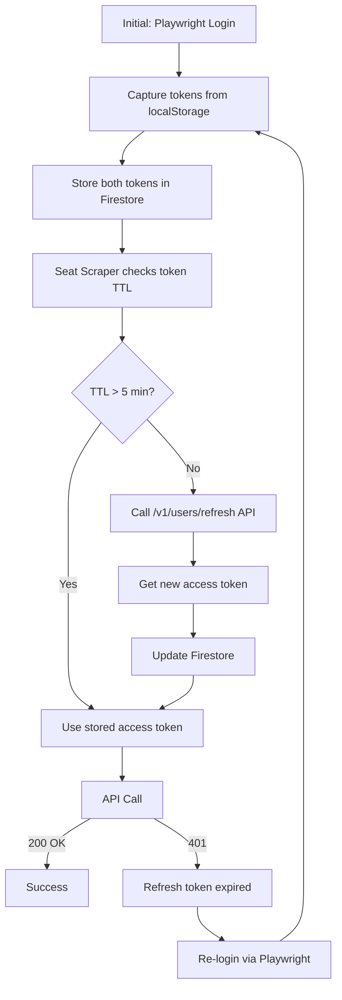
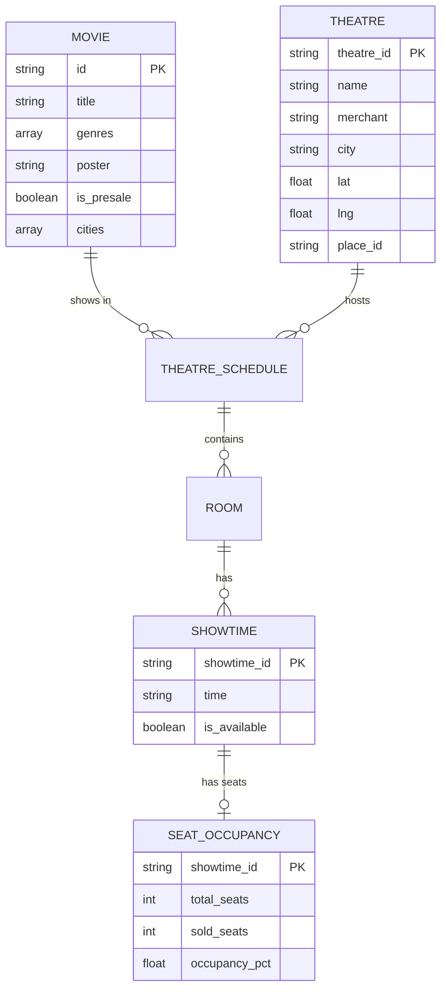

# Architecture & Data Flow

This document details the system design, data flow, token management, and infrastructure of CineRadar.

## System Overview

CineRadar is a 3-scraper pipeline for TIX.id movie data collection, feeding into a Firestore database that powers both an Admin Dashboard and a Public Consumer Web App.

### Data Flow

```
TIX.id Website → Scraper (GitHub Actions) → Firestore → 
  ├── Admin Dashboard (admin.cineradar-id.vercel.app)
  └── Public Website (cineradar-id.vercel.app)
```

### Infrastructure Components

- **Backend**: Python 3.11+ using Playwright for scraping and interactions.
- **Database**: Google Cloud Firestore (NoSQL).
- **Admin**: Next.js 16 (React 19) dashboard.
- **Web**: Next.js 16 (React 19) consumer app.
- **CI/CD**: GitHub Actions for daily scraping, testing, and deployment.

---

## Token Architecture (Single Source of Truth)

> [!NOTE]
> This is the authoritative documentation for TIX.id authentication. All other docs reference this section.

### Token Types

| Token | localStorage Key | Actual TTL | Purpose |
|-------|-----------------|------------|---------|
| **Access** | `authentication_token` | **30 minutes** | Bearer token for API calls |
| **Refresh** | `authentication_refresh_token` | **~91 days** | Used for programmatic token refresh |

### Token Lifecycle



### Programmatic Token Refresh

> [!IMPORTANT]
> **No browser needed!** We can refresh tokens via API using the refresh token.

**Endpoint:**
```http
POST https://api-b2b.tix.id/v1/users/refresh
Authorization: Bearer <REFRESH_TOKEN>
```

**Key Points:**
- Works **before** token expiration (proactive refresh)
- Works **after** token expiration (recovery)
- Refresh token lasts ~91 days
- Initial login still requires Playwright (to get refresh token)

### Firestore Storage

Tokens are stored at `auth_tokens/tix_jwt`:

```json
{
    "token": "eyJhbGciOiJIUzI1NiIs...",
    "refresh_token": "eyJhbGciOiJIUzI1NiIs...",
    "phone": "6285***",
    "stored_at": "2025-12-23T06:26:40.591620"
}
```

---

## Database Schema

### Entity Relationship Diagram



### Firestore Collections

| Collection | Document ID | Purpose |
|------------|-------------|---------|
| `theatres` | `{theatre_id}` | Master list of cinema locations |
| `snapshots` | `latest` or `{YYYY-MM-DD}` | Daily movie data (slim) |
| `schedules/{date}/movies` | `{movie_id}` | Full showtime data by date |
| `seat_snapshots` | `{showtime_id}_{type}_{time}` | Seat occupancy data |
| `scraper_runs` | `{timestamp}_{type}` | Scraper run logs |
| `auth_tokens` | `tix_jwt` | JWT token storage |

---

## CI/CD Pipeline

### Workflow Overview

| Workflow | Trigger | Purpose |
|----------|---------|---------|
| `ci.yml` | Push/PR to `backend/**` | Lint, test, type-check Python |
| `admin-ci.yml` | Push/PR to `admin/**` | Lint, type-check, build Next.js |
| `pr-checks.yml` | Pull requests | Unified quality gate |
| `smoke-tests.yml` | Push to `admin/**` + daily | Test production APIs |
| `security-scan.yml` | Push/PR + weekly | CodeQL security analysis |
| `failure-reporter.yml` | Workflow failures | Auto-create GitHub issues |
| `daily-scrape.yml` | Daily 6 AM WIB | Movie + seat scraping |
| `token-refresh.yml` | Daily 5:50 AM WIB | JWT token refresh |

### Quality Gates (Required for Merge)

The `PR Checks` workflow serves as a single required status check for branch protection. It enforces `ruff` linting, `mypy` type checking, `pytest` coverage (min 70%), and Frontend Type Check + Build.
