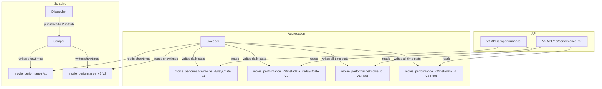

# V1 Performance Not Updating - Debug Analysis

## Problem Statement

The V1 performance menu is not showing the correct number of tickets sold, while V2 is displaying correctly.

## Questions to Answer

1. Why is V1 not updating the correct sold seats number?
2. Are we still dual writing?

---

## Architecture Overview

### Data Flow



### Collection Structure

**V1 Path:**
```
movie_performance/{movie_id aka schedule_id}/
├── days/{date}/
│   └── showtimes/{showtime_id}  ← Scraper writes here
└── (root fields: total_sold, total_seats, etc.)  ← Sweeper writes here
```

**V2 Path:**
```
movie_performance_v2/{metadata_id}/
├── days/{date}/
│   └── showtimes/{showtime_id}  ← Scraper writes here
└── (root fields: total_sold, total_seats, etc.)  ← Sweeper writes here
```

---

## Answer: Are We Still Dual Writing?

### ✅ YES - We are still dual writing

#### Scraper Dual Write
Location: [`backend/functions/scraper/main.py:1226-1236`](backend/functions/scraper/main.py:1226)

```python
# V1 write (existing - keep for backward compatibility)
doc_ref.set(snapshot_data, merge=True)
logger.info(f"Saved V1 snapshot for {showtime_id}")

# V2 write (new - only if metadata_id available)
if doc_ref_v2:
    v2_snapshot_data = {**snapshot_data, "schedule_id": movie_id}
    doc_ref_v2.set(v2_snapshot_data, merge=True)
    logger.info(f"Saved V2 snapshot for {showtime_id} (metadata_id={metadata_id})")
```

#### Sweeper Dual Write
Location: [`backend/functions/sweeper/main.py:156-176`](backend/functions/sweeper/main.py:156)

```python
# V1 write (existing - keep for backward compatibility)
daily_ref_v1 = (
    db.collection("movie_performance")
    .document(movie_id)
    .collection("days")
    .document(date_str)
)
daily_ref_v1.set(update_data, merge=True)  # ← ALWAYS writes to V1

# V2 write (new - only if metadata_id available and using V2 data)
if metadata_id and use_v2:
    daily_ref_v2 = (
        db.collection("movie_performance_v2")
        .document(metadata_id)
        .collection("days")
        .document(date_str)
    )
    daily_ref_v2.set(update_data, merge=True)  # ← Conditionally writes to V2
```

---

## Root Cause Analysis

### Primary Issue: Field Name Mismatch

**V1 API queries by `last_updated`:**

Location: [`admin/src/app/api/performance/route.ts:37-41`](admin/src/app/api/performance/route.ts:37)

```typescript
// Get all movie metadata (Root Collection)
const movies = (await firestoreRestClient.getCollectionWithQuery(
    'movie_performance',
    'last_updated',  // ← Querying by 'last_updated'
    100
)) as unknown as MovieWithStats[];
```

**But Sweeper writes `last_swept_at`:**

Location: [`backend/functions/sweeper/main.py:147-154`](backend/functions/sweeper/main.py:147)

```python
update_data = {
    "total_showtimes_scraped": total_showtimes_scraped,
    "total_seats": total_seats,
    "total_sold": total_sold,
    "avg_occupancy_pct": round(avg_occupancy, 1),
    "cities": sorted(cities),
    "last_swept_at": datetime.now(JAKARTA_TZ).isoformat(),  # ← Writing 'last_swept_at', NOT 'last_updated'
}
```

**Result:** The V1 API query may not return the most recently updated documents because it is ordering by a field that is never set by the sweeper.

---

### Secondary Issue: V1 Schedules May Lack metadata_id

**Sweeper reads from schedules_v2 first, falls back to schedules:**

Location: [`backend/functions/sweeper/main.py:287-296`](backend/functions/sweeper/main.py:287)

```python
movies_ref_v2 = db.collection("schedules_v2").document(today_str).collection("movies")
movies_ref_v1 = db.collection("schedules").document(today_str).collection("movies")

movie_docs = list(movies_ref_v2.stream())
use_v2_schema = True

if not movie_docs:
    logger.info(f"No data in schedules_v2/{today_str}/movies, falling back to schedules (V1)")
    movie_docs = list(movies_ref_v1.stream())
    use_v2_schema = False
```

**For V1 schema, metadata_id extraction is unreliable:**

Location: [`backend/functions/sweeper/main.py:318-326`](backend/functions/sweeper/main.py:318)

```python
else:
    # V1 schema: movie_id is schedule_id, metadata_id may be in tix_metadata_id
    schedule_id = data.get("movie_id") or data.get("id") or doc.id
    metadata_id = data.get("tix_metadata_id") or data.get("metadata_id")  # ← May be None!
    movie_info[schedule_id] = {
        "title": title,
        "metadata_id": metadata_id,  # ← Could be None
        "schedule_id": schedule_id,
    }
```

**Impact when metadata_id is None:**

Location: [`backend/functions/sweeper/main.py:77-100`](backend/functions/sweeper/main.py:77)

```python
if metadata_id:  # ← If None, skips V2 check entirely
    showtimes_ref_v2 = (
        db.collection("movie_performance_v2")
        .document(metadata_id)
        .collection("days")
        .document(date_str)
        .collection("showtimes")
    )
    # Check if V2 has data
    v2_snapshots = list(showtimes_ref_v2.limit(1).stream())
    if v2_snapshots:
        showtimes_ref = showtimes_ref_v2
        use_v2 = True

# Fallback to V1 if V2 not available
if not showtimes_ref:
    showtimes_ref = (
        db.collection("movie_performance")
        .document(movie_id)
        .collection("days")
        .document(date_str)
        .collection("showtimes")
    )
```

**Result:** If `metadata_id` is None and V1 showtimes are empty (because scraper writes primarily to V2), the sweeper finds no snapshots and returns without updating.

---

## Comparison: V1 vs V2 API

| Aspect | V1 API | V2 API |
|--------|--------|--------|
| Collection | `movie_performance` | `movie_performance_v2` |
| Query field | `last_updated` | `last_swept_at` |
| Document ID | `movie_id` (schedule_id) | `metadata_id` |
| Metadata source | Root doc has title/poster | Fetches from `movies` collection |
| Status | ❌ Field mismatch | ✅ Correct field |

**V2 API uses correct field:**

Location: [`admin/src/app/api/performance_v2/route.ts:31-34`](admin/src/app/api/performance_v2/route.ts:31)

```typescript
const performanceDocs = (await firestoreRestClient.getCollectionWithQuery(
    'movie_performance_v2',
    'last_swept_at',  // ← Correctly matches sweeper field
    100
))
```

---

## Proposed Solutions

### Option 1: Fix Field Name Mismatch (Recommended)

Change the sweeper to write `last_updated` instead of `last_swept_at`:

```python
# In backend/functions/sweeper/main.py
update_data = {
    "total_showtimes_scraped": total_showtimes_scraped,
    "total_seats": total_seats,
    "total_sold": total_sold,
    "avg_occupancy_pct": round(avg_occupancy, 1),
    "cities": sorted(cities),
    "last_updated": datetime.now(JAKARTA_TZ).isoformat(),  # Changed from last_swept_at
}
```

**Pros:**
- Minimal change
- Fixes V1 API immediately
- Maintains consistency with existing V1 schema

**Cons:**
- V2 API also uses `last_swept_at`, so we need to update both or write both fields

### Option 2: Write Both Fields

```python
update_data = {
    ...
    "last_updated": datetime.now(JAKARTA_TZ).isoformat(),
    "last_swept_at": datetime.now(JAKARTA_TZ).isoformat(),
}
```

**Pros:**
- Backwards compatible
- Works for both V1 and V2 APIs

**Cons:**
- Redundant data

### Option 3: Update V1 API to Query by last_swept_at

```typescript
// In admin/src/app/api/performance/route.ts
const movies = (await firestoreRestClient.getCollectionWithQuery(
    'movie_performance',
    'last_swept_at',  // Changed from last_updated
    100
))
```

**Pros:**
- No backend changes required
- Consistent with V2 API

**Cons:**
- Existing documents may not have `last_swept_at` field
- May need backfill

---

## Recommended Action Plan

1. **Immediate Fix:** Implement Option 2 (write both fields) in the sweeper
2. **Verification:** Add diagnostic logging to confirm the fix
3. **Cleanup:** Consider deprecating V1 API once V2 is stable

---

## Diagnostic Logging to Add

Add these logs to [`backend/functions/sweeper/main.py`](backend/functions/sweeper/main.py):

```python
# After line 103 (after streaming snapshots)
logger.info(f"[SWEEPER] movie_id={movie_id}, metadata_id={metadata_id}, use_v2={use_v2}, snapshots_count={len(snapshots)}")

# After line 154 (before writing)
logger.info(f"[SWEEPER] Writing daily stats: total_sold={total_sold}, total_seats={total_seats}")

# After line 327 (after building movie_info)
logger.info(f"[SWEEPER] Movies to sweep: {len(movie_info)}, sample metadata_ids: {[v.get('metadata_id') for v in list(movie_info.values())[:3]]}")
```

---

## Files Involved

| File | Purpose |
|------|---------|
| [`backend/functions/sweeper/main.py`](backend/functions/sweeper/main.py) | Aggregates showtimes into daily/all-time stats |
| [`backend/functions/scraper/main.py`](backend/functions/scraper/main.py) | Writes showtime snapshots |
| [`admin/src/app/api/performance/route.ts`](admin/src/app/api/performance/route.ts) | V1 API endpoint |
| [`admin/src/app/api/performance_v2/route.ts`](admin/src/app/api/performance_v2/route.ts) | V2 API endpoint |
