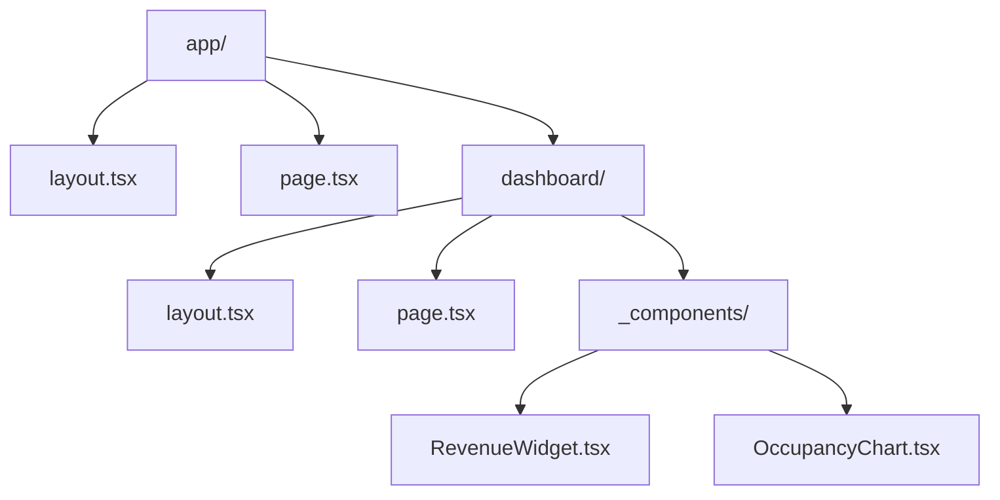

# Frontend Guidelines

> Standards for user interface, Next.js architecture, and regional data.

## 🎨 Design System

We enforce a **Premium/Corporate** aesthetic suitable for dashboard clients.

### Approved Tech Stack
-   **Framework**: Next.js 16 (App Router)
-   **Styling**: Tailwind CSS
-   **Components**: Shadcn UI (Radix Primitives)
-   **Base Font**: `Inter` (Sans), `JetBrains Mono` (Code)

### Do's and Don'ts

#### ❌ Don't: Manual Color Values
```tsx
// Bad: Hardcoded colors inconsistent with theme
<div className="bg-[#123456] text-white">...</div>
```

#### ✅ Do: Design Tokens
```tsx
// Good: Semantic tokens
<div className="bg-primary text-primary-foreground">...</div>
```

---

## 📂 Project Structure

All new features should follow this App Router structure:



### Key Directories
-   `app/`: Routes and Pages.
-   `lib/`: Utility functions (time, numbers).
-   `components/ui/`: Shadcn primitives (Button, Card).
-   `components/shared/`: Cross-page business components.

---

## 🌎 Geographic Configuration

### Region Mapping (Strict)

All 83 cities must map to one of these 6 regions.

| Region | Color Token | Hex | Center (Lat, Lng) |
|--------|-------------|-----|-------------------|
| **Jawa** | `teal-600` | `#0d9488` | -7.0, 110.4 |
| **Sumatera** | `purple-600` | `#7c3aed` | -0.5, 101.5 |
| **Kalimantan** | `pink-600` | `#db2777` | 0.5, 116.5 |
| **Sulawesi** | `orange-600` | `#ea580c` | -2.0, 121.0 |
| **Bali & NT** | `cyan-600` | `#0891b2` | -8.5, 118.0 |
| **Papua & Maluku** | `lime-600` | `#65a30d` | -3.5, 135.0 |

---

## ⚠️ Next.js Best Practices

### Hydration Safety
1.  **Strict Mode**: Don't use `window` in render body.
2.  **Date Consistency**: Use `formatWIB()` from `@/lib/timeUtils` instead of `new Date()`.

```tsx
// ❌ Hydration Mismatch
<span>{new Date().toLocaleTimeString()}</span>

// ✅ Hydration Safe
const [time, setTime] = useState<string | null>(null)
useEffect(() => setTime(formatWIB(new Date())), [])
if (!time) return null
return <span>{time}</span>
```
