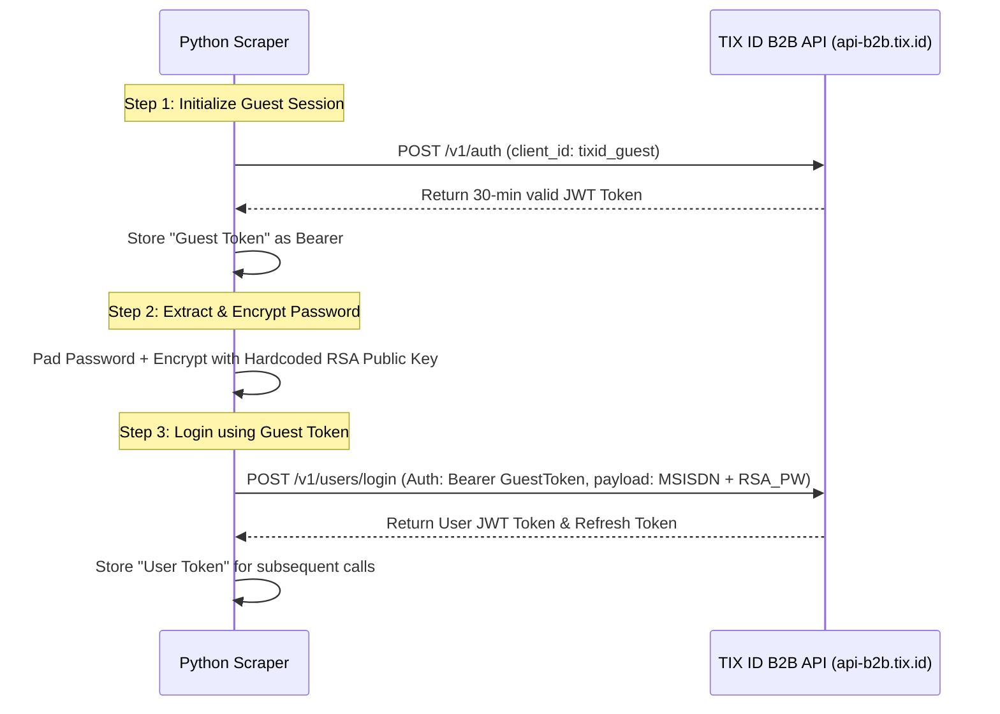
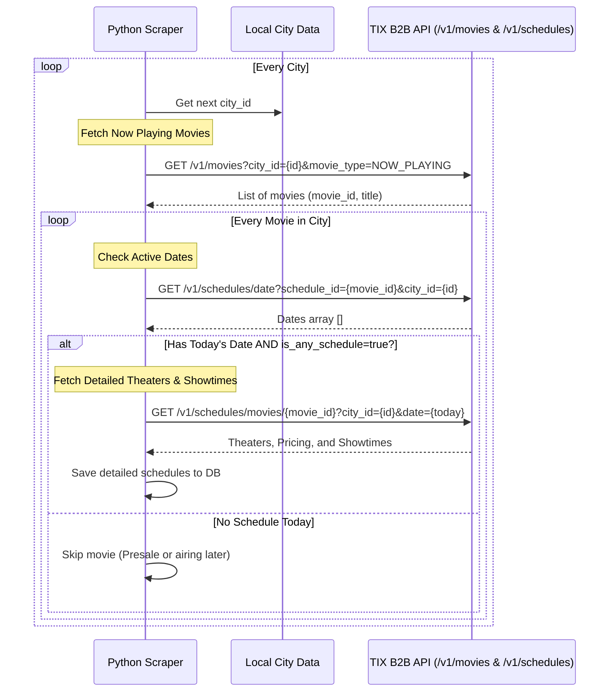

# TIX ID API Scraping Process

This document outlines the reverse-engineered scraping process for the TIX ID platform (`app.tix.id` / `api-b2b.tix.id`). The workflow relies on direct API calls rather than browser automation to maximize efficiency and minimize load.

## 1. Authentication Flow (Guest & Login)

TIX ID employs a strict 30-minute rotating "Guest Token" mechanism to prevent primitive bot replay attacks, coupled with RSA-2048 asymmetric encryption for login credentials.

### Swimlane Diagram: Authentication

> [!NOTE] 
> **Ground Truth Login Payload:**
> - Request: [`raw_payloads/02_auth_login.request`](./raw_payloads/02_auth_login.request)
> - Response: [`raw_payloads/02_auth_login.response`](./raw_payloads/02_auth_login.response)

### Encryption Details
- The client encapsulates the `password` in a 344-character Base64 encoded payload.
- This represents a 256-byte output standard to **RSA-2048 encryption**.
- The public key is hardcoded directly into the `main.dart.js` output of their Flutter web app.
- Because asymmetric encryption is used, server-side interception without the private key cannot determine user passwords.

## 2. Daily Showtimes Scraping Sequence (Morning Scrape)

To avoid useless API calls checking showtimes for pre-sale movies or movies not airing today, we use an iterative 4-step "funnel" approach.

### Swimlane Diagram: Showtimes

## 3. Rate Limiting & Optimization
- **Do not brute-force dates:** Always use `/v1/schedules/date` before requesting full theater/showtime objects. The date check is heavily cached by TIX ID on their CDNs and significantly reduces load.
- **Pagination:** Check the `has_next` boolean on `/v1/schedules/movies`. Highly populated cities (e.g., Jakarta) for popular movies may span multiple API pages.
