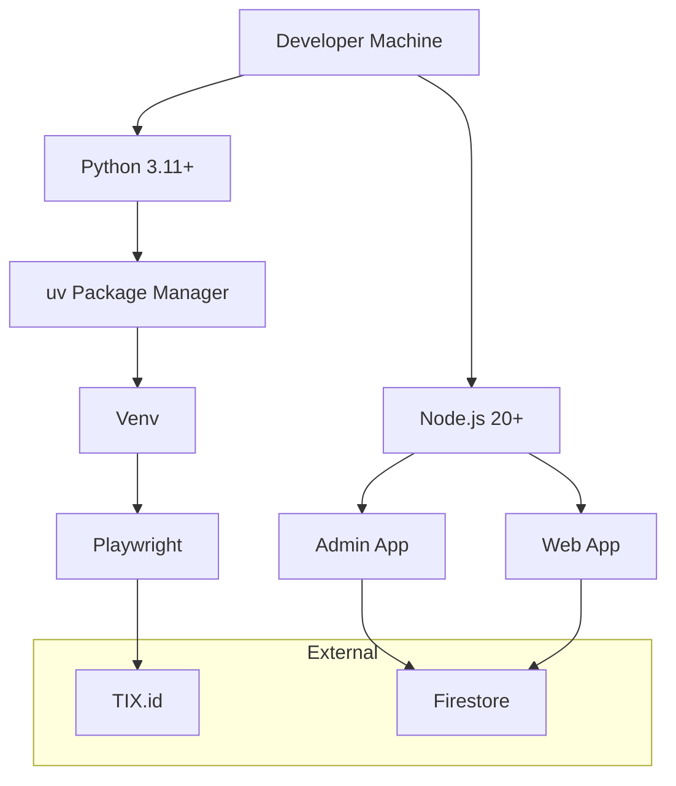

# Manual Setup & Verification

> Guide for setting up the simplified CineRadar development environment.

## 🛠 Dependency Tree



## ⚡️ Quick Start (Manual)

### 1. Installation

```bash
# Clone
git clone https://github.com/okihita/CineRadar.git
cd CineRadar

# Python Setup
uv sync
uv run playwright install chromium

# Javascript Setup
(cd admin && npm install)
(cd web && npm install)
```

### 2. Run Applications

| App | Command | URL |
|-----|---------|-----|
| **Backend** | `uv run python -m scraper` | N/A |
| **Admin** | `cd admin && npm run dev` | `localhost:3000` |
| **Web** | `cd web && npm run dev` | `localhost:3001`* |

*Note: If Admin is running on 3000, Web usually defaults to 3001.*

---

## 🩺 System Health Check

Save this as `health_check.sh` and run it to verify your environment:

```bash
#!/bin/bash

echo "🏥 CineRadar Health Check"
echo "------------------------"

# 1. Check Python
python3 --version || echo "❌ Python missing"

# 2. Check Node
node -v || echo "❌ Node missing"

# 3. Check Admin Server
if curl -s -o /dev/null -w "%{http_code}" http://localhost:3000 | grep -q "200"; then
    echo "✅ Admin Dashboard: UP"
else
    echo "⚠️  Admin Dashboard: DOWN"
fi

# 4. Check Web Server
if curl -s -o /dev/null -w "%{http_code}" http://localhost:3001 | grep -q "200"; then
    echo "✅ Consumer Web: UP"
else
    echo "⚠️  Consumer Web: DOWN"
fi
```

## 🌐 Network Diagnostics

If production deployment fails, run this to check connectivity to Vercel and APIs:

```bash
# Quick connectivity check with timing
curl -s -o /dev/null -w "DNS: %{time_namelookup}s | Connect: %{time_connect}s | Total: %{time_total}s | HTTP: %{http_code}\n" https://cineradar-admin.vercel.app/api/dashboard
```

**Thresholds:**
-   **DNS**: < 0.5s
-   **Connect**: < 1.0s
-   **Total**: < 3.0s
