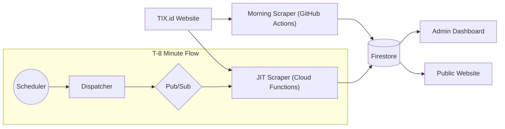
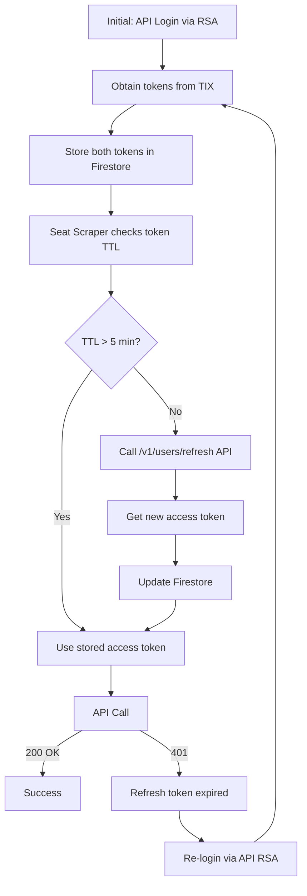
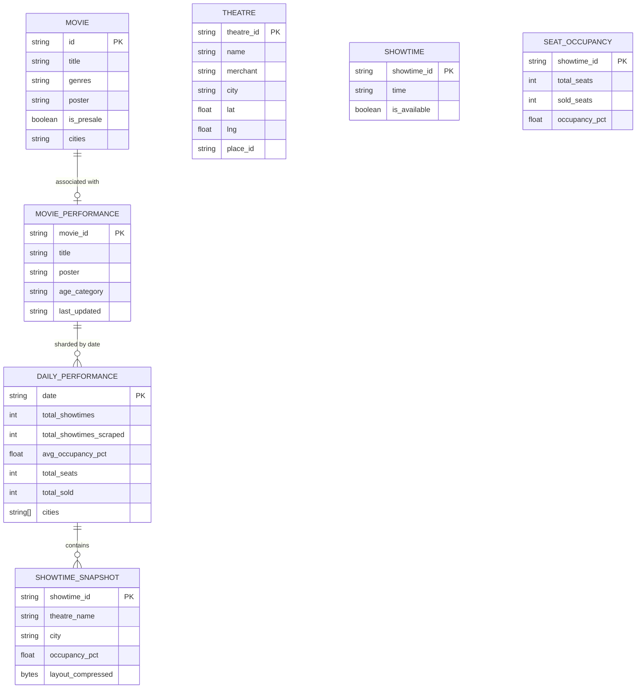
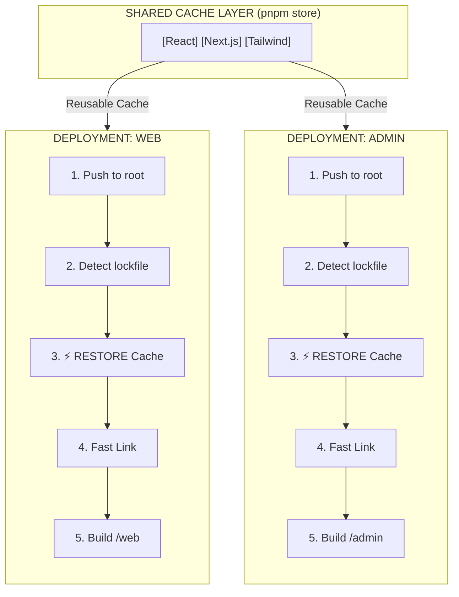

# Architecture & Data Flow

This document details the system design, data flow, token management, and infrastructure of CineRadar.

## System Overview

CineRadar is a **hybrid scraping pipeline** combining **Morning Scraping** (GitHub Actions) and **Real-Time JIT** (Cloud Functions) for TIX.id movie data collection, feeding into a Firestore database.

---

## Software Architecture (Backend)

We follow a loose **Clean Architecture** pattern to separate concerns between the "Runner" (CLI), the "Business Logic" (Domain), and the "Tools" (Infrastructure).

| Layer | Directory | Responsibility |
|-------|-----------|----------------|
| **1. Controllers** | `cli/` | **Entry Points.** Every file here corresponds to a `run` or `workflow` command. Contains *no business logic*, only orchestration. |
| **2. Use Cases** | `application/` | **Orchestrator.** Connects Scrapers -> Repositories. Pure Python, no framework dependencies. |
| **3. Domain** | `domain/` | **Entities.** Pydantic models & Error definitions. pure business rules. |
| **4. Contracts** | `schemas/` | **DTOs.** Data Transfer Objects for validation (e.g., TIX.id JSON responses). |
| **5. Infrastructure** | `infrastructure/` | **The "Dirty" Work.** API scraping, Token Logic, and Firestore Adapters. |

---

## Core Philosophy: Stability First

To ensure long-term maintainability and prevent "bit-rot," CineRadar adheres to a strict **Stability DNA**:

### 1. LTS Preference
We prioritize **Long Term Support (LTS)** versions for all core runtimes and frameworks.
*   **Node.js**: Use Active LTS (even numbered releases) where possible.
*   **Python**: Use stable releases supported by major cloud providers.
*   **Next.js**: While we use the latest major version (e.g., 16), we treat it as our stable base and do not chase experimental flags.

### 2. SemVer Strategy (`^` Range)
We strictly follow Semantic Versioning:
*   **Major Updates**: Manual intervention required.
*   **Minor/Patch Updates**: Allowed via Caret (`^`) versioning to automatically consume security patches and non-breaking features.
*   **Lockfiles**: `pnpm-lock.yaml` and `uv.lock` are the sources of truth. We trust them to pin exact versions for reproducibility.

### 3. Boring Technology
We choose "boring" (proven) technology for critical infrastructure.
*   **Database**: Firestore (Serverless, Managed) over self-hosted SQL.
*   **Auth**: TIX.id's native tokens over complex custom auth flows.
*   **Hosting**: Vercel Managed Infrastructure over custom VPS/Docker Swarm.

---

### Data Flow



### Infrastructure Components

- **Backend**: Python 3.13+ using pure HTTP API for scraping and interactions.
- **Database**: Google Cloud Firestore V2 (NoSQL).
- **Admin**: Next.js 16 (React 19, Turbopack, Tailwind CSS v4) Studio dashboard.
- **Web**: Next.js 16 (React 19, Turbopack, Tailwind CSS v4) Consumer web app.
- **CI/CD**: GitHub Actions for daily scraping, testing, and deployment.

### Morning Scraper Environment

The morning pipeline operates on **GitHub Actions**, utilizing a single runner to map the entire day's schedule via fast HTTP APIs.

#### Executors & Limits
*   **Runner**: `ubuntu-latest` (Standard GitHub Actions runner).
*   **Limits**: Subject to standard GitHub Actions concurrency and storage quotas.
*   **Strategy**: Single runner. The pure HTTP API scraper is fast enough (10-15 minutes) that parallel matrix strategies are no longer required.

#### Workflow Ecosystem

| Workflow | Schedule | Python Entry Point | Description |
|----------|----------|--------------------|-------------|
| **`daily-initial-scrape.yml`** | Daily 05:30 WIB (`22:30 UTC`) & 09:00 WIB (`02:00 UTC`) | `run_national_scrape.py`, `post_process.py` | **Main Pipeline**. Scrapes nationwide movies, showtimes, and links metadata directly into Firestore V2. |

#### Direct Stream Persistence Layer

Data is streamed directly into Firestore V2 using Google Cloud Service Account credentials:
*   `run_national_scrape.py`: Scrapes and streams schedules into `schedules_v2/{date}/movies/{movieId}`.
*   `post_process.py`: Links schedule documents with geocoded theatre IDs and city indices.
*   `movie_performance --init-only`: Initializes daily rollup skeletons in `movie_performance_v2/{metadataId}/days/{date}`.
*   `movie-details --all`: Enriches any newly discovered movies with synopsis, cast, and posters.

### JIT Scraper Environment (Real-Time)

The **Just-In-Time (JIT) Scraper** captures seat occupancy data leading up to showtime (T-30, T-20, T-10) to compute final occupancy rates.

#### Architecture
*   **Platform**: Google Cloud Functions (Gen 2).
*   **Trigger**: Cloud Scheduler $\rightarrow$ Dispatcher $\rightarrow$ Pub/Sub topic `scrape-seat-jit` $\rightarrow$ Scraper Function.
*   **Sweeper**: Low-memory streaming generator function periodically rolling up JIT occupancy into `movie_performance_v2`.

---

## Token Architecture (Single Source of Truth)

> ℹ️ **Note**
> This is the authoritative documentation for TIX.id authentication. All other docs reference this section.

### Token Types

| Token | localStorage Key | Actual TTL | Purpose |
|-------|-----------------|------------|---------|
| **Access** | `authentication_token` | **30 minutes** | Bearer token for API calls |
| **Refresh** | `authentication_refresh_token` | **~91 days** | Used for programmatic token refresh |

### Token Lifecycle

> ℹ️ **Note on Roles**
> Token refresh logic is exclusively managed by the **Scraper**. The **Dispatcher** only reads schedules and assigns tasks; it never attempts to fetch, check, or refresh authentication tokens.



### Programmatic Token Refresh

> 🚨 **Important**
> **No browser needed!** We can refresh tokens via API using the refresh token.

**Endpoint:**
```http
POST https://api-b2b.tix.id/v1/users/refresh
Authorization: Bearer <REFRESH_TOKEN>
```

**Key Points:**
- Works **before** token expiration (proactive refresh)
- Works **after** token expiration (recovery)
- Refresh token lasts ~91 days
- Initial login requires `refresh_token.py` (RSA encrypted POST)

### Firestore Storage

Tokens are stored at `auth_tokens/tix_jwt`:

```json
{
    "token": "eyJhbGciOiJIUzI1NiIs...",
    "refresh_token": "eyJhbGciOiJIUzI1NiIs...",
    "phone": "6285***",
    "stored_at": "2025-12-23T06:26:40.591620"
}
```

---

## Database Schema

### Entity Relationship Diagram



### Firestore V2 Collections

| Collection | Document ID | Purpose |
|------------|-------------|---------|
| `theatres` | `{theatre_id}` | Master list of geocoded cinema locations and studio capacities |
| `schedules_v2/{date}/movies` | `{movie_id}` | Full showtime data, formats, and room categories by date |
| `movie_performance_v2/{metadata_id}` | Root doc | Movie metadata entity (title, poster, age category) |
| `.../days/{date}` | Daily Performance | Aggregated daily admissions, showtimes, and occupancy percentage |
| `.../showtimes/{showtime_id}` | JIT Snapshot | JIT seat layout snapshot, occupancy, and compressed layout |
| `cinepoint_daily_boxoffice` | `{YYYY-MM-DD}` | CinePoint daily admissions, showtimes, and rankings |
| `cinepoint_movies` | `{movie_id}` | Normalized competitor movie catalog with creator credits |
| `social_feed_sources` | `{source_id}` | YouTube & social intelligence channels tracked by CineRadar |
| `auth_tokens` | `tix_jwt` | TIX ID Bearer and 91-day refresh token storage |

---

## CI/CD Pipeline

### Workflow Overview

| Workflow | Trigger | Purpose |
|----------|---------|---------|
| `ci.yml` | Push/PR to `main` / `dev` | Type-check & build Next.js apps, Ruff & Mypy Python checks |
| `daily-initial-scrape.yml` | Daily 05:30 & 09:00 WIB | Scrape nationwide schedules & initialize daily performance |
| `daily-initial-layouts.yml` | Daily 04:15 WIB | Scrape baseline seat maps to detect pre-blocked seats |
| `scrape-movie-details.yml` | Scheduled / On-demand | Enrich new movies with cast, synopsis, and posters |
| `token-refresh.yml` | 1st of month 02:50 WIB | Automatic RSA login for fresh 91-day long-term token |
| `security-scan.yml` | Push/PR + weekly | CodeQL static application security testing |

### Quality Gates (Required for Merge)

The `PR Checks` workflow serves as a single required status check for branch protection. It enforces `ruff` linting, `mypy` type checking, `pytest` coverage (min 70%), and Frontend Type Check + Build.

---

## Deployment Strategy (Monorepo)

CineRadar uses a **Monorepo structure** (pnpm workspaces) for code organization, but deploys primarily via **Git Integration** on Vercel.

### Vercel Deployment Model

Although `web` and `admin` live in the same repository, they are deployed as separate Vercel projects (isolated environments) that benefit from a shared build cache.

| Project | Root Directory | Hosting | URL |
|---------|----------------|---------|-----|
| **cineradar-web** | `web` | Vercel | `cineradar.id` |
| **cineradar-admin** | `admin` | Vercel | `cineradar-admin.vercel.app` |

### Shared Cache Efficiency

Vercel automatically detects the root `pnpm-lock.yaml` and optimizes the build pipeline:



### Key Benefits
1.  **Faster Builds**: Dependencies are downloaded once per commit, not twice.
2.  **Versioning**: Guarantees `web` and `admin` use the exact same library versions defined in the root lockfile.
3.  **Isolation**: Users on `cineradar-web` never load admin code bundles.
