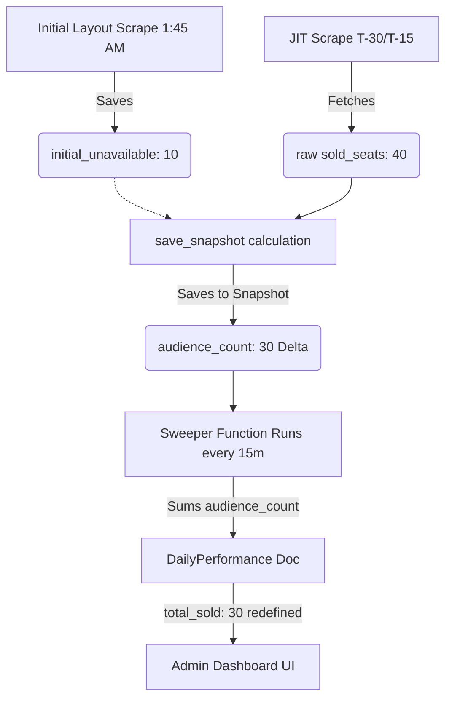

# Architecture Review: Sweeper vs Aggregator

## 1. Core Definitions

### What is the "Sweeper"?
*   **Where it lives:** `backend/functions/sweeper/main.py`
*   **What it is:** A Google Cloud Function triggered purely by time (Cloud Scheduler).
*   **Trigger:** Runs every 30 minutes (`0,30 10-23 * * *`).
*   **Purpose:** Loops through **all active movies for the current day**, reads all their JIT `ShowtimeSnapshot` documents, sums up the totals, and overwrites the parent `DailyPerformance` document. It is a brute-force, eventual-consistency catch-up job.

### What is the "Aggregator"?
*   **Where it lives:** `backend/application/services/performance_aggregator.py`
*   **What it is:** A core domain service class inside the backend package.
*   **Trigger:** Historically triggered synchronously by CLI scripts or the monolithic scraper. It is triggered *manually* via `backend/cli/movie_performance.py`.
*   **Purpose:** Exists to recalculate data on command.

## 2. Can we safely remove the Aggregator?

**Yes.** We should absolutely deprecate and remove the manual CLI `performance_aggregator.py` from regular execution loops, but keep the CLI wrapper around for manual database resets.

**Pros of removing the Aggregator:**
1.  **D.R.Y (Don't Repeat Yourself):** Removes the code duplication between the cloud function (`sweeper/main.py`) and the backend module (`application/services/performance_aggregator.py`). Right now, updating calculation logic (like True Audience Delta) requires carefully modifying two files to stay in sync. 
2.  **Less Write Contention:** In older architectures, the synchronous aggregator was used. In serverless scale, the Sweeper handles the load correctly.

**Cons of removing the Aggregator:**
1.  We lose the ability to easily trigger a synchronous recalculation via Python scripts. If we want to recalculate a specific movie, we have to wait for the next Sweeper tick or trigger the Cloud Function manually.

**Verdict:** 
We will keep `performance_aggregator.py` around purely as a CLI-driven utility for local disaster recovery and database migrations, but the **Sweeper Cloud Function is the sole source of truth in production**. 

## 3. Sweeper Frequency Analysis: 30 vs 15 vs 5 Minutes

The Sweeper's "Eventual Consistency" model is an excellent architectural choice to avoid write contention. By batching the rollups, we save immense amounts of database reads/writes. But how often should it run?

### 🟢 Option A: Sweeper at 30 Minutes (Current)
*   **Pros:** Extremely low Firestore costs (~224,000 reads/day) easily fitting in the free tier. No DB write contention.
*   **Cons:** The Admin UI will be up to 29 minutes out of date.

### 🟡 Option B: Sweeper at 15 Minutes (Proposed)
*   **Pros:** Data will never be more than 14 minutes old, an excellent middle ground for an executive view.
*   **Cons:** Double the Firestore cost compared to 30 mins, hitting ~448,000 reads/day. At $0.036 per 100,000 reads beyond the free tier, this costs roughly **~$0.14 per day** (or **~$4.30/month**). Extremely cheap.

### 🟠 Option C: Sweeper at 5 Minutes
*   **Pros:** Dashboard feels completely live. 
*   **Cons:** 6x cost increase (~1.3 million reads/day) costing ~$14/month. Computationally inefficient because 90% of the showtimes it recalculates haven't changed since the last 5-minute run.

**Verdict:** 
We will change the Sweeper to **Option B (15 Minutes)** to increase dashboard liveliness while maintaining negligible infrastructure costs.

## 4. Data Flow & Schema

Both the Sweeper and the Aggregator write to the exact same place.

**Firestore Tree Visualization:**
```text
movie_performance/ (or movie_performance_v2/)
└── {movie_id}
    ├── title: "Siksa Kubur"
    ├── total_sold: 500         <-- [UPDATED BY SWEEPER: All-Time Rollup]
    ├── total_seats: 1000
    ├── avg_occupancy_pct: 50.0
    │
    └── days/
        └── {YYYY-MM-DD}
            ├── date: "2026-03-10"
            ├── total_sold: 30       <-- [UPDATED BY SWEEPER: Daily Rollup]
            ├── total_seats: 100
            ├── avg_occupancy_pct: 30.0
            │
            └── showtimes/
                └── {showtime_id}    <-- [READ BY SWEEPER: T-30/T-15 Snapshots]
                    ├── sold_seats: 40           (Raw API unavailable count)
                    ├── initial_unavailable: 10  (Morning baseline)
                    ├── audience_count: 30       (True Delta)
                    └── audience_pct: 30.0
```

**Data Flow Explanation:**
1. **Inputs (Reads from):** The Sweeper loops through every document inside `.../days/{YYYY-MM-DD}/showtimes/`.
2. **Outputs (Writes to):** 
    *   **Daily Rollup:** It sums the showtimes and overwrites the parent document `.../days/{YYYY-MM-DD}`.
    *   **All-Time Rollup:** It then reads *all* `days` documents and overwrites the root `.../{movie_id}` document.

---

# True Audience Delta (TAD) Migration Plan

## Problem Statement
Currently, the "Total Sold" and "Occupancy %" metrics on the Admin Dashboard show the raw number of unavailable seats returned by the TIX.id API. 
However, cinemas often block seats (e.g. for maintenance, VIP reservations). Because the T-30 scrapers count all unavailable seats as "sold", the dashboard heavily overreports actual ticket sales.

The Scraper has already been updated to calculate True Delta:
```python
audience_count = max(0, sold_seats - initial_unavailable)
```
However, both the Sweeper and the Aggregator are still summing up the raw `sold_seats` instead of the `audience_count`.

## Can this be done without changing the Database Schema?
**Yes.** We are going to perform an "in-place semantic redefinition". 

Right now, the `DailyPerformance` schema looks like this:
```json
{
  "total_seats": 500,
  "total_sold": 400,
  "avg_occupancy_pct": 80.0
}
```

Instead of adding new fields, we will simply update the mathematical logic in the Sweeper so that `total_sold` is calculated by summing the highly accurate `audience_count`. 

If a historical snapshot doesn't have `audience_count` (because it was scraped before we added this feature), the logic will safely fall back to the old `sold_seats`.

**Will there be gaps?**
If we deploy this migration at 3:00 PM WIB, any data aggregated *after* the deployment will be perfectly accurate. Any data from previous days will remain slightly inflated (because the morning baselines didn't exist to calculate `audience_count`). This is an acceptable artifact of deploying a more accurate data model. 

## Technical Execution Plan

### 1. Update the Sweeper Cloud Function (`backend/functions/sweeper/main.py`)

**Proposed Logic:**
```python
# Try to use true delta first, fallback to raw sold seats
s_sold = data.get("audience_count")
if s_sold is None:
    s_sold = data.get("sold_seats", 0)

# Try to use true delta occupancy first, fallback to raw occupancy
s_occ = data.get("audience_pct")
if s_occ is None:
    s_occ = data.get("occupancy_pct", 0.0)

total_sold += s_sold
occupancy_sum += s_occ
```

### 2. Update the Manual CLI Aggregator (`backend/application/services/performance_aggregator.py`)

Must perfectly mirror the Sweeper logic so that local recalculation scripts remain accurate.

### 3. Deploy & Recalculate

1. **Update Scheduler Frequency:** Change `deploy.sh` to trigger the sweeper `*/15 10-23 * * *`.
2. **Deploy Components:** Run `./deploy.sh sweeper` and `./deploy.sh scheduler`.
3. **Trigger Database Recalculation:** Run `uv run python -m backend.cli.movie_performance --recalculate` locally to instantly sweep and update all today's data using the new Delta logic.

---

