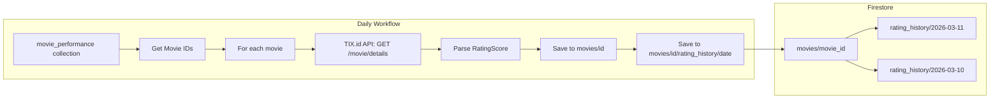

# Daily Rating Update Plan

## Current State Analysis

### Existing Rating Infrastructure

The project already has a complete rating history system in place:

#### 1. Data Model ([`backend/domain/models/movie_details.py`](backend/domain/models/movie_details.py:116))

```python
@dataclass
class RatingScore:
    vote_average: float
    vote_count: int
    average_source: int
    detail: dict[str, int] = field(default_factory=dict)
```

#### 2. Storage Schema ([`backend/infrastructure/repositories/firestore_movie_details.py`](backend/infrastructure/repositories/firestore_movie_details.py:5))

```
movies/{movie_id}                          - Main document with current rating_score
movies/{movie_id}/rating_history/{YYYY-MM-DD}  - Daily rating snapshots
```

#### 3. Repository Methods

| Method | Purpose |
|--------|---------|
| [`save()`](backend/infrastructure/repositories/firestore_movie_details.py:50) | Saves movie + rating history entry |
| [`_save_rating_history()`](backend/infrastructure/repositories/firestore_movie_details.py:85) | Saves daily rating snapshot |
| [`get_rating_history()`](backend/infrastructure/repositories/firestore_movie_details.py:166) | Retrieves rating history for a movie |

#### 4. CLI Support ([`backend/cli/cli.py`](backend/cli/cli.py:67))

```python
details_parser.add_argument(
    "--update-ratings", action="store_true", help="Update ratings for existing movies"
)
```

### The Problem

The current workflow [`scrape-movie-details.yml`](.github/workflows/scrape-movie-details.yml:26) runs:

```yaml
run: uv run python -m backend.cli movie-details --from-performance
```

**Without** the `--update-ratings` flag, this means:
- ✅ New movies get scraped with ratings
- ❌ Existing movies' ratings are NOT updated
- ❌ No daily rating history is captured for existing movies

---

## Proposed Solution

### Option A: Add `--update-ratings` Flag (Recommended)

**Change the workflow to:**

```yaml
- name: Scrape Movie Details with Rating Updates
  run: uv run python -m backend.cli movie-details --from-performance --update-ratings
```

#### How it works:

Looking at [`scrape_movie_details.py`](backend/application/use_cases/scrape_movie_details.py:94):

```python
# Get existing movie IDs if skipping
existing_ids = set()
if skip_existing and not update_ratings:
    existing_ids = self.repository.get_existing_ids()

for movie_id in movie_ids:
    # Skip if exists and not updating ratings
    if movie_id in existing_ids and not update_ratings:
        skipped += 1
        continue
```

With `--update-ratings`:
1. `existing_ids` remains empty (not fetched)
2. ALL movies from `movie_performance` are processed
3. Each movie gets a fresh API call
4. [`repository.save()`](backend/infrastructure/repositories/firestore_movie_details.py:50) is called
5. `_save_rating_history()` creates a new daily snapshot

#### Pros:
- ✅ Minimal code change (1 line in workflow)
- ✅ Uses existing infrastructure
- ✅ Daily rating history for all movies
- ✅ Can track rating trends over time

#### Cons:
- ❌ API calls for ALL movies daily (could be 200+ calls)
- ❌ Longer execution time
- ❌ More API quota consumption

### Option B: Dedicated Rating Update Workflow

Create a new lightweight workflow that ONLY updates ratings:

```yaml
name: Daily Rating Update

on:
  schedule:
    - cron: '30 19 * * *'  # 02:30 WIB
  workflow_dispatch:

jobs:
  update-ratings:
    runs-on: ubuntu-latest
    timeout-minutes: 30

    steps:
      - uses: actions/checkout@v6
      - uses: astral-sh/setup-uv@v7
      - uses: actions/setup-python@v6
        with:
          python-version: '3.12'

      - name: Install dependencies
        run: uv sync

      - name: Update Daily Ratings
        run: uv run python -m backend.cli movie-details --from-performance --update-ratings --skip-details
        env:
          FIREBASE_SERVICE_ACCOUNT: ${{ secrets.FIREBASE_SERVICE_ACCOUNT }}
```

**Note:** This would require a new `--skip-details` flag to only fetch/update ratings without re-saving all movie metadata.

#### Pros:
- ✅ Separation of concerns
- ✅ Can run at different time
- ✅ Easier to monitor failures

#### Cons:
- ❌ Requires code changes
- ❌ Another workflow to maintain

### Option C: Rating-Only API Endpoint

Create a dedicated rating update mechanism that:
1. Fetches only rating data from API (lighter payload)
2. Updates `rating_history` subcollection only
3. Skips main document update if unchanged

#### Pros:
- ✅ Most efficient
- ✅ Minimal API usage

#### Cons:
- ❌ Significant code changes required
- ❌ Need to verify TIX.id API supports rating-only fetch

---

## Recommendation: Option A

**Implement immediately** by modifying the existing workflow.

### Implementation

```yaml
# .github/workflows/scrape-movie-details.yml
- name: Scrape Movie Details with Rating Updates
  run: uv run python -m backend.cli movie-details --from-performance --update-ratings
```

### Data Flow Diagram



### Rating History Document Structure

```json
// movies/1991446452714422272/rating_history/2026-03-11
{
  "vote_average": 8.5,
  "vote_count": 15234,
  "average_source": 1,
  "detail": {
    "0": 120,
    "1": 450,
    "2": 890,
    "3": 1200,
    "4": 1567
  },
  "scraped_at": "2026-03-11T01:30:45.123Z"
}
```

---

## Future Enhancements

### 1. Admin Dashboard - Rating Trend Chart

Add a rating trend visualization in the admin panel:

```typescript
// Fetch rating history
const response = await fetch(`/api/movies/${movieId}/rating-history`);
const { history } = await response.json();

// Chart data
const chartData = history.map(h => ({
  date: h.date,
  rating: h.vote_average,
  votes: h.vote_count
}));
```

### 2. Rating Alert System

Alert when a movie's rating:
- Drops below 5.0 (poor reception)
- Rises above 8.5 (potential blockbuster)
- Vote count increases by >50% in one day (viral)

### 3. Rating History API Endpoint

Create a new API endpoint:

```
GET /api/movies/:id/rating-history?days=30
```

Returns last 30 days of rating snapshots for trend analysis.

---

## Summary

| Aspect | Current | Proposed |
|--------|---------|----------|
| New movies | ✅ Scraped with ratings | ✅ Same |
| Existing movies | ❌ Skipped | ✅ Rating updated daily |
| Rating history | ⚠️ Only on first scrape | ✅ Daily snapshots |
| Change required | - | 1 line in workflow |

**Action:** Modify `.github/workflows/scrape-movie-details.yml` to add `--update-ratings` flag.
