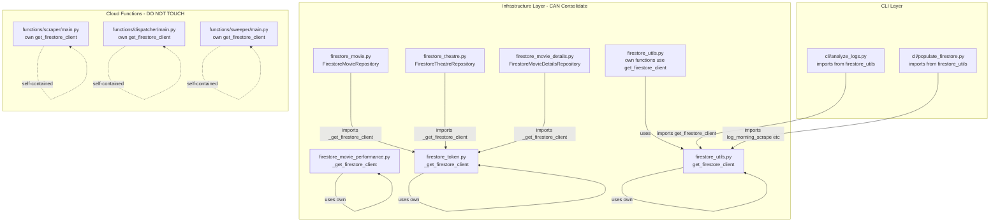

# Analysis: Firestore Client Consolidation

> **Kaizen Candidate**: Reduce cognitive load by consolidating duplicate `get_firestore_client()` functions.

## Executive Summary

**Status**: ✅ **COMPLETED** (2026-02-19)

**Recommendation**: ✅ **SAFE TO PROCEED** with consolidation, but only within the `backend/infrastructure/` layer.

The consolidation has a clear boundary:
- **CAN consolidate**: 3 duplicate functions within `backend/infrastructure/repositories/`
- **MUST NOT consolidate**: Cloud Functions code in `backend/functions/` (intentional duplication for deployment isolation)

---

## Completed Changes

| File | Action |
|------|--------|
| [`firestore_token.py`](backend/infrastructure/repositories/firestore_token.py) | Removed `_get_firestore_client()`, now imports from `firestore_utils` |
| [`firestore_movie_performance.py`](backend/infrastructure/repositories/firestore_movie_performance.py) | Removed `_get_firestore_client()`, now imports from `firestore_utils` |
| [`firestore_movie.py`](backend/infrastructure/repositories/firestore_movie.py) | Changed import from `firestore_token` to `firestore_utils` |
| [`firestore_theatre.py`](backend/infrastructure/repositories/firestore_theatre.py) | Changed import from `firestore_token` to `firestore_utils` |
| [`firestore_movie_details.py`](backend/infrastructure/repositories/firestore_movie_details.py) | Changed import from `firestore_token` to `firestore_utils` |

**Lines of code removed**: ~40 lines of duplicate code

---

## Original State: Function Locations (Pre-Consolidation)

### Duplicate Functions in Infrastructure Layer

| File | Function Name | Signature |
|------|---------------|-----------|
| [`firestore_token.py:20`](backend/infrastructure/repositories/firestore_token.py:20) | `_get_firestore_client()` | `def _get_firestore_client() -> Any` |
| [`firestore_movie_performance.py:19`](backend/infrastructure/repositories/firestore_movie_performance.py:19) | `_get_firestore_client()` | `def _get_firestore_client() -> Any` |
| [`firestore_utils.py:16`](backend/infrastructure/repositories/firestore_utils.py:16) | `get_firestore_client()` | `def get_firestore_client() -> Any` |

### Separate Implementation in Cloud Functions (Intentional)

| File | Function Name | Notes |
|------|---------------|-------|
| [`functions/scraper/main.py:71`](backend/functions/scraper/main.py:71) | `get_firestore_client()` | **DO NOT TOUCH** - self-contained |
| [`functions/dispatcher/main.py`](backend/functions/dispatcher/main.py) | `get_firestore_client()` | **DO NOT TOUCH** - self-contained |
| [`functions/sweeper/main.py`](backend/functions/sweeper/main.py) | `get_firestore_client()` | **DO NOT TOUCH** - self-contained |

---

## Call Graph: Who Uses What?



---

## Import Analysis: Current State

### Files importing from `firestore_token.py`

| File | Import Statement | Usage |
|------|------------------|-------|
| [`firestore_movie.py:12`](backend/infrastructure/repositories/firestore_movie.py:12) | `from backend.infrastructure.repositories.firestore_token import _get_firestore_client` | Lazy-loaded `db` property |
| [`firestore_theatre.py:15`](backend/infrastructure/repositories/firestore_theatre.py:15) | `from backend.infrastructure.repositories.firestore_token import _get_firestore_client` | Lazy-loaded `db` property |
| [`firestore_movie_details.py:16`](backend/infrastructure/repositories/firestore_movie_details.py:16) | `from backend.infrastructure.repositories.firestore_token import _get_firestore_client` | Lazy-loaded `db` property |

### Files importing from `firestore_utils.py`

| File | Import Statement | Usage |
|------|------------------|-------|
| [`cli/analyze_logs.py:19`](backend/cli/analyze_logs.py:19) | `from backend.infrastructure.repositories.firestore_utils import get_firestore_client` | Direct client usage |
| [`cli/populate_firestore.py:13`](backend/cli/populate_firestore.py:13) | `from backend.infrastructure.repositories.firestore_utils import log_morning_scrape, ...` | Logging functions |

### Files using own implementation

| File | Implementation | Notes |
|------|----------------|-------|
| [`firestore_token.py:20`](backend/infrastructure/repositories/firestore_token.py:20) | Own `_get_firestore_client()` | Used by `FirestoreTokenRepository` |
| [`firestore_movie_performance.py:19`](backend/infrastructure/repositories/firestore_movie_performance.py:19) | Own `_get_firestore_client()` | Used by `FirestoreMoviePerformanceRepository` |
| [`firestore_utils.py:16`](backend/infrastructure/repositories/firestore_utils.py:16) | Own `get_firestore_client()` | Used by all utility functions in same file |

---

## Function Comparison: Are They Identical?

### `firestore_token.py` vs `firestore_movie_performance.py` vs `firestore_utils.py`

All three implementations are **functionally identical**:

```python
# All three follow this exact pattern:
def _get_firestore_client() -> Any:
    from google.cloud import firestore
    
    service_account_json = os.environ.get("FIREBASE_SERVICE_ACCOUNT")
    if service_account_json:
        creds_data = json.loads(service_account_json)
        with tempfile.NamedTemporaryFile(mode="w", suffix=".json", delete=False) as f:
            json.dump(creds_data, f)
            temp_path = f.name
        os.environ["GOOGLE_APPLICATION_CREDENTIALS"] = temp_path
        return firestore.Client(project=creds_data.get("project_id", "cineradar-481014"))
    
    return firestore.Client(project=os.environ.get("FIREBASE_PROJECT_ID", "cineradar-481014"))
```

**Minor difference**: `firestore_utils.py` has slightly better inline comments, but logic is identical.

---

## Risk Analysis: Will Consolidation Break Anything?

### ✅ Safe: Repository Layer Consolidation

| Risk | Assessment | Reasoning |
|------|------------|-----------|
| Import cycles | **None** | `firestore_utils.py` has no dependencies on other repos |
| Missing imports | **Zero risk** | All 3 implementations are identical |
| Runtime errors | **Zero risk** | Same env var handling, same fallback logic |
| Cloud Functions impact | **None** | They have their own isolated implementations |

### ⚠️ Must Preserve: Cloud Functions Isolation

Per [`backend/functions/README.md:23-54`](backend/functions/README.md:23):

> **Each Cloud Function MUST be entirely self-contained.**
> - No imports from `backend.*` - paths don't exist in container
> - Code duplication is **intentional**
> - DO NOT attempt to extract shared code

The Cloud Functions use a simplified version:

```python
# functions/scraper/main.py - simplified, no service account handling
def get_firestore_client() -> firestore.Client:
    return firestore.Client(project=PROJECT_ID)
```

This is **different** from the infrastructure version because Cloud Functions run with Workload Identity (no service account JSON needed).

---

## Proposed Refactoring Plan

### Step 1: Establish Single Source of Truth

Keep `get_firestore_client()` in [`firestore_utils.py`](backend/infrastructure/repositories/firestore_utils.py:16) as the canonical location.

**Rationale**:
- It already has the most complete documentation
- It uses public naming (no underscore prefix)
- Other CLI tools already import from it

### Step 2: Update Imports

| File | Current Import | New Import |
|------|----------------|------------|
| `firestore_token.py` | Own implementation | `from backend.infrastructure.repositories.firestore_utils import get_firestore_client` |
| `firestore_movie_performance.py` | Own implementation | `from backend.infrastructure.repositories.firestore_utils import get_firestore_client` |
| `firestore_movie.py` | `from ...firestore_token import _get_firestore_client` | `from backend.infrastructure.repositories.firestore_utils import get_firestore_client` |
| `firestore_theatre.py` | `from ...firestore_token import _get_firestore_client` | `from backend.infrastructure.repositories.firestore_utils import get_firestore_client` |
| `firestore_movie_details.py` | `from ...firestore_token import _get_firestore_client` | `from backend.infrastructure.repositories.firestore_utils import get_firestore_client` |

### Step 3: Remove Duplicate Implementations

Delete the `_get_firestore_client()` function from:
- [`firestore_token.py:20-39`](backend/infrastructure/repositories/firestore_token.py:20)
- [`firestore_movie_performance.py:19-38`](backend/infrastructure/repositories/firestore_movie_performance.py:19)

### Step 4: Update Lazy-Loading Properties

No changes needed - all repositories use the same pattern:

```python
@property
def db(self) -> Any:
    if self._db is None:
        self._db = get_firestore_client()  # Just changes which function is called
    return self._db
```

---

## Cognitive Load Improvement

### Before Consolidation

```python
# Developer must remember:
# - _get_firestore_client in firestore_token.py (private)
# - _get_firestore_client in firestore_movie_performance.py (private, duplicate)
# - get_firestore_client in firestore_utils.py (public)
# - Which one should I import from??
```

### After Consolidation

```python
# Developer knows:
# - get_firestore_client in firestore_utils.py (single source of truth)
# - All repositories import from there
```

**Lines of code removed**: ~40 lines of duplicate code

---

## Verification Checklist

Before merging:

- [ ] All repository files import from `firestore_utils.py`
- [ ] No duplicate `_get_firestore_client()` functions remain
- [ ] `ruff check backend/` passes
- [ ] `mypy backend/` passes
- [ ] Manual test: `uv run python -m backend.cli movies --city JAKARTA --limit 1`
- [ ] Manual test: `uv run python -m backend.cli refresh_token --check`
- [ ] Cloud Functions not modified (verify `git diff functions/` is empty)

---

## Summary

| Aspect | Status |
|--------|--------|
| **Risk Level** | Low |
|**Breaking Changes** | None |
| **Cloud Functions Impact** | None (must not modify) |
| **Lines Removed** | ~40 |
| **Cognitive Load Reduction** | Moderate - eliminates where-to-import confusion |
