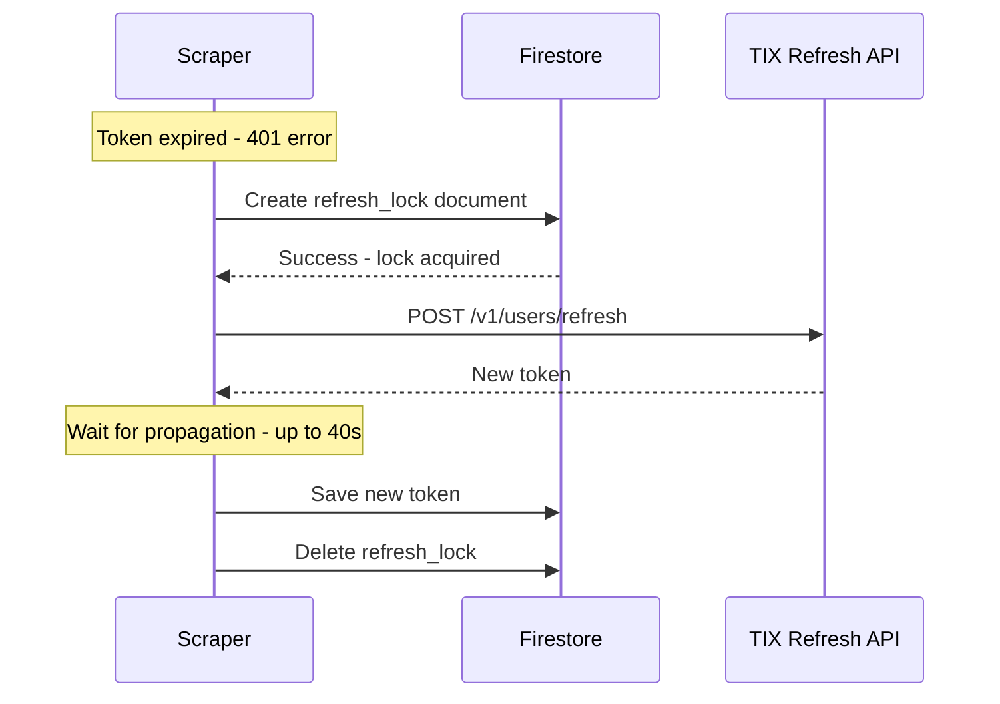
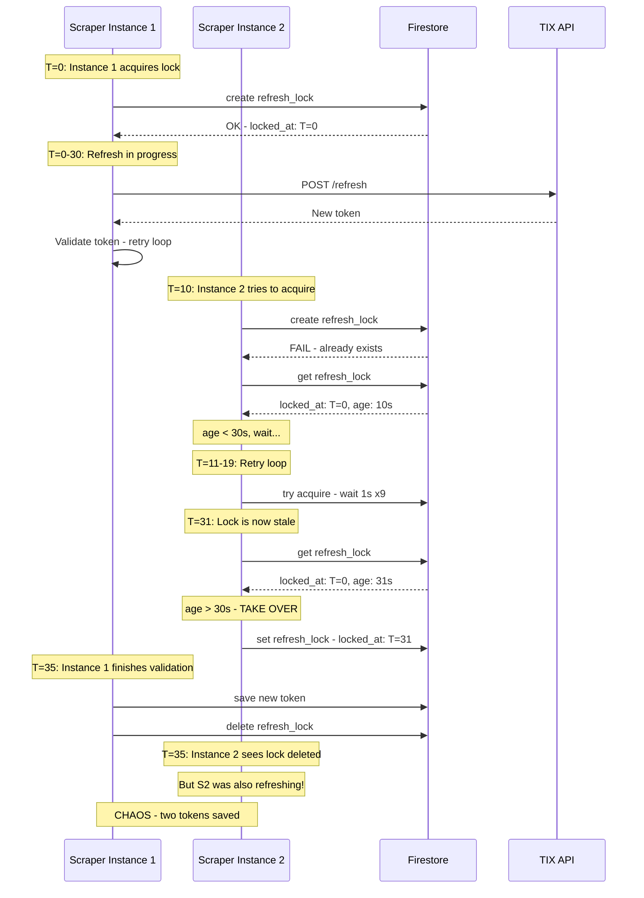
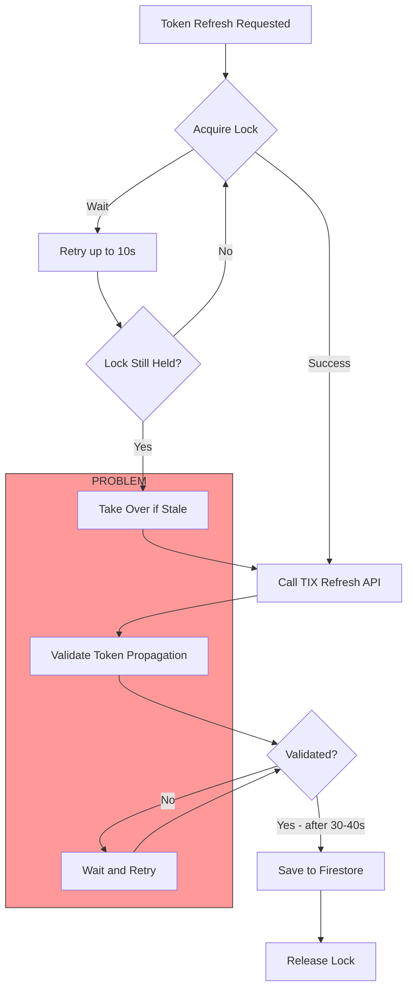
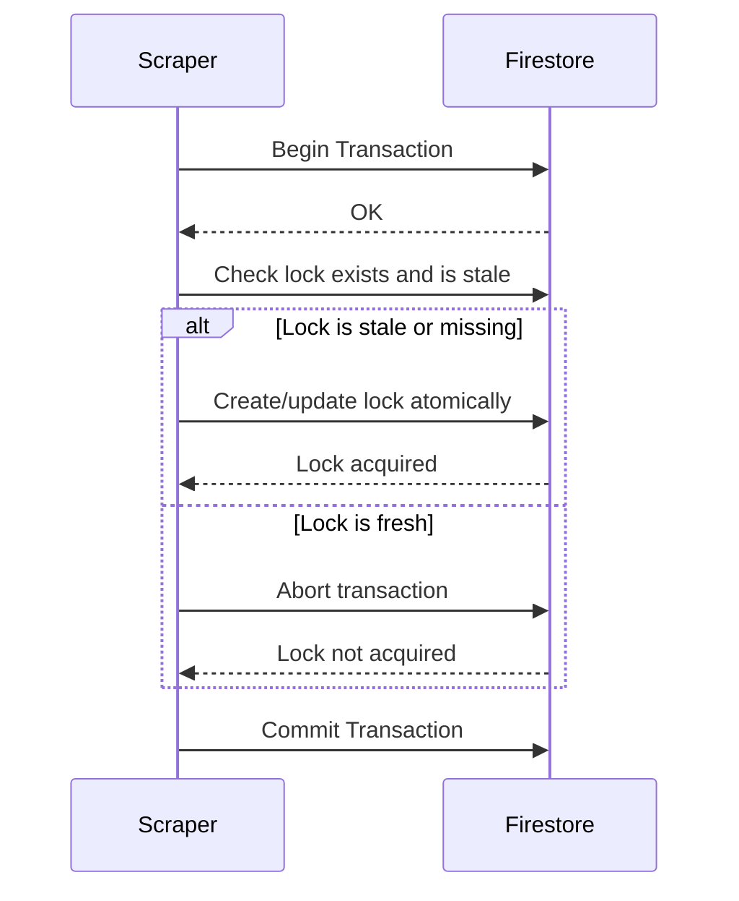
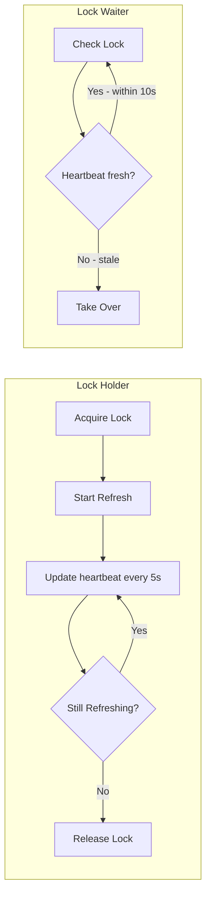

# Token Refresh Lock Issue Analysis

## Problem Summary

All scraper requests are failing with **HTTP 401** errors because the token refresh mechanism is blocked by a stale lock document in Firestore.

---

## Current Architecture

```mermaid
flowchart TB
    subgraph GCP[Google Cloud Platform]
        subgraph CF[Cloud Functions]
            S1[Scraper Instance 1]
            S2[Scraper Instance 2]
            S3[Scraper Instance 3]
        end
        
        subgraph FS[(Firestore)]
            AUTH[auth_tokens/tix_jwt]
            LOCK[auth_tokens/refresh_lock]
        end
    end
    
    subgraph TIX[TIX.id API]
        REFRESH[Refresh Endpoint]
        LAYOUT[Seat Layout API]
    end
    
    S1 -->|1. Get token| AUTH
    S2 -->|1. Get token| AUTH
    S3 -->|1. Get token| AUTH
    
    S1 -->|2. Acquire lock| LOCK
    S2 -.->|2. Wait for lock| LOCK
    S3 -.->|2. Wait for lock| LOCK
    
    S1 -->|3. Refresh token| REFRESH
    S1 -->|4. Save new token| AUTH
    S1 -->|5. Release lock| LOCK
```

---

## The Token Refresh Lock

### Purpose
Prevent multiple Cloud Function instances from refreshing the token simultaneously.

### How It Works


---

## The Bug: Lock Timeout vs Propagation Wait

```mermaid
gantt
    title Token Refresh Timeline
    dateFormat X
    axisFormat %s seconds
    
    section Lock
    Lock created     :0, 30
    Lock considered STALE :30, 60
    
    section Token Validation
    API call         :0, 2
    Wait 2s x10      :2, 22
    Wait 5s x4       :22, 42
    
    section Problem
    VALIDATION STILL RUNNING :crit, 30, 42
    OTHER INSTANCES TAKE OVER :crit, 30, 42
```



### The Issue

| Parameter | Value | Location |
|-----------|-------|----------|
| Lock timeout | **30 seconds** | `main.py:469` |
| Max propagation wait | **40 seconds** | `main.py:569` |
| Retry wait for lock | **10 seconds** | `main.py:529` |

**Problem:** The lock becomes "stale" after 30s, but the actual refresh can take up to 40s!

---

## Race Condition Scenario



---

## Root Cause Analysis



### Key Problems

1. **Timeout mismatch**: Lock timeout 30s < Max validation time 40s
2. **No instance tracking**: Cannot detect if lock holder is still alive
3. **Aggressive takeover**: Any instance can steal lock after 30s
4. **No transaction**: Lock operations not atomic

---

## Solution Options

### Option 1: Increase Lock Timeout - Quick Fix

```python
# main.py:469
self.timeout = 60  # Was 30, now 60
```

**Pros:** Simple, one-line fix
**Cons:** May cause longer waits if process crashes

### Option 2: Use Firestore Transactions - Robust



**Pros:** Atomic, prevents race conditions
**Cons:** More complex, requires transaction API

### Option 3: Heartbeat Pattern - Most Robust



**Pros:** Detects crashed processes quickly
**Cons:** Requires periodic writes, more complex

---

## Recommended Fix: Option 1 + Monitoring

### Immediate Fix

```python
# backend/functions/scraper/main.py:469
self.timeout = 60  # Increased from 30 to 60 seconds
```

This ensures the lock doesn't become stale while validation is still running.

### Additional Safety

Add a manual lock cleanup endpoint or CLI:

```python
# backend/cli/cleanup_lock.py
def cleanup_stale_lock():
    db = firestore.Client()
    lock_ref = db.collection("auth_tokens").document("refresh_lock")
    lock_ref.delete()
    print("Lock cleaned up")
```

---

## Action Items

- [ ] Increase `self.timeout` from 30 to 60 seconds
- [ ] Add logging when lock is taken over due to staleness
- [ ] Consider adding lock status to admin dashboard
- [ ] Optionally: implement transaction-based locking for robustness
