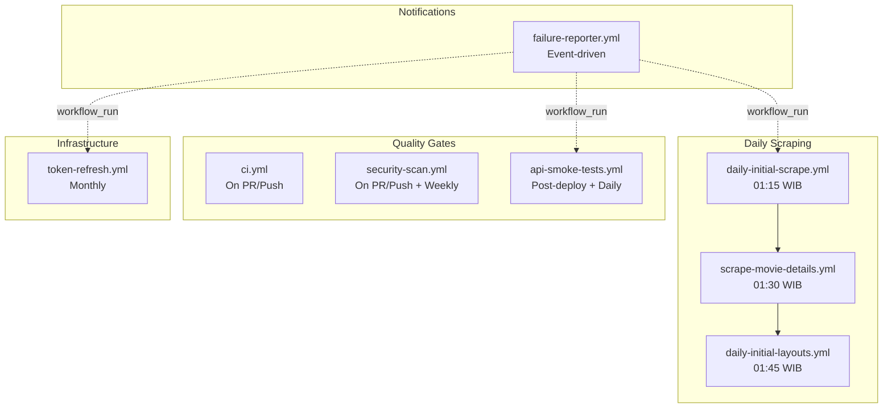
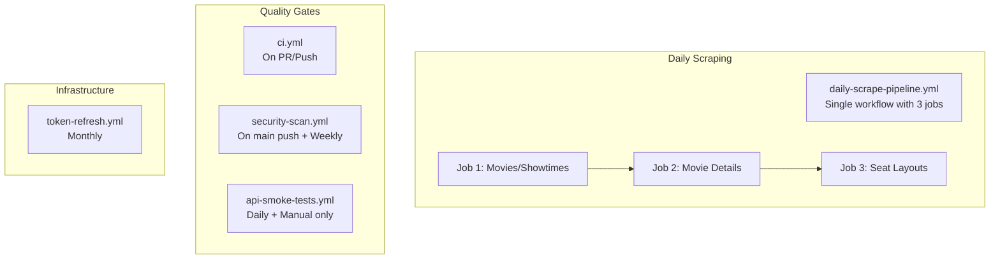

# GitHub Actions Deep Analysis

## Executive Summary

This analysis evaluates the 8 GitHub Actions workflows in the CineRadar project to determine:
- Whether API smoke tests are needed
- Whether security scans are needed
- Whether token refresh is needed
- Opportunities for consolidation/simplification

---

## Current Workflow Inventory

| Workflow | Trigger | Purpose | Frequency |
|----------|---------|---------|-----------|
| [`ci.yml`](.github/workflows/ci.yml) | Push/PR to main | Build & test | On code change |
| [`api-smoke-tests.yml`](.github/workflows/api-smoke-tests.yml) | Push to main, Schedule, Manual | Verify prod endpoints | Post-deploy + Daily |
| [`security-scan.yml`](.github/workflows/security-scan.yml) | Push/PR + Weekly Monday | CodeQL analysis | On code change + Weekly |
| [`token-refresh.yml`](.github/workflows/token-refresh.yml) | Monthly + Manual | Refresh TIX.id token | 1st of month |
| [`daily-initial-scrape.yml`](.github/workflows/daily-initial-scrape.yml) | Schedule + Manual | Scrape movies/showtimes | Daily 01:15 WIB |
| [`daily-initial-layouts.yml`](.github/workflows/daily-initial-layouts.yml) | Schedule + Manual | Scrape seat layouts | Daily 01:45 WIB |
| [`scrape-movie-details.yml`](.github/workflows/scrape-movie-details.yml) | Schedule + Manual | Scrape movie metadata | Daily 01:30 WIB |
| [`failure-reporter.yml`](.github/workflows/failure-reporter.yml) | Workflow completion | Alert on failures | Event-driven |

---

## Detailed Analysis

### 1. API Smoke Tests

**File:** [`api-smoke-tests.yml`](.github/workflows/api-smoke-tests.yml)

#### What it does:
- Tests 3 endpoints: `/api/dashboard`, `/api/performance`, `/api/scraper`
- Validates JSON structure (checks for expected fields)
- Runs after Vercel deploy (120s wait), daily at midnight UTC, and manually

#### Scoring Matrix

| Criterion | Score | Weight | Weighted |
|-----------|-------|--------|----------|
| Business Value | 4/5 | 30% | 1.2 |
| Maintenance Cost | 3/5 | 20% | 0.6 |
| Signal-to-Noise Ratio | 3/5 | 25% | 0.75 |
| Execution Speed | 2/5 | 15% | 0.3 |
| Uniqueness | 3/5 | 10% | 0.3 |
| **Total** | | | **3.15/5** |

#### Pros
- ✅ Catches production regressions early
- ✅ Validates actual deployed endpoints (not just build)
- ✅ JSON structure validation catches breaking changes
- ✅ Manual trigger allows on-demand verification
- ✅ Daily schedule catches runtime issues (e.g., DB connection)

#### Cons
- ❌ 120-second wait on push events is inefficient
- ❌ Limited endpoint coverage (only 3 of many)
- ❌ No authentication testing
- ❌ Duplicate purpose with Vercel's built-in checks
- ❌ Creates noise if Vercel deployment is delayed

#### Verdict: **KEEP but OPTIMIZE**

The smoke tests provide real value by validating production endpoints after deployment. However, the implementation can be improved:

1. **Remove push trigger** - Rely on daily schedule + manual trigger only
2. **Use Vercel API** - Check deployment status instead of blind 120s wait
3. **Expand coverage** - Add more critical endpoints like `/api/movies`, `/api/theatres`

---

### 2. Security Scan

**File:** [`security-scan.yml`](.github/workflows/security-scan.yml)

#### What it does:
- Runs GitHub CodeQL analysis for Python and JavaScript/TypeScript
- Uses `security-and-quality` query suite
- Triggers on push/PR to main and weekly schedule

#### Scoring Matrix

| Criterion | Score | Weight | Weighted |
|-----------|-------|--------|----------|
| Business Value | 5/5 | 30% | 1.5 |
| Maintenance Cost | 5/5 | 20% | 1.0 |
| Signal-to-Noise Ratio | 3/5 | 25% | 0.75 |
| Execution Speed | 2/5 | 15% | 0.3 |
| Uniqueness | 5/5 | 10% | 0.5 |
| **Total** | | | **4.05/5** |

#### Pros
- ✅ Free for public repositories
- ✅ Zero configuration - uses autobuild
- ✅ Covers both Python backend and TypeScript frontend
- ✅ Integrates with GitHub Security tab
- ✅ Weekly schedule catches new vulnerabilities in dependencies
- ✅ Industry standard practice

#### Cons
- ❌ Can be slow (up to 15 minutes per language)
- ❌ False positives possible
- ❌ Runs on every PR which may be excessive

#### Verdict: **KEEP - Essential**

Security scanning is non-negotiable for a production application handling user data. CodeQL is free and well-integrated.

**Recommendation:** Consider removing PR trigger to speed up PR checks, keep push to main + weekly schedule.

---

### 3. Token Refresh

**File:** [`token-refresh.yml`](.github/workflows/token-refresh.yml)

#### What it does:
- Refreshes TIX.id authentication token monthly
- Uses RSA encryption for secure login
- Stores token in Firebase for use by scrapers

#### Scoring Matrix

| Criterion | Score | Weight | Weighted |
|-----------|-------|--------|----------|
| Business Value | 5/5 | 30% | 1.5 |
| Maintenance Cost | 4/5 | 20% | 0.8 |
| Signal-to-Noise Ratio | 5/5 | 25% | 1.25 |
| Execution Speed | 5/5 | 15% | 0.75 |
| Uniqueness | 5/5 | 10% | 0.5 |
| **Total** | | | **4.8/5** |

#### Pros
- ✅ **Critical business dependency** - Without valid token, all scraping fails
- ✅ Automated - No manual intervention needed
- ✅ Fast execution (under 5 minutes)
- ✅ Clear failure alerting with actionable steps
- ✅ 91-day token validity with monthly refresh = good buffer

#### Cons
- ❌ Depends on TIX.id API stability
- ❌ Requires secrets management (credentials in GitHub Secrets)
- ❌ If login flow changes, requires code update

#### Verdict: **KEEP - Critical Infrastructure**

This is essential infrastructure. The entire data pipeline depends on valid authentication tokens. The monthly schedule provides a 60-day safety buffer (91-day token - 30 days = 61 days margin).

---

### 4. Daily Scraping Workflows (3 files)

**Files:**
- [`daily-initial-scrape.yml`](.github/workflows/daily-initial-scrape.yml) - Movies & Showtimes (01:15 WIB)
- [`scrape-movie-details.yml`](.github/workflows/scrape-movie-details.yml) - Movie Metadata (01:30 WIB)
- [`daily-initial-layouts.yml`](.github/workflows/daily-initial-layouts.yml) - Seat Layouts (01:45 WIB)

#### What they do:
Three sequential scraping jobs that populate the database with:
1. National movies and showtimes
2. Movie metadata (posters, descriptions, etc.)
3. Baseline seat layouts for performance tracking

#### Combined Scoring Matrix

| Criterion | Score | Weight | Weighted |
|-----------|-------|--------|----------|
| Business Value | 5/5 | 30% | 1.5 |
| Maintenance Cost | 3/5 | 20% | 0.6 |
| Signal-to-Noise Ratio | 4/5 | 25% | 1.0 |
| Execution Speed | 3/5 | 15% | 0.45 |
| Uniqueness | 5/5 | 10% | 0.5 |
| **Total** | | | **4.05/5** |

#### Pros
- ✅ Core business logic - This IS the product
- ✅ Sequential timing avoids conflicts (15-minute gaps)
- ✅ Each has independent failure alerting
- ✅ Checkpoint support for resume on failure
- ✅ Manual trigger for re-runs

#### Cons
- ❌ **Three separate workflows create maintenance overhead**
- ❌ Staggered cron times are confusing (18:15, 18:30, 18:45 UTC)
- ❌ Each workflow duplicates setup steps (checkout, uv, python)
- ❌ If one fails, downstream may run with incomplete data
- ❌ No explicit dependency declaration

#### Verdict: **CONSOLIDATE into Single Workflow**

These three workflows are tightly coupled sequential steps. They should be merged into one workflow with named jobs that have explicit dependencies.

---

### 5. Failure Reporter

**File:** [`failure-reporter.yml`](.github/workflows/failure-reporter.yml)

#### What it does:
- Listens for workflow completions from "Daily Scrape", "Token Refresh", "Smoke Tests"
- Creates GitHub issues on failure

#### Scoring Matrix

| Criterion | Score | Weight | Weighted |
|-----------|-------|--------|----------|
| Business Value | 3/5 | 30% | 0.9 |
| Maintenance Cost | 4/5 | 20% | 0.8 |
| Signal-to-Noise Ratio | 2/5 | 25% | 0.5 |
| Execution Speed | 5/5 | 15% | 0.75 |
| Uniqueness | 3/5 | 10% | 0.3 |
| **Total** | | | **3.25/5** |

#### Pros
- ✅ Centralized failure notification
- ✅ Creates trackable issues
- ✅ Prevents duplicate issues

#### Cons
- ❌ **Workflow name matching is fragile** - references "Daily Scrape" but actual name is "Scrape National Movies & Showtimes"
- ❌ Individual workflows already have their own alerting
- ❌ Creates redundancy - same failure creates two issues
- ❌ `workflow_run` trigger can be delayed

#### Verdict: **REMOVE - Redundant**

Each workflow already has inline failure alerting that creates issues. The failure-reporter duplicates this and has broken workflow name references.

---

### 6. CI Workflow

**File:** [`ci.yml`](.github/workflows/ci.yml)

#### What it does:
- Backend: lint (ruff), type check (mypy)
- Admin Frontend: type check, build
- Web Frontend: type check, build

#### Scoring Matrix

| Criterion | Score | Weight | Weighted |
|-----------|-------|--------|----------|
| Business Value | 5/5 | 30% | 1.5 |
| Maintenance Cost | 5/5 | 20% | 1.0 |
| Signal-to-Noise Ratio | 4/5 | 25% | 1.0 |
| Execution Speed | 4/5 | 15% | 0.6 |
| Uniqueness | 5/5 | 10% | 0.5 |
| **Total** | | | **4.6/5** |

#### Pros
- ✅ Essential quality gate
- ✅ Fast parallel jobs
- ✅ Tests commented out (not removed) for future enablement
- ✅ CodeCov integration ready

#### Cons
- ❌ Tests are disabled (commented out)
- ❌ No actual test execution

#### Verdict: **KEEP - Essential**

Standard CI pipeline. No changes needed except enabling tests when ready.

---

## Consolidation Analysis

### Current State Diagram

### Proposed State Diagram

---

## Recommendations Summary

| Workflow | Action | Priority | Effort |
|----------|--------|----------|--------|
| `ci.yml` | **Keep** | N/A | None |
| `security-scan.yml` | **Keep** - Remove PR trigger | Low | Low |
| `token-refresh.yml` | **Keep** | N/A | None |
| `api-smoke-tests.yml` | **Optimize** - Remove push trigger, add Vercel API check | Medium | Medium |
| `daily-initial-scrape.yml` | **Merge** into single pipeline | High | Medium |
| `scrape-movie-details.yml` | **Merge** into single pipeline | High | Medium |
| `daily-initial-layouts.yml` | **Merge** into single pipeline | High | Medium |
| `failure-reporter.yml` | **Remove** - Redundant | High | Low |

---

## Final Verdict

### Do we need API Smoke Tests?
**YES** - But optimized. Remove the push trigger to avoid the 120-second wait on every deployment. Keep daily schedule and manual trigger. Consider adding Vercel API integration to check deployment status before testing.

### Do we need Security Scan?
**YES** - Absolutely essential. CodeQL is free, well-integrated, and catches vulnerabilities. Consider removing the PR trigger to speed up pull request checks while keeping the push to main and weekly schedule.

### Do we need Token Refresh?
**YES** - Critical infrastructure. The entire scraping pipeline depends on valid TIX.id authentication. Monthly refresh of 91-day tokens provides adequate safety margin.

### Can workflows be merged/removed?
**YES** - Significant consolidation opportunity:

1. **Merge 3 daily scrape workflows** into `daily-scrape-pipeline.yml` with explicit job dependencies
2. **Remove failure-reporter.yml** - Each workflow already has inline alerting
3. **Optimize api-smoke-tests.yml** - Remove push trigger, keep schedule + manual

### Expected Outcome

| Metric | Before | After | Improvement |
|--------|--------|-------|-------------|
| Workflow files | 8 | 5 | -37.5% |
| Daily cron jobs | 3 | 1 | -66.7% |
| Redundant alerts | 2x | 1x | -50% |
| Maintenance complexity | High | Low | Significant |

---

## Implementation Priority

1. **Immediate:** Remove [`failure-reporter.yml`](.github/workflows/failure-reporter.yml) (broken workflow names, redundant)
2. **Short-term:** Consolidate 3 scraping workflows into one
3. **Medium-term:** Optimize smoke tests (remove push trigger, add Vercel integration)
4. **Optional:** Remove PR trigger from security scan for faster PR checks
