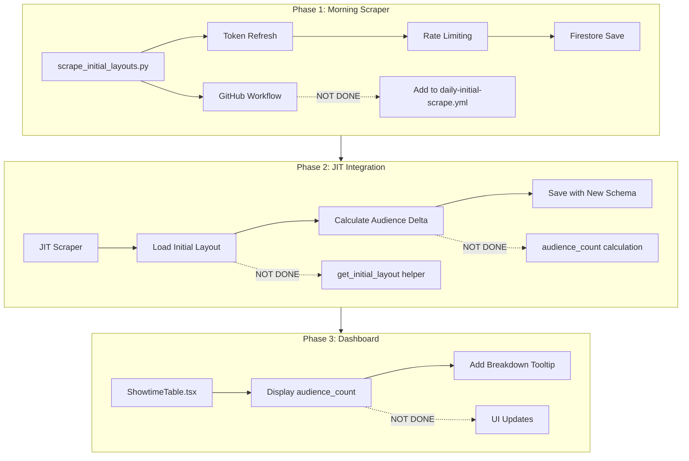

# Initial Layout Deployment Plan

## Executive Summary

The initial layout scraper script (`backend/scripts/scrape_initial_layouts.py`) has been **fully implemented**. However, three critical integration points remain incomplete before the feature can be deployed:

1. **GitHub Workflow** - Missing step to run initial layout scraper
2. **JIT Scraper** - Missing audience delta calculation logic
3. **Admin Dashboard** - Missing UI updates to display audience metrics

## Current Implementation Status



## Detailed Gap Analysis

### 1. GitHub Workflow - NOT DONE ❌

**File**: `.github/workflows/daily-initial-scrape.yml`

**Current State**: Runs V2 scraper, post-processing, performance init, and movie details - but NOT initial layout scraper.

**Required Change**: Add step after post-processing:

```yaml
# Step 4: Initial Layout Scraper (04:00 Jakarta)
- name: Scrape initial seat layouts
  run: PYTHONPATH=. uv run python backend/scripts/scrape_initial_layouts.py
  env:
    FIREBASE_SERVICE_ACCOUNT: ${{ secrets.FIREBASE_SERVICE_ACCOUNT }}
```

### 2. JIT Scraper Updates - NOT DONE ❌

**File**: `backend/functions/scraper/main.py`

**Current Schema** (lines 1045-1060):
```python
snapshot_data = {
    "showtime_id": showtime_id,
    "movie_id": movie_id,
    # ... other fields ...
    "sold_seats": sold_seats,           # Currently = all unavailable
    "occupancy_pct": occupancy_pct,      # Currently = sold/total
    "layout_compressed": layout_compressed,
}
```

**Required Changes**:

1. Add helper function to load initial layout:
```python
def get_initial_layout(db: firestore.Client, movie_id: str, date: str, showtime_id: str) -> dict | None:
    """Load initial layout data from morning scrape."""
    doc_ref = (
        db.collection("movie_performance")
        .document(movie_id)
        .collection("days")
        .document(date)
        .collection("showtimes")
        .document(showtime_id)
    )
    doc = doc_ref.get()
    if doc.exists:
        return doc.to_dict()
    return None
```

2. Update `save_snapshot()` to calculate audience delta:
```python
def save_snapshot(...):
    # ... existing code ...
    
    # Load initial layout
    initial_data = get_initial_layout(db, movie_id, date, showtime_id)
    initial_unavailable = 0
    if initial_data:
        initial_unavailable = initial_data.get("initial_unavailable", 0)
    
    # Calculate actual audience (True Sold Seats = JIT Unavailable - Morning Unavailable)
    audience_count = max(0, sold_seats - initial_unavailable)
    audience_pct = (audience_count / total_seats * 100) if total_seats > 0 else 0
    
    snapshot_data = {
        # ... existing fields ...
        
        # New audience fields
        "initial_unavailable": initial_unavailable,
        "final_unavailable": sold_seats,
        "audience_count": audience_count,
        "audience_pct": round(audience_pct, 1),
        
        # Legacy compatibility
        "sold_seats": sold_seats,
        "occupancy_pct": occupancy_pct,
    }
```

### 3. Admin Dashboard Updates - NOT DONE ❌

**Files to Update**:
- `admin/src/features/performances/components/ShowtimeTable.tsx`
- `admin/src/features/performances/components/PerformanceDetail.tsx`

**Required Changes**:
- Display `audience_count` and `audience_pct` as primary metrics
- Add tooltip showing: "Initial: X blocked → Final: Y unavailable → Audience: Y-X sold"
- Keep legacy `occupancy_pct` for backward compatibility

## Deployment Checklist

### Phase 1: Complete Morning Workflow

- [ ] Update `.github/workflows/daily-initial-scrape.yml`
  - Add initial layout scraper step after post-processing
  - Ensure proper env vars are passed

- [ ] Test initial layout scraper locally
  ```bash
  PYTHONPATH=. uv run python backend/scripts/scrape_initial_layouts.py --limit 10
  ```

- [ ] Verify Firestore writes
  - Check `movie_performance/{movie_id}/days/{date}/showtimes/{showtime_id}`
  - Confirm `initial_layout_compressed` and `initial_unavailable` fields

### Phase 2: Update JIT Scraper

- [ ] Add `get_initial_layout()` helper function
- [ ] Update `save_snapshot()` with audience calculation
- [ ] Deploy updated Cloud Function
  ```bash
  cd backend/functions/scraper
  gcloud functions deploy jit-seat-scraper ...
  ```

### Phase 3: Update Admin Dashboard

- [ ] Update ShowtimeTable.tsx with audience columns
- [ ] Add breakdown tooltip component
- [ ] Deploy to Vercel

### Phase 4: Validation

- [ ] Run full morning workflow manually
- [ ] Wait for JIT scraper to process showtimes
- [ ] Verify audience calculations in dashboard
- [ ] Compare before/after metrics

## Risk Assessment

| Risk | Impact | Mitigation |
|------|--------|------------|
| Initial layout scraper fails | No baseline data | Add alerting, fallback to legacy calculation |
| Token expires mid-scrape | Incomplete data | Already handled with 25-min refresh threshold |
| JIT scraper cant find initial layout | Missing audience data | Graceful fallback to occupancy_pct |
| Schema migration | Dashboard breaks | Keep legacy fields for backward compatibility |

## Recommended Deployment Order

1. **Deploy Phase 1 first** - Run initial layout scraper in shadow mode
2. **Validate data quality** - Check initial_unavailable values make sense
3. **Deploy Phase 2** - Update JIT scraper with audience calculation
4. **Monitor for 1-2 days** - Verify calculations are correct
5. **Deploy Phase 3** - Update dashboard to show new metrics

## Estimated Effort

| Phase | Complexity | Dependencies |
|-------|------------|--------------|
| Phase 1: Workflow | Low | None |
| Phase 2: JIT Scraper | Medium | Phase 1 data |
| Phase 3: Dashboard | Low | Phase 2 data |
| Phase 4: Validation | Low | All phases |

## Next Steps

1. **Immediate**: Update GitHub workflow to include initial layout scraper
2. **Short-term**: Modify JIT scraper to calculate audience delta
3. **Medium-term**: Update admin dashboard with new metrics
