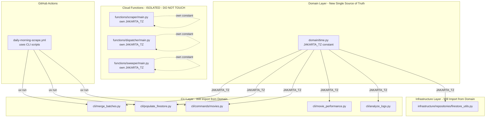

# Analysis: Jakarta Timezone Consolidation

> **Kaizen Candidate**: Reduce cognitive load by centralizing the Jakarta timezone constant.

## Executive Summary

**Recommendation**: ✅ **SAFE TO PROCEED** with consolidation in CLI and Infrastructure layers only.

The consolidation has a clear boundary:
- **CAN consolidate**: 5 CLI scripts + 1 infrastructure file = 6 files
- **MUST NOT consolidate**: Cloud Functions (intentional duplication for deployment isolation)

---

## Current State: Usage Locations

### CLI Layer (Safe to Consolidate)

| File | Import Location | Usage Pattern |
|------|-----------------|---------------|
| [`cli/merge_batches.py:9,28`](backend/cli/merge_batches.py:9) | Top-level import | `datetime.now(ZoneInfo("Asia/Jakarta"))` |
| [`cli/populate_firestore.py:9,29`](backend/cli/populate_firestore.py:9) | Top-level import | `datetime.now(ZoneInfo("Asia/Jakarta"))` |
| [`cli/commands/movies.py:11,36`](backend/cli/commands/movies.py:11) | Top-level import | `datetime.now(ZoneInfo("Asia/Jakarta"))` |
| [`cli/movie_performance.py:68,70`](backend/cli/movie_performance.py:68) | Local import in function | `datetime.now(ZoneInfo("Asia/Jakarta"))` |
| [`cli/movie_performance.py:219,226`](backend/cli/movie_performance.py:219) | Local import in function | `datetime.now(ZoneInfo("Asia/Jakarta"))` |
| [`cli/analyze_logs.py:281-282`](backend/cli/analyze_logs.py:281) | Local import in function | `jakarta_tz = ZoneInfo("Asia/Jakarta")` |

### Infrastructure Layer (Safe to Consolidate)

| File | Import Location | Usage Pattern |
|------|-----------------|---------------|
| [`infrastructure/repositories/firestore_utils.py:279,285`](backend/infrastructure/repositories/firestore_utils.py:279) | Inside `log_morning_scrape()` | `datetime.now(ZoneInfo("Asia/Jakarta"))` |
| [`infrastructure/repositories/firestore_utils.py:346,352`](backend/infrastructure/repositories/firestore_utils.py:346) | Inside `log_jit_dispatch()` | `datetime.now(ZoneInfo("Asia/Jakarta"))` |

### Cloud Functions (DO NOT TOUCH)

Per [`backend/functions/README.md:23-54`](backend/functions/README.md:23):

> **Each Cloud Function MUST be entirely self-contained.**
> - No imports from `backend.*` - paths don't exist in container

| File | Already Has Constant | Action |
|------|---------------------|--------|
| [`functions/scraper/main.py:53`](backend/functions/scraper/main.py:53) | `JAKARTA_TZ = ZoneInfo("Asia/Jakarta")` | **No change** |
| [`functions/dispatcher/main.py:48`](backend/functions/dispatcher/main.py:48) | `JAKARTA_TZ = ZoneInfo("Asia/Jakarta")` | **No change** |
| [`functions/sweeper/main.py:48`](backend/functions/sweeper/main.py:48) | `JAKARTA_TZ = ZoneInfo("Asia/Jakarta")` | **No change** |

---

## Call Graph: Who Uses What?



---

## Proposed Changes

### Step 1: Add JAKARTA_TZ to domain/time.py

**Before**:
```python
# backend/domain/time.py
"""Time utility functions for domain models."""

from datetime import UTC, datetime


def get_now_iso() -> str:
    """Get current UTC time as ISO 8601 string."""
    return datetime.now(UTC).isoformat()
```

**After**:
```python
# backend/domain/time.py
"""Time utility functions for domain models."""

from datetime import UTC, datetime
from zoneinfo import ZoneInfo

# Jakarta timezone - used throughout the application for business hours
JAKARTA_TZ = ZoneInfo("Asia/Jakarta")


def get_now_iso() -> str:
    """Get current UTC time as ISO 8601 string."""
    return datetime.now(UTC).isoformat()


def get_now_jakarta() -> datetime:
    """Get current datetime in Jakarta timezone.
    
    Returns:
        Timezone-aware datetime in Asia/Jakarta timezone.
    """
    return datetime.now(JAKARTA_TZ)


def get_jakarta_date_str() -> str:
    """Get current date in Jakarta timezone as YYYY-MM-DD string.
    
    Convenience function for CLI scripts.
    
    Returns:
        Date string in YYYY-MM-DD format.
    """
    return datetime.now(JAKARTA_TZ).strftime("%Y-%m-%d")
```

### Step 2: Update CLI Scripts

| File | Current | New |
|------|---------|-----|
| `cli/merge_batches.py` | `from zoneinfo import ZoneInfo`<br/>`datetime.now(ZoneInfo("Asia/Jakarta"))` | `from backend.domain.time import get_jakarta_date_str`<br/>`get_jakarta_date_str()` |
| `cli/populate_firestore.py` | `from zoneinfo import ZoneInfo`<br/>`datetime.now(ZoneInfo("Asia/Jakarta"))` | `from backend.domain.time import get_jakarta_date_str`<br/>`get_jakarta_date_str()` |
| `cli/commands/movies.py` | `from zoneinfo import ZoneInfo`<br/>`datetime.now(ZoneInfo("Asia/Jakarta"))` | `from backend.domain.time import JAKARTA_TZ`<br/>`datetime.now(JAKARTA_TZ)` |
| `cli/movie_performance.py` | Local import in 2 functions | `from backend.domain.time import JAKARTA_TZ, get_jakarta_date_str` |
| `cli/analyze_logs.py` | Local import in function | `from backend.domain.time import JAKARTA_TZ` |

### Step 3: Update Infrastructure

| File | Current | New |
|------|---------|-----|
| `infrastructure/repositories/firestore_utils.py` | Local import in 2 functions | `from backend.domain.time import JAKARTA_TZ` (top-level) |

---

## Safety Analysis

### Why This Is Safe

| Risk | Assessment | Reasoning |
|------|------------|-----------|
| Behavior change | **None** | `ZoneInfo("Asia/Jakarta")` is identical whether inline or imported |
| Import cycles | **None** | `domain/time.py` has no dependencies on CLI/infrastructure |
| GitHub Actions | **No impact** | Same runtime behavior |
| Cloud Functions | **No impact** | Not modified (self-contained constraint) |
| Type safety | **Maintained** | `JAKARTA_TZ` is `ZoneInfo` type |

### What Changes

| Before | After |
|--------|-------|
| Magic string `"Asia/Jakarta"` in 6+ files | Single definition in `domain/time.py` |
| Repeated `from zoneinfo import ZoneInfo` | Single import in `domain/time.py` |
| ~15 lines of duplicate timezone logic | 1 constant + 2 helper functions |

### What Stays the Same

- Cloud Functions keep their own `JAKARTA_TZ` constant
- All date/time calculations produce identical results
- GitHub Actions workflows unchanged

---

## Cognitive Load Improvement

### Before Consolidation

```python
# Developer must remember:
# - Import ZoneInfo in every file
# - Type "Asia/Jakarta" correctly every time
# - Copy-paste datetime.now(ZoneInfo("Asia/Jakarta")).strftime("%Y-%m-%d")
```

### After Consolidation

```python
# Developer knows:
# - from backend.domain.time import JAKARTA_TZ (or helper functions)
# - Single source of truth for timezone
# - Helper functions for common patterns
```

---

## Verification Checklist

Before merging:

- [ ] `domain/time.py` has `JAKARTA_TZ` constant
- [ ] All CLI scripts import from `domain/time`
- [ ] `firestore_utils.py` imports from `domain/time`
- [ ] Cloud Functions NOT modified (verify `git diff functions/` is empty)
- [ ] `ruff check backend/` passes
- [ ] `mypy backend/` passes
- [ ] Manual test: `uv run python -m backend.cli populate_firestore` (dry run)
- [ ] Verify date strings match before/after

---

## Summary

| Aspect | Status |
|--------|--------|
| **Risk Level** | Low |
| **Breaking Changes** | None |
| **Cloud Functions Impact** | None (must not modify) |
| **Lines Consolidated** | ~15 lines → 1 constant + 2 helpers |
| **Cognitive Load Reduction** | Moderate - eliminates magic string repetition |
