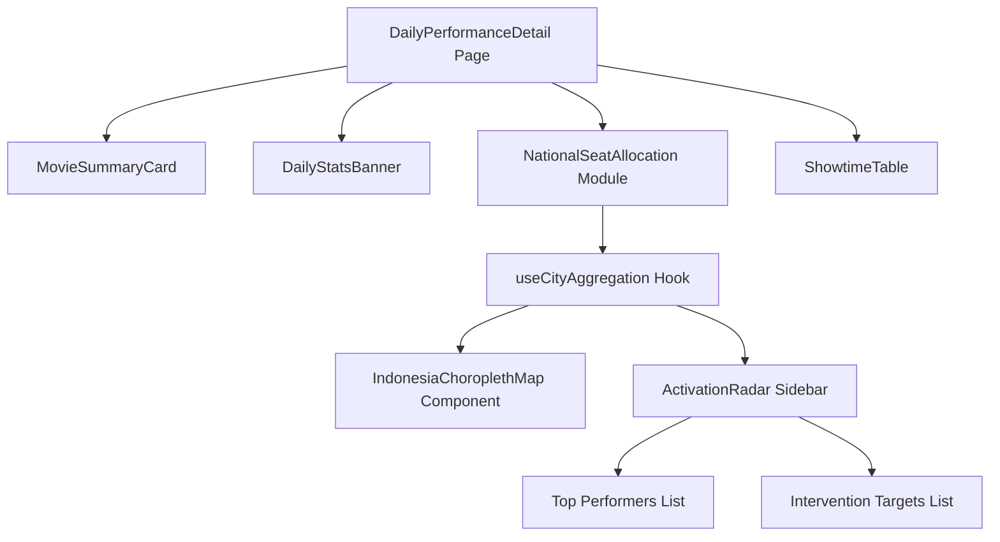

# National Seat Allocation Visualization Plan

## 1. Objective & Business Value

The goal is to implement a comprehensive "bird's-eye view" of a movie's daily performance across Indonesia on the `DailyMoviePerformancePage` (`/performances/[id]/[date]`). 

**Primary User Story:** A production house executive, producer, or marketing team member wants to instantly identify which regions/cities are driving revenue and which are underperforming.

**Actionable Business Outcomes:**
- **Validation & Expansion (Green Regions):** High occupancy indicates successful marketing or strong organic word-of-mouth. Production houses can use this data to negotiate with cinema chains (XXI, CGV, Cinepolis) for additional screens or extended showtimes in those regions.
- **Targeted Interventions (Orange/Red Regions):** Low occupancy indicates a need for immediate intervention. Teams can deploy geo-targeted social media ads, organize emergency cinema visits by actors (cinema touring), or run promotional activations (buy 1 get 1, merchandise giveaways) in these specific cities.

## 2. Data Source Analysis & Aggregation Strategy

Currently, the daily performance page fetches data via `/api/performance/${movieId}/days/${date}`, which yields an array of `ShowtimeSnapshot` objects.

**Available Metrics per Showtime:**
- `city` (e.g., "JAKARTA", "BANDUNG", "PONTIANAK")
- `total_seats` (Static capacity)
- `audience_count` (Phase 2 True Delta) / `sold_seats` (Legacy fallback)
- `audience_pct` (Phase 2 True Delta) / `occupancy_pct` (Legacy fallback)

**Data Aggregation Logic (Client-Side):**
We will implement an aggregator hook (`useCityAggregation`) that processes the raw `ShowtimeSnapshot[]` array. For each unique city, we will compute:
1.  `Total Capacity` = $\sum$ `total_seats`
2.  `Total Sold` = $\sum$ (`audience_count` ?? `sold_seats`)
3.  `Overall Occupancy %` = (`Total Sold` / `Total Capacity`) * 100
4.  `Total Shows` = Count of showtimes in that city

*Note: Filtering out statistical noise is critical. Cities with extremely low show counts (e.g., < 3 shows) might skew percentage-based metrics. A minimum threshold may be required for the "Needs Attention" list.*

## 3. Proposed Visualization Architecture

To answer the business question efficiently, we will build a new **`NationalSeatAllocation`** module consisting of two primary components:

### A. The "Heatmap": Interactive Indonesia Choropleth Map
Using the existing `admin/public/indonesia-provinces.json` (GeoJSON), we will map aggregated city data to their respective provinces to create a heat map.

- **Data Mapping Challenge:** The TIX.id data provides 83 distinct *cities*, while the GeoJSON represents *provinces*. We must create a static mapping dictionary (`city_to_province.json` or a TS record) to group the 83 cities into their parent provinces (e.g., mapping "BANDUNG", "BEKASI", "BOGOR" -> "JAWA BARAT").
- **Color Scale (Occupancy):**
  - **Red / Needs Intervention:** < 30% Occupancy
  - **Yellow / Stable:** 30% - 60% Occupancy
  - **Green / High Flyer:** > 60% Occupancy
- **Interactivity:** Hovering over a province will display a custom tooltip showing:
  - Province Name
  - Total Sold / Total Capacity
  - Overall Occupancy %
  - Top contributing city in that province.

### B. The "Activation Radar": Top & Bottom Performers List
While the map provides geographic context, a side-panel directly answers the "who needs a boost" question without requiring the user to hover over every region.

- **High Flyers (Top 5 Cities):** The cities with the highest occupancy percentage.
- **Needs Attention (Bottom 5 Cities):** The cities with the lowest occupancy percentage. (Requires a minimum showtime threshold, e.g., > 5 shows, to avoid highlighting a city with only 1 show that happened to sell 0 tickets).

## 4. Component Hierarchy & Flow



## 5. UI Layout / ASCII Wireframe

```text
================================================================================
  [ < Back ]  [ Movie Poster + Title: Pengabdi Setan 3 ]     [ DATE: 2026-03-15 ]
================================================================================
  [ Banner: Total Shows: 1,200 | Total Seats: 150k | Sold: 95k | Occ: 63% ]
================================================================================
  NATIONAL ALLOCATION & ACTIVATION RADAR
--------------------------------------------------------------------------------
  [ MAP OF INDONESIA ]                           |  🚀 HIGH FLYERS (Good)
                                                 |  1. Jakarta    (85% Occ)
       ...*#*#...                                |  2. Bandung    (78% Occ)
     .*####****##*..                             |  3. Surabaya   (75% Occ)
    *####*      *###*     ...**..                |
     *##*        *##*   .*######*.               |
                         *#######*               |  🚨 NEEDS ATTENTION (Boost!)
                           *####*                |  1. Pontianak  (15% Occ)
                                                 |  2. Jayapura   (20% Occ)
  Legend: [■ <30%] [■ 30-60%] [■ >60%]           |  3. Bengkulu   (22% Occ)
--------------------------------------------------------------------------------
  SHOWTIMES BREAKDOWN TABLE
  [Filters: City, Merchant, Room]
  Time  | Theatre | City | Occupancy [====  ] | Seats
================================================================================
```

## 6. Required Dependencies & Tools
- `d3-geo` (or `react-simple-maps` if preferred) for rendering the GeoJSON paths cleanly in React. Since this is an admin dashboard, adding a small geo-visualization library is acceptable. Alternatively, we can render standard `<svg>` and `<path>` elements by manually creating a projection using raw `d3-geo`.

## 7. Tiered Implementation Plan

To ensure continuous delivery of value, we will implement this feature in 5 distinct, presentable steps. Each step builds upon the previous one.

### Step 1: Data Aggregation & The Activation Radar (No Map)
**Goal:** Deliver immediate business value by showing the best and worst performing cities textually.
- **Action:** Implement the `useCityAggregation(showtimes)` hook to calculate total capacity, sold, and occupancy % per city.
- **Action:** Build the `ActivationRadar.tsx` component to display the "High Flyers" (Top 5 cities) and "Needs Attention" (Bottom 5 cities) in simple, styled list cards.
- **Integration:** Place this component directly in `DailyPerformanceDetail.tsx`.

### Step 2: Geo-Mapping Utility & Province Aggregation
**Goal:** Prepare the data layer required for geographic visualization.
- **Action:** Create `admin/src/lib/geo-mapping.ts` to statically map all 83 TIX.id cities to their corresponding `Propinsi` (Province) names found in `indonesia-provinces.json`.
- **Action:** Extend `useCityAggregation` to group and aggregate city data up to the province level. 

### Step 3: Base Indonesia Map Rendering
**Goal:** Successfully render the geographic boundaries of Indonesia without data overlay.
- **Action:** Install `d3-geo` for geographic projection.
- **Action:** Build `IndonesiaMap.tsx` to load `indonesia-provinces.json` and render the SVG `<path>` elements using a standard projection (e.g., Mercator or Equirectangular).
- **Result:** A static, styled outline map of Indonesia displayed alongside the Activation Radar.

### Step 4: Map Data Overlay (The Choropleth Heatmap)
**Goal:** Bring the map to life by color-coding provinces based on performance.
- **Action:** Connect the province-level aggregated data from Step 2 to the SVG paths from Step 3.
- **Action:** Implement a color scale function (e.g., Red for <30%, Yellow for 30-60%, Green for >60%).
- **Result:** The map now visually reflects the occupancy heatmap across the country.

### Step 5: Interactivity, Tooltips & Final Polish
**Goal:** Make the map fully interactive for detailed exploration.
- **Action:** Add `onMouseEnter` and `onMouseLeave` event handlers to the SVG paths.
- **Action:** Build a floating `Tooltip` component that displays the province name, total occupancy %, seats sold, and the top contributing city when hovering over a province.
- **Action:** Polish responsive layouts ensuring the Map and Radar components stack nicely on mobile and sit side-by-side on desktop. Assemble into a single `NationalSeatAllocation.tsx` wrapper.
