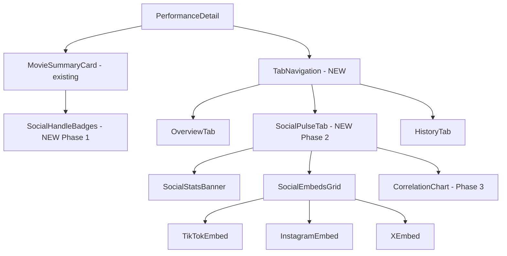

# Social Marketing & Trends Integration Plan

## 1. Objective & Business Value

The goal is to enrich the Movie Performance Homepage (`/performances/[id]`) with real-time social marketing context. Box office performance is heavily correlated with social media momentum. 

**Primary User Story:** A production house executive or marketing manager wants to view a movie's daily ticket sales *alongside* its social media momentum (TikTok, Instagram, X) to directly measure the ROI of digital marketing campaigns and identify virality.

**Actionable Business Outcomes:**
- **Correlate Virality to Sales:** See if a spike in a specific hashtag directly translates to ticket sales in specific regions.
- **Centralized Command Center:** Eliminate the need for marketers to switch between the box office dashboard and multiple social media apps.

---

## 2. UX Integration Strategy

### A. Tab-Based Detail Page Architecture

The current [`PerformanceDetail.tsx`](admin/src/features/performances/components/PerformanceDetail.tsx) uses a linear vertical layout. We will restructure it into a tab-based architecture to give social data equal prominence without cluttering the box office view.

```
┌─────────────────────────────────────────────────────────────┐
│  [← Back]  [MovieSummaryCard - Always Visible]              │
│             └── Social Handle Badges (Phase 1)              │
├─────────────────────────────────────────────────────────────┤
│  [Overview] [Social Pulse] [Regional Breakdown] [History]   │
├─────────────────────────────────────────────────────────────┤
│                                                             │
│  Tab Content Area                                           │
│                                                             │
└─────────────────────────────────────────────────────────────┘
```

**Benefits:**
- Social data gets equal prominence without cluttering box office view
- Users can self-select the information they need
- Easier to add future tabs (e.g., Competitor Analysis)
- Mobile-friendly: tabs are touch-friendly navigation

### B. Component Hierarchy



### C. Social Pulse Tab Layout

```
┌───────────────────────────────────────────────────────────────┐
│  🎬 Social Momentum - Summary Banner                           │
│                                                               │
│  TikTok: 2.4M views    Instagram: 156K followers   X: 45.2K  │
│  #PengabdiSetan3 trending ↑ 34% this week                    │
└───────────────────────────────────────────────────────────────┘

┌───────────────────────────────────────────────────────────────┐
│  Social Feed Embeds (Grid Layout)                             │
│  ┌─────────────────┐  ┌─────────────────┐  ┌───────────────┐ │
│  │   TikTok        │  │   Instagram     │  │   X/Twitter   │ │
│  │   Embed         │  │   Embed         │  │   Embed       │ │
│  │                 │  │                 │  │               │ │
│  │  [Fallback Link │  │  [Fallback Link │  │ [Fallback    │ │
│  │   if failed]    │  │   if failed]    │  │  Link if     │ │
│  │                 │  │                 │  │  failed]     │ │
│  └─────────────────┘  └─────────────────┘  └───────────────┘ │
└───────────────────────────────────────────────────────────────┘

┌───────────────────────────────────────────────────────────────┐
│  Marketing ROI Correlation (Phase 3)                          │
│                                                               │
│  Ticket Sales vs Hashtag Views - Dual Axis Chart             │
│  [Annotations for marketing events: Trailer Drop, TV Spot]   │
│  Correlation Coefficient: r = 0.78                           │
└───────────────────────────────────────────────────────────────┘
```

---

## 3. Data Strategy & Architecture

### A. Database Schema Updates (Firestore)

We will extend the existing Movie Summary document and add a new subcollection for historical tracking.

**Location:** `movie_performance/{movie_id}` (or `movie_performance_v2/{metadata_id}`)

#### Marketing Metadata (Static)

Add a new `marketing` map to the document:

```json
{
  "id": "12345",
  "title": "Pengabdi Setan 3",
  // ... existing fields ...
  "marketing": {
    "primary_hashtag": "#PengabdiSetan3",
    "secondary_hashtags": ["#TerorIbu", "#PS3"],
    "official_accounts": {
      "tiktok": "@pengabdisetanfilm",
      "instagram": "@pengabdisetanofficial",
      "x": "@jokoanwar"
    },
    "campaign_start_date": "2024-02-15",
    "marketing_budget": 500000000
  }
}
```

#### Social Metrics Subcollection (Temporal - for Phase 3)

**Location:** `movie_performance/{movie_id}/social_metrics/{date}`

```json
{
  "date": "2024-03-15",
  "tiktok": {
    "hashtag_views": 2400000,
    "video_count": 156,
    "top_video_views": 500000,
    "top_video_id": "7123456789"
  },
  "instagram": {
    "followers": 156000,
    "posts_count": 24,
    "avg_engagement_rate": 4.2,
    "latest_post_likes": 12500
  },
  "x": {
    "followers": 45200,
    "tweets_about_movie": 1240,
    "impressions": 890000,
    "sentiment_score": 0.72
  },
  "last_scraped": "2024-03-15T18:30:00Z"
}
```

This temporal structure enables:
- Historical trend analysis
- Correlation with daily ticket sales
- Marketing event impact measurement

---

## 4. Technical Integration Approaches

### Approach 1: Native Iframe Embeds (Recommended Initial Step)

The simplest and most robust way to show social media feeds without dealing with complex, expensive, and rate-limited API keys.

- **TikTok:** Use TikTok's official embed player (`https://www.tiktok.com/embed/v2/...` or their script).
- **Instagram:** Use standard IG embed scripts (`<blockquote class="instagram-media" ...>`).
- **X (Twitter):** Use `react-tweet` or the official X widget to render timelines or specific hashtag searches.

**Pros:** Free, zero backend infrastructure, exact native UI.
**Cons:** Limited customization, cannot easily run analytics without API access.

### Approach 2: Third-Party Aggregator APIs (e.g., Juicer, Curator.io, Apify)

Use a service designed to aggregate social feeds via a single API.

**Workflow:** The production house connects their accounts to the aggregator. Our Next.js backend fetches the unified JSON feed from the aggregator and renders custom UI components.

**Pros:** High customization, unified data structure, avoids direct API complexity.
**Cons:** Paid subscription required for the third-party service.

### Approach 3: Direct API Integrations (Complex - Future Roadmap)

Building direct integrations with the Graph API (Instagram), TikTok API, and X API.

**Pros:** Full data ownership, deep analytics (view counts, engagement rates).
**Cons:** Massive engineering overhead, highly volatile APIs, strict rate limits.

---

## 5. Error Handling & Resilience Strategy

Social embeds are notoriously unreliable due to:
- Network issues
- Ad blockers blocking embed scripts
- Content removal or account suspension
- Platform API changes

### Embed Timeout Fallback Pattern

```tsx
// admin/src/features/performances/components/social/SocialEmbed.tsx
interface SocialEmbedProps {
  platform: 'tiktok' | 'instagram' | 'x';
  fallbackUrl: string;
  children: React.ReactNode;
}

function SocialEmbed({ platform, fallbackUrl, children }: SocialEmbedProps) {
  const [embedFailed, setEmbedFailed] = useState(false);
  const [loading, setLoading] = useState(true);
  
  useEffect(() => {
    // Check if embed rendered after timeout
    const timeout = setTimeout(() => {
      if (loading) {
        setEmbedFailed(true);
        setLoading(false);
      }
    }, 5000);
    
    return () => clearTimeout(timeout);
  }, [loading]);
  
  // Listen for successful embed render
  useEffect(() => {
    const handleEmbedLoad = () => setLoading(false);
    window.addEventListener(`${platform}-embed-loaded`, handleEmbedLoad);
    return () => window.removeEventListener(`${platform}-embed-loaded`, handleEmbedLoad);
  }, [platform]);
  
  if (embedFailed) {
    return (
      <div className="flex flex-col items-center justify-center p-8 bg-muted rounded-lg">
        <ExternalLink className="w-8 h-8 text-muted-foreground mb-2" />
        <p className="text-sm text-muted-foreground mb-3">
          Could not load {platform} embed
        </p>
        <a 
          href={fallbackUrl} 
          target="_blank" 
          rel="noopener noreferrer"
          className="text-primary hover:underline"
        >
          View on {platform} ↗
        </a>
      </div>
    );
  }
  
  return (
    <div className="relative">
      {loading && <EmbedSkeleton platform={platform} />}
      {children}
    </div>
  );
}
```

### Loading Skeleton

```tsx
function EmbedSkeleton({ platform }: { platform: string }) {
  return (
    <div className="animate-pulse space-y-3 p-4">
      <div className="h-4 bg-muted rounded w-3/4"></div>
      <div className="h-32 bg-muted rounded"></div>
      <div className="h-3 bg-muted rounded w-1/2"></div>
    </div>
  );
}
```

---

## 6. Admin UI Specifications

### Marketing Metadata Form

Accessible from Movie Database page or Performance detail page.

| Field | Type | Required | Validation | Notes |
|-------|------|----------|------------|-------|
| Primary Hashtag | text | Yes | Must start with # | Main campaign hashtag |
| Secondary Hashtags | tag input | No | Max 5 tags | Supporting hashtags |
| TikTok Handle | text | No | @ prefix auto-added | Official account |
| Instagram Handle | text | No | @ prefix auto-added | Official account |
| X Handle | text | No | @ prefix auto-added | Official account |
| Campaign Start Date | date | No | - | For ROI calculation baseline |
| Marketing Budget | number | No | Positive integer | In IDR, for ROI calculation |

### Form Wireframe

```
┌─────────────────────────────────────────────────────────────┐
│  Edit Marketing Info - [Movie Title]                    [X] │
├─────────────────────────────────────────────────────────────┤
│                                                             │
│  Primary Hashtag *                                          │
│  ┌─────────────────────────────────────────────────────┐   │
│  │ #PengabdiSetan3                                     │   │
│  └─────────────────────────────────────────────────────┘   │
│                                                             │
│  Secondary Hashtags (max 5)                                 │
│  ┌─────────────────────────────────────────────────────┐   │
│  │ [#TerorIbu ×] [#PS3 ×] [+ Add hashtag]              │   │
│  └─────────────────────────────────────────────────────┘   │
│                                                             │
│  Official Accounts                                          │
│  ┌─────────────────────────────────────────────────────┐   │
│  │ TikTok    │ @pengabdisetanfilm                      │   │
│  ├───────────┼─────────────────────────────────────────┤   │
│  │ Instagram │ @pengabdisetanofficial                  │   │
│  ├───────────┼─────────────────────────────────────────┤   │
│  │ X/Twitter │ @jokoanwar                              │   │
│  └─────────────────────────────────────────────────────┘   │
│                                                             │
│  Campaign Info (Optional)                                   │
│  ┌─────────────────────────────────────────────────────┐   │
│  │ Start Date │ 📅 Feb 15, 2024                        │   │
│  ├───────────┼─────────────────────────────────────────┤   │
│  │ Budget    │ Rp 500,000,000                          │   │
│  └─────────────────────────────────────────────────────┘   │
│                                                             │
│                              [Cancel]  [Save Changes]       │
└─────────────────────────────────────────────────────────────┘
```

---

## 7. Correlation Visualization Design (Phase 3)

### Dual-Axis Time Series Chart

```
Ticket Sales (bars)     Hashtag Views (line)
     │                        ╱‾‾╲
  ▓▓▓│                    ╱‾‾╲    ╱‾‾
  ▓▓▓│╱‾‾╲            ╱‾‾╲    ╱‾‾
  ▓▓▓│    ╱‾‾╲    ╱‾‾╲    
───┼┼┼┼┼┼┼┼┼┼┼┼┼┼┼┼┼┼┼┼┼┼┼┼┼┼
   D1   D2   D3   D4   D5   D6
   
   🎬 Trailer Drop (D2)    📺 TV Appearance (D4)
```

**Design Specifications:**
- **Chart Type:** Dual-axis combination chart (bar + line)
- **Left Y-Axis:** Ticket sales (absolute numbers)
- **Right Y-Axis:** Social views/engagement (relative, can be scaled)
- **X-Axis:** Daily dates from campaign start
- **Annotations:** Markers for marketing events (trailer drops, TV spots, premieres)
- **Correlation Display:** Pearson correlation coefficient (r value) shown in header
- **Interactivity:** Hover to see exact values, click annotation to see event details

### Chart Component Interface

```tsx
interface CorrelationChartProps {
  movieId: string;
  dateRange: { start: string; end: string };
  showAnnotations: boolean;
  metricType: 'views' | 'engagement' | 'followers';
}

// Data structure expected
interface CorrelationData {
  date: string;
  ticketSales: number;
  socialMetric: number;
  annotations?: Array<{
    type: 'trailer' | 'tv_appearance' | 'premiere' | 'custom';
    label: string;
  }>;
}
```

---

## 8. File Structure

```
admin/src/features/performances/
├── components/
│   ├── MovieSummaryCard.tsx        (extend with social badges)
│   ├── PerformanceDetail.tsx       (add tab navigation)
│   ├── TabNavigation.tsx           (NEW)
│   └── social/                     (NEW directory)
│       ├── index.ts                (exports)
│       ├── SocialStatsBanner.tsx   (summary metrics)
│       ├── SocialEmbedsGrid.tsx    (container for embeds)
│       ├── SocialEmbed.tsx         (error boundary wrapper)
│       ├── TikTokEmbed.tsx         (platform-specific)
│       ├── InstagramEmbed.tsx      (platform-specific)
│       ├── XEmbed.tsx              (platform-specific)
│       ├── EmbedSkeleton.tsx       (loading state)
│       └── CorrelationChart.tsx    (Phase 3)
├── hooks/
│   └── useSocialMetrics.ts         (NEW - Phase 3)
└── types/
    └── social.ts                   (NEW)
```

### Type Definitions

```typescript
// admin/src/features/performances/types/social.ts

export interface MarketingMetadata {
  primary_hashtag: string;
  secondary_hashtags: string[];
  official_accounts: {
    tiktok?: string;
    instagram?: string;
    x?: string;
  };
  campaign_start_date?: string;
  marketing_budget?: number;
}

export interface SocialMetrics {
  date: string;
  tiktok?: TikTokMetrics;
  instagram?: InstagramMetrics;
  x?: XMetrics;
  last_scraped: string;
}

export interface TikTokMetrics {
  hashtag_views: number;
  video_count: number;
  top_video_views: number;
  top_video_id?: string;
}

export interface InstagramMetrics {
  followers: number;
  posts_count: number;
  avg_engagement_rate: number;
  latest_post_likes?: number;
}

export interface XMetrics {
  followers: number;
  tweets_about_movie: number;
  impressions: number;
  sentiment_score?: number;
}
```

---

## 9. Tiered Implementation Plan

### Phase 1: Foundation & Admin Input

**Goal:** Allow admins to input marketing data and display basic social links.

**Tasks:**
- [ ] Update Firestore schema to support `marketing` map on movie documents
- [ ] Create `MarketingMetadata` type definitions
- [ ] Create "Edit Marketing Info" modal/form in Admin UI
- [ ] Extend [`MovieSummaryCard`](admin/src/features/performances/components/MovieSummaryCard.tsx) to display social handles as clickable badge links
- [ ] Add validation for hashtag format and handle format

**Deliverable:** Admins can enter marketing info; users see social badges on movie detail page.

### Phase 2: Tab Navigation & Native Feed Embeds

**Goal:** Display actual social content directly on the dashboard with proper error handling.

**Tasks:**
- [ ] Implement `TabNavigation` component
- [ ] Restructure [`PerformanceDetail`](admin/src/features/performances/components/PerformanceDetail.tsx) to use tabs
- [ ] Create `SocialPulseTab` container component
- [ ] Create `SocialStatsBanner` component (manual data entry for now)
- [ ] Create `SocialEmbedsGrid` component
- [ ] Implement `TikTokEmbed` component with fallback
- [ ] Implement `InstagramEmbed` component with fallback
- [ ] Implement `XEmbed` component using `react-tweet`
- [ ] Create `SocialEmbed` error boundary wrapper
- [ ] Create `EmbedSkeleton` loading component
- [ ] Test with ad blockers and slow networks

**Deliverable:** Users can view social feeds in dedicated tab with graceful error handling.

### Phase 3: Analytics & Automated Scraping

**Goal:** Move from "displaying feeds" to "analyzing momentum" with automated data collection.

**Tasks:**
- [ ] Set up `social_metrics` subcollection in Firestore
- [ ] Create Python scraper job for TikTok hashtag views (using Apify or similar)
- [ ] Create Python scraper job for Instagram metrics
- [ ] Create Python scraper job for X metrics
- [ ] Schedule daily cloud function to run scrapers
- [ ] Create `useSocialMetrics` hook for fetching historical data
- [ ] Build `CorrelationChart` dual-axis visualization
- [ ] Add marketing event annotation system
- [ ] Calculate and display Pearson correlation coefficient
- [ ] Add export functionality for ROI reports

**Deliverable:** Automated daily metrics collection; correlation chart showing marketing ROI.

---

## 10. Open Questions for Stakeholders

1. **Data Freshness:** How often should social metrics update? Real-time vs. daily?
   - Recommendation: Daily is sufficient for correlation analysis

2. **Account Access:** Will production houses grant API access to their accounts, or will we rely on public data only?
   - Recommendation: Start with public data; OAuth integration in Phase 3

3. **Competitor Tracking:** Should we track competitor movies' social momentum for benchmarking?
   - Recommendation: Add as future enhancement after core feature is stable

4. **Mobile Priority:** Is mobile a primary use case?
   - Recommendation: Tab-based design works well on mobile; embeds may need "view on platform" fallback

5. **Budget for Third-Party Tools:** Is there budget for aggregator APIs (Juicer, Apify)?
   - Recommendation: Start with free embeds; evaluate paid tools in Phase 3

---

## 11. Success Metrics

### Phase 1 Success Criteria
- [ ] 100% of active movies have marketing metadata populated
- [ ] Social badges are clickable and navigate to correct profiles

### Phase 2 Success Criteria
- [ ] Social Pulse tab loads within 3 seconds
- [ ] Embed fallback activates within 5 seconds on failure
- [ ] Zero uncaught errors from embed failures

### Phase 3 Success Criteria
- [ ] Daily social metrics collected for all active movies
- [ ] Correlation chart shows statistically significant relationships (r > 0.5)
- [ ] Marketing team uses dashboard as primary social monitoring tool
