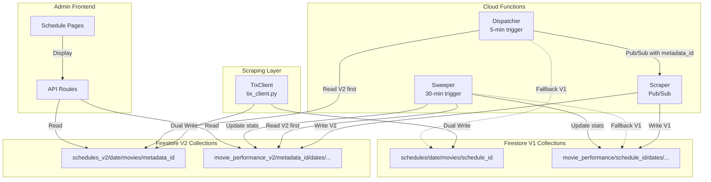

# V2 Migration - Current State & Architecture Plan

## Executive Summary

Based on analysis of the leftover artifacts and codebase, the V2 migration is **substantially complete**. The domain model renaming, dual-write logic, and Cloud Function updates have been implemented. This document consolidates the architecture and identifies remaining tasks.

---

## 1. Current Implementation Status

### 1.1 Domain Model Renaming ✅ COMPLETE

| Component | Status | File |
|-----------|--------|------|
| `Movie` → `MovieSchedule` | ✅ Done | [`backend/domain/models/movie.py`](backend/domain/models/movie.py) |
| `id` → `schedule_id` | ✅ Done | Line 217 |
| `tix_metadata_id` → `metadata_id` | ✅ Done | Line 219 |
| Backward compat alias `Movie = MovieSchedule` | ✅ Done | Line 316 |
| Backward compat properties | ✅ Done | Lines 230-239 |

### 1.2 Firestore Collections ✅ COMPLETE

| Collection | Constant | Status |
|------------|----------|--------|
| `schedules` | `SCHEDULES` | ✅ V1 - backward compat |
| `schedules_v2` | `SCHEDULES_V2` | ✅ Added |
| `movie_performance` | `MOVIE_PERFORMANCE` | ✅ V1 - backward compat |
| `movie_performance_v2` | ❌ Missing | ⚠️ Needs to be added |

### 1.3 TIX Client Dual-Write ✅ COMPLETE

File: [`backend/infrastructure/core/tix_client.py`](backend/infrastructure/core/tix_client.py)

- V1 write to `schedules/{date}/movies/{schedule_id}` ✅
- V2 write to `schedules_v2/{date}/movies/{metadata_id}` ✅
- Accumulates `schedule_ids` array in V2 documents ✅

### 1.4 Cloud Functions ✅ COMPLETE

#### Dispatcher ([`backend/functions/dispatcher/main.py`](backend/functions/dispatcher/main.py))

| Feature | Status |
|---------|--------|
| Read from `schedules_v2` first | ✅ Lines 94-97 |
| Fallback to `schedules` V1 | ✅ Lines 100-103 |
| Pass `metadata_id` in Pub/Sub | ✅ Line 155 |

#### Scraper ([`backend/functions/scraper/main.py`](backend/functions/scraper/main.py))

| Feature | Status |
|---------|--------|
| Extract `metadata_id` from message | ✅ Line 1071 |
| V1 write to `movie_performance` | ✅ Existing |
| V2 write to `movie_performance_v2` | ✅ Lines 1092-1149 |

#### Sweeper ([`backend/functions/sweeper/main.py`](backend/functions/sweeper/main.py))

| Feature | Status |
|---------|--------|
| Read from `movie_performance_v2` first | ✅ Lines 77-90 |
| Fallback to `movie_performance` V1 | ✅ Lines 93-100 |
| Dual-write daily stats | ✅ Lines 147-164 |
| Dual-write all-time stats | ✅ Lines 247-250 |

### 1.5 Admin Frontend ✅ COMPLETE

| Component | Status | File |
|-----------|--------|------|
| Sidebar V2 menu | ✅ | [`admin/src/components/Sidebar.tsx`](admin/src/components/Sidebar.tsx) |
| V2 API route | ✅ | [`admin/src/app/api/schedules_v2/route.ts`](admin/src/app/api/schedules_v2/route.ts) |
| V2 schedule page | ✅ | [`admin/src/app/schedules_v2/[date]/page.tsx`](admin/src/app/schedules_v2/[date]/page.tsx) |

---

## 2. Architecture Diagram



---

## 3. Data Flow - V2 Schema

### 3.1 Schedule Collection Structure

```
schedules_v2/{date}/movies/{metadata_id}
├── metadata_id: "1996107160261574656"    # Document ID - immutable
├── schedule_ids: ["1996107175268794368"] # Array of associated schedule IDs
├── title: "Avatar"
├── merchants: ["XXI", "CGV"]
├── cities: ["JAKARTA", "SURABAYA"]
├── schedules: { ... }
└── ...
```

### 3.2 Performance Collection Structure

```
movie_performance_v2/{metadata_id}/days/{date}
├── total_showtimes_scraped: 42
├── total_seats: 8400
├── total_sold: 2520
├── avg_occupancy_pct: 30.0
├── cities: ["JAKARTA"]
└── last_swept_at: "2026-03-09T07:00:00+07:00"

movie_performance_v2/{metadata_id}/days/{date}/showtimes/{showtime_id}
├── schedule_id: "1996107175268794368"    # Reference to V1
├── sold_seats: 60
├── total_seats: 200
├── occupancy_pct: 30.0
└── ...
```

---

## 4. Identified Gaps

### 4.1 Missing Constant

The `MOVIE_PERFORMANCE_V2` constant is not defined in [`backend/infrastructure/firestore_collections.py`](backend/infrastructure/firestore_collections.py).

**Current:**
```python
SCHEDULES = "schedules"
SCHEDULES_V2 = "schedules_v2"
MOVIE_PERFORMANCE = "movie_performance"
# Missing: MOVIE_PERFORMANCE_V2
```

**Required:**
```python
MOVIE_PERFORMANCE_V2 = "movie_performance_v2"
```

### 4.2 No V2 Performance API Route

The admin frontend has:
- ✅ `/api/schedules_v2` - for schedule data
- ❌ No `/api/performance_v2` - for performance data

The performance pages still read from V1 collections.

### 4.3 Historical Data Migration

Historical data in V1 collections has not been migrated to V2. This was intentionally deferred.

---

## 5. Remaining Tasks

### Phase 1: Code Cleanup (Low Priority)

1. Add `MOVIE_PERFORMANCE_V2` constant to `firestore_collections.py`
2. Update docstrings to reflect V2 schema

### Phase 2: Admin Frontend Enhancement (Optional)

1. Create `/api/performance_v2` route
2. Update performance pages to read from V2
3. Add V1 vs V2 comparison views

### Phase 3: V1 Deprecation (Future)

1. Monitor V2 stability for 1+ month
2. Switch all reads to V2 primary
3. Remove V1 fallback code
4. Delete V1 collections (irreversible)

---

## 6. Testing Checklist

### Validation Steps

- [ ] Verify `schedules_v2` has data with correct `metadata_id` keys
- [ ] Verify `movie_performance_v2` has documents with correct structure
- [ ] Compare V1 vs V2 aggregation results in sweeper
- [ ] Test dispatcher fallback when V2 is empty
- [ ] Test sweeper fallback when V2 is empty
- [ ] Monitor Cloud Function logs for errors

### Rollback Plan

If issues arise:

1. **TixClient**: Already writes to both, no rollback needed
2. **Dispatcher**: Already has V1 fallback, no action needed
3. **Scraper**: V1 writes continue, V2 can be safely deleted
4. **Sweeper**: Already has V1 fallback, no action needed

V2 collections can be safely deleted and rebuilt from fresh scrapes.

---

## 7. Summary

| Component | Status | Notes |
|-----------|--------|-------|
| Domain Model | ✅ Complete | `MovieSchedule` with `schedule_id`/`metadata_id` |
| TixClient | ✅ Complete | Dual-write to V1 + V2 |
| Dispatcher | ✅ Complete | V2 read with V1 fallback |
| Scraper | ✅ Complete | Dual-write to V1 + V2 |
| Sweeper | ✅ Complete | V2 read with V1 fallback, dual-write stats |
| Admin Frontend | ✅ Complete | V2 schedule page exists |
| Constants | ⚠️ Minor Gap | Missing `MOVIE_PERFORMANCE_V2` |

**Conclusion**: The V2 migration is functionally complete. The system is running in dual-write mode with V2 reads prioritized. The only identified gap is a missing constant definition, which is a minor code hygiene issue since Cloud Functions use string literals directly.

---

## Appendix: Key Files Reference

| Layer | File | Purpose |
|-------|------|---------|
| Domain | [`backend/domain/models/movie.py`](backend/domain/models/movie.py) | `MovieSchedule` dataclass |
| Domain | [`backend/domain/models/movie_details.py`](backend/domain/models/movie_details.py) | `MovieDetails` dataclass |
| Infra | [`backend/infrastructure/firestore_collections.py`](backend/infrastructure/firestore_collections.py) | Collection constants |
| Infra | [`backend/infrastructure/core/tix_client.py`](backend/infrastructure/core/tix_client.py) | Dual-write logic |
| Func | [`backend/functions/dispatcher/main.py`](backend/functions/dispatcher/main.py) | Dispatch showtimes |
| Func | [`backend/functions/scraper/main.py`](backend/functions/scraper/main.py) | Scrape seat data |
| Func | [`backend/functions/sweeper/main.py`](backend/functions/sweeper/main.py) | Aggregate stats |
| Admin | [`admin/src/app/schedules_v2/[date]/page.tsx`](admin/src/app/schedules_v2/[date]/page.tsx) | V2 schedule UI |
